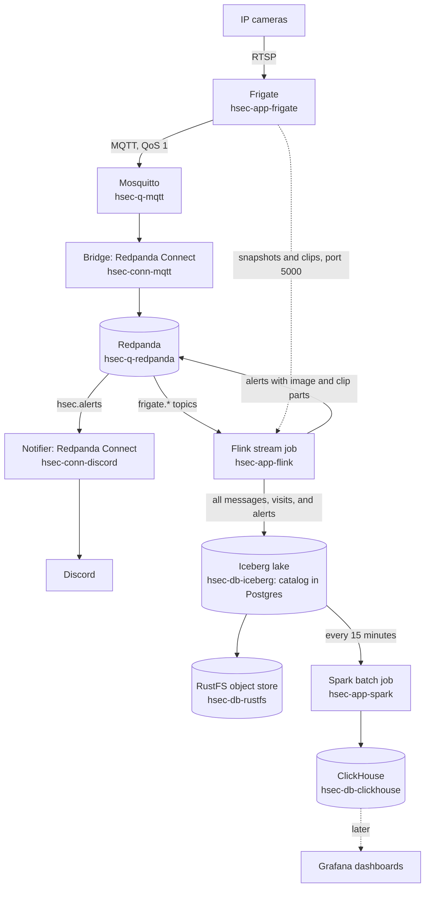

# Home security

A home security system that runs on one k3s node. Frigate watches the IP cameras and finds people, cars, and faces. Each alert goes to Discord at once with a snapshot image, and the video follows in clip parts. Every message also goes into an Iceberg lake, and every 15 minutes Spark turns it into stats in ClickHouse for dashboards. Terraform deploys everything, and the data stays for 30 days at most.

## Contents

- [How it works](#how-it-works)
- [Apps](#apps)
- [Repository layout](#repository-layout)
- [Before you start](#before-you-start)
- [Deploy](#deploy)
- [Check the system](#check-the-system)
- [Test](#test)
- [Documents](#documents)
- [Status](#status)

## How it works



1. Frigate reads each camera, detects objects on the Intel UHD 620, and keeps the video of alerts and detections for 14 days.
2. Frigate publishes every event to Mosquitto. The bridge copies each message into its Redpanda topic and adds a video reference: the camera and a time range.
3. The Flink job removes duplicates, writes all messages to Iceberg tables, and builds visits of people.
4. When Frigate marks a review as an alert, Flink sends message 1 with a 720-pixel snapshot. When the review ends, Flink sends the review video in clip parts of up to 25 seconds.
5. The notifier posts these messages to Discord, the image first and then the clip parts.
6. Every 15 minutes, Spark reads the Iceberg tables and writes five stats tables to ClickHouse. Every night, it also deletes old data and compacts the tables.

## Apps

Each app folder holds the code, the configuration, the tests, and a Terraform module in `terraform/`. Its `README.md` has the details and the base knowledge of its technology.

| Folder | Role | Technology | Terraform root |
| --- | --- | --- | --- |
| [hsec-app-frigate](hsec-app-frigate/README.md) | Records the cameras and detects objects and faces | Frigate 0.18.0 | `020-app` |
| [hsec-q-mqtt](hsec-q-mqtt/README.md) | MQTT broker between Frigate and the bridge | Mosquitto 2.1.2 | `010-workload` |
| [hsec-conn-mqtt](hsec-conn-mqtt/README.md) | Copies MQTT messages into Redpanda, with video references | Redpanda Connect 4.112.0 | `020-app` |
| [hsec-q-redpanda](hsec-q-redpanda/README.md) | Message log of all Frigate messages and alerts, 7 days | Redpanda 26.2.3 | `010-workload` |
| [hsec-conn-discord](hsec-conn-discord/README.md) | Posts alerts to Discord | Redpanda Connect 4.112.0 | `020-app` |
| [hsec-app-flink](hsec-app-flink/README.md) | Stream job: tables, visits, and alerts | Flink 2.2.1, Flink Kubernetes Operator 1.16.1 | `020-app` |
| [hsec-db-iceberg](hsec-db-iceberg/README.md) | Iceberg catalog and table migrations | Iceberg 1.12.0, Postgres 18.6 | `010-workload` |
| [hsec-db-rustfs](hsec-db-rustfs/README.md) | Object store of the lake and the Flink checkpoints | RustFS 1.0.1 | `010-workload` |
| [hsec-app-spark](hsec-app-spark/README.md) | Batch job: stats every 15 minutes, nightly cleanup | Spark 4.0.4, Spark Operator 2.5.2 | `020-app` |
| [hsec-db-clickhouse](hsec-db-clickhouse/README.md) | Stats for the dashboards, 29 days | ClickHouse 26.3.39.7 (LTS) | `010-workload` |

Two Terraform roots call the modules:

| Root | Creates | README |
| --- | --- | --- |
| `terraform/010-workload` | Namespaces, the Intel GPU plugin, passwords, Secrets, network policies, and the data services | [README](terraform/010-workload/README.md) |
| `terraform/020-app` | Frigate, the bridge, the notifier, Flink, and Spark | [README](terraform/020-app/README.md) |

## Repository layout

```text
home-security/
├── README.md                 # this file
├── docs/
│   ├── system-design.md      # top-level design, decisions, budgets
│   └── specs.md              # detailed specs
├── terraform/
│   ├── 010-workload/         # root 1: base and data services
│   └── 020-app/              # root 2: apps
├── hsec-app-frigate/         # Frigate seed configuration and module
├── hsec-q-mqtt/              # Mosquitto configuration, ACL, and module
├── hsec-conn-mqtt/           # bridge pipeline, tests, and module
├── hsec-q-redpanda/          # topics script and module
├── hsec-conn-discord/        # notifier pipeline, tests, and module
├── hsec-app-flink/           # Maven project, Dockerfile, module, and job chart
├── hsec-db-iceberg/          # Iceberg migrations, migrate.sh, and Postgres module
├── hsec-db-rustfs/           # RustFS module
├── hsec-app-spark/           # Maven project, Dockerfile, module, and job chart
└── hsec-db-clickhouse/       # ClickHouse configuration, users, migrations, and module
```

## Before you start

The system needs a single-node k3s cluster on the Fedora host, with the Intel UHD 620, an SSD storage class, and an HDD storage class. The full list is in [Prerequisites](docs/system-design.md#prerequisites).

The admin machine needs these tools:

- Terraform 1.16 and kubectl, with a kubeconfig that has cluster-admin rights.
- Docker with `buildx`, Java 17 or newer, and Maven, to build the two images.
- golang-migrate 4.20.1, for the ClickHouse migrations.
- Java 17 and Spark 4.0.4 (`spark-4.0.4-bin-hadoop3`), for the Iceberg migrations.
- An image registry that the cluster can pull from, and a Discord webhook URL.

## Deploy

On a fresh cluster, do these steps in order. Run each command from the repository root.

1. Copy `terraform/010-workload/terraform.tfvars.example` to `terraform/010-workload/terraform.tfvars`, and fill in the values.
2. Apply the first root. It creates the base and the data services.

   ```sh
   (cd terraform/010-workload && terraform init && terraform apply)
   ```

3. Test and build the two custom images, then push them to your registry.

   ```sh
   (cd hsec-app-flink && mvn test) && (cd hsec-app-spark && mvn test)
   docker buildx build --platform linux/amd64 -t <registry>/hsec-app-flink:<tag> --push hsec-app-flink/
   docker buildx build --platform linux/amd64 -t <registry>/hsec-app-spark:<tag> --push hsec-app-spark/
   ```

4. Run the ClickHouse migrations with golang-migrate. See [Migrate](hsec-db-clickhouse/README.md#migrate) in the ClickHouse README.
5. Run the Iceberg migrations with `migrate.sh`. See [Migrate](hsec-db-iceberg/README.md#migrate) in the Iceberg README.
6. Copy `terraform/020-app/terraform.tfvars.example` to `terraform/020-app/terraform.tfvars`. Fill in the values, with the same registry and tags as the images that you pushed.
7. Apply the second root. It installs the apps.

   ```sh
   (cd terraform/020-app && terraform init && terraform apply)
   ```

Each root keeps its state in a Kubernetes Secret in `kube-system`. The state of `010-workload` holds all passwords in plain text. Do not commit a `terraform.tfvars`, because it holds secret values.

On the first start, Frigate prints its admin password in its log. Open the Frigate UI at `https://<node address>:8971`.

## Check the system

```sh
kubectl -n hsec get pods
kubectl -n hsec get flinkdeployment hsec-stream -o jsonpath='{.status.jobStatus.state}{"\n"}'
kubectl -n hsec get scheduledsparkapplication hsec-batch
kubectl -n hsec exec redpanda-0 -c redpanda -- rpk topic list
kubectl -n hsec exec clickhouse-0 -- clickhouse-client -q "SELECT count() FROM hsec.objects FINAL"
```

If the stream works, the Flink job state is `RUNNING`. The Spark job starts every 15 minutes, on the quarter hour.

## Test

| Part | Folder | Command |
| --- | --- | --- |
| Terraform modules and roots | Each `hsec-*/terraform`, `terraform/010-workload`, `terraform/020-app` | `terraform init -backend=false && terraform test` |
| Bridge and notifier pipelines | `hsec-conn-mqtt`, `hsec-conn-discord` | `redpanda-connect test --env-file connect/tests/test.env ./connect/tests/...` |
| Flink job | `hsec-app-flink` | `mvn test` |
| Spark job | `hsec-app-spark` | `mvn test` |
| Job charts | `hsec-app-flink/terraform/chart`, `hsec-app-spark/terraform/chart` | `helm lint` and `helm template` |
| Scripts | `hsec-q-redpanda/topics.sh`, `hsec-db-iceberg/migrate.sh` | `shellcheck` |
| ClickHouse migrations | `hsec-db-clickhouse/migrations` | `clickhouse local` with each `.up.sql` and `.down.sql` file |

This loop runs every Terraform test:

```sh
for d in hsec-*/terraform terraform/010-workload terraform/020-app; do
  (cd "$d" && terraform init -backend=false >/dev/null && terraform test) || break
done
```

The README of each app explains its tests and how to run the pipeline tests with the Redpanda Connect image.

## Documents

- [docs/system-design.md](docs/system-design.md): the top-level design, with the architecture, the decisions (ADRs), the failure modes, and the resource and storage budgets.
- [docs/specs.md](docs/specs.md): the detailed specs of each part.
- The `README.md` of each app and root: the facts of the code, a diagram, the base knowledge of its technology, and its tests.

## Status

Done and tested:

- All ten apps and both Terraform roots, with their unit tests.
- A run on a test k3s cluster, without Frigate, because Frigate needs the real GPU. Test messages went from Mosquitto through Redpanda, Flink, and Iceberg into ClickHouse, and the notifier reached Discord.

Not done yet:

- The Grafana data source and dashboards.
- The smoke test `tests/smoke-test.sh`.
- A first run of Frigate on the host with the UHD 620.
- `docs/specs.md` and `docs/system-design.md` still describe some earlier choices. For example, they mention a `job.properties` file, a `UInt64` version column, a Flink job that creates tables, and the old Spark operator memory budget. The app READMEs describe the current code.
