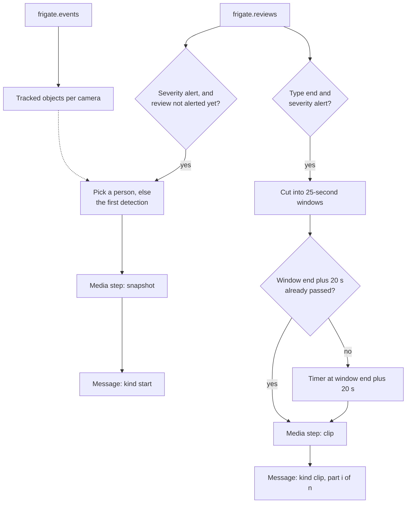

# Home security system: detailed specs

- Status: draft for review
- Date: 2026-10-03
- Owner: Huy Le Nguyen
- Top-level design: [system-design.md](system-design.md)

## Contents

- [Conventions](#conventions)
- [Monorepo](#monorepo)
- [Terraform](#terraform)
- [Container images](#container-images)
- [Intel GPU plugin](#intel-gpu-plugin)
- [Frigate](#frigate)
- [Mosquitto](#mosquitto)
- [Redpanda](#redpanda)
- [Redpanda Connect bridge](#redpanda-connect-bridge)
- [Flink](#flink)
- [Iceberg](#iceberg)
- [RustFS](#rustfs)
- [Postgres](#postgres)
- [Spark](#spark)
- [ClickHouse](#clickhouse)
- [Discord notifier](#discord-notifier)
- [Grafana setup](#grafana-setup)
- [Network policies](#network-policies)
- [Testing](#testing)
- [Repository layout](#repository-layout)
- [References](#references)

## Conventions

The code and the sketches in this file use these names. A sketch shows the required behavior. The implementation can change the form, but it must keep the behavior.

Namespaces:

| Namespace | Contents |
| --- | --- |
| `hsec` | All apps, the Flink and Spark operators, the Flink job, and the Spark job. The Terraform variable `namespace` sets this name, and its default is `hsec`. |
| `intel-gpu-plugin` | Intel GPU device plugin |

In-cluster endpoints:

| Service | Address |
| --- | --- |
| Mosquitto | `mosquitto.hsec.svc.cluster.local:1883` |
| Redpanda Kafka API | `redpanda-0.redpanda.hsec.svc.cluster.local:9093` |
| Redpanda admin API | `redpanda-0.redpanda.hsec.svc.cluster.local:9644` |
| RustFS S3 API | `http://rustfs-svc.hsec.svc.cluster.local:9000` |
| Postgres | `postgres.hsec.svc.cluster.local:5432` |
| ClickHouse HTTP | `http://clickhouse.hsec.svc.cluster.local:8123` |
| Frigate | `https://192.168.1.17:8971` (ServiceLB) |

Other names:

- Each resource has the labels `app.kubernetes.io/name` and `app.kubernetes.io/part-of: hsec`.
- The Terraform variable `timezone` sets the local time zone. The default is `Asia/Singapore`.
- The Iceberg namespace and the ClickHouse database are both `hsec`.

## Monorepo

The repository is a monorepo with one folder per app. Each app folder holds the code, the configuration files, the tests, the Dockerfile (if the app has one), and a Terraform module for that app.

| Folder | Parts | Terraform modules | Other contents |
| --- | --- | --- | --- |
| `hsec-frigate` | Frigate, Intel GPU plugin | `terraform/platform` (GPU plugin), `terraform` (Frigate) | `config.seed.yml.tftpl` |
| `hsec-mqtt` | Mosquitto | `terraform` | `mosquitto.conf`, `acl` |
| `hsec-redpanda` | Redpanda, topics, bridge, Discord notifier | `terraform` | `connect/` with both pipelines and their tests |
| `hsec-rustfs` | RustFS, buckets | `terraform` | none |
| `hsec-iceberg` | Postgres for the Iceberg JDBC catalog | `terraform` | none. The Flink job creates the tables. |
| `hsec-flink` | Flink operator, stream job | `terraform/platform` (operator), `terraform` (job) | Maven project, `Dockerfile` |
| `hsec-spark` | Spark operator, batch job | `terraform/platform` (operator), `terraform` (job) | Python project, `Dockerfile` |
| `hsec-clickhouse` | ClickHouse, schema, Grafana setup | `terraform` | `config.d/`, `users.d/`, `schema.sql`, `grafana/dashboards/` |

Shared folders:

| Folder | Contents |
| --- | --- |
| `deploy/platform` | Terraform root for stage 1. Creates the namespaces and calls the `terraform/platform` modules. |
| `deploy/apps` | Terraform root for stage 2. Creates the passwords and the network policies, and calls the `terraform` modules. |
| `docs` | Design documents |
| `tests` | The end-to-end smoke test |

Rules for the app folders:

- A module reads files only from its own app folder.
- A module has no `provider` blocks. It lists its providers in `required_providers`, and the root configures them.
- A module never creates passwords. The root creates them and passes them in. The module creates the Kubernetes Secrets that its pods need.
- A module gives other modules its service addresses as outputs. The root passes these outputs to the modules that use them, so Terraform knows the order.
- A module has its own `tests/` folder for `terraform test`.

## Terraform

### Stages

Terraform has two root modules in `deploy/`. On a fresh cluster, do these steps in order:

1. In `deploy/platform`, run `terraform init` and `terraform apply`.
2. Build and push the two custom images. See [Container images](#container-images).
3. In `deploy/apps`, run `terraform init` and `terraform apply`.

| Stage | Creates | Calls the modules |
| --- | --- | --- |
| `deploy/platform` | Namespaces | `hsec-frigate/terraform/platform`, `hsec-flink/terraform/platform`, `hsec-spark/terraform/platform` |
| `deploy/apps` | Passwords, network policies | `terraform` in all eight app folders |

The job modules in `hsec-flink` and `hsec-spark` use `kubernetes_manifest` for the operator custom resources. This resource reads the cluster during the plan [1]. So the operator CRDs from the `deploy/platform` stage must exist first.

Module inputs and outputs in `deploy/apps`. Each module also gets `namespace` and the common labels.

| Module | Main inputs | Outputs |
| --- | --- | --- |
| `hsec-mqtt` | SSD class, MQTT passwords | `mqtt_address` |
| `hsec-redpanda` | SSD class, `mqtt_address`, bridge password, Discord webhook URL | `kafka_address` |
| `hsec-rustfs` | HDD class, RustFS keys | `s3_endpoint` |
| `hsec-iceberg` | SSD class, Postgres password | `jdbc_uri` |
| `hsec-clickhouse` | HDD class, time zone, ClickHouse passwords, Grafana namespace | `clickhouse_http` |
| `hsec-flink` | Image, `kafka_address`, `s3_endpoint`, `jdbc_uri`, `frigate_api_address`, passwords, time zone, `frigate_url` | none |
| `hsec-spark` | Image, `s3_endpoint`, `jdbc_uri`, `clickhouse_http`, passwords, time zone, night window | none |
| `hsec-frigate` | SSD and HDD classes, time zone, cameras, RTSP password, `mqtt_address`, MQTT password | `frigate_api_address` |

### Providers and versions

| Item | Version constraint |
| --- | --- |
| Terraform | `~> 1.16` |
| `hashicorp/kubernetes` | `~> 3.3` |
| `hashicorp/helm` | `~> 3.3` |
| `hashicorp/random` | `~> 3.9` |
| `grafana/grafana` | `~> 4.47` (only in `deploy/apps` and `hsec-clickhouse`) |

The roots configure the providers. The modules only list them in `required_providers`. Commit `.terraform.lock.hcl` for both roots, so that every run uses the same provider builds.

### State

Each stage stores its state in a Kubernetes Secret in `kube-system`:

```hcl
terraform {
  backend "kubernetes" {
    secret_suffix = "hsec-apps" # "hsec-platform" in the platform stage
    namespace     = "kube-system"
    config_path   = "~/.kube/config"
  }
}
```

The state holds all passwords in plain text. Only cluster admins can read Secrets in `kube-system`.

### Secrets

The root `deploy/apps` creates these passwords with `random_password`. Each module stores the passwords that it gets in Kubernetes Secrets:

| Password | Used by |
| --- | --- |
| `mqtt_frigate` | Frigate, Mosquitto |
| `mqtt_bridge` | Bridge, Mosquitto |
| `rustfs_access_key`, `rustfs_secret_key` | RustFS, Flink, Spark, bucket job |
| `postgres_iceberg` | Postgres, Flink, Spark |
| `clickhouse_admin` | ClickHouse, schema job |
| `clickhouse_spark` | ClickHouse, Spark |
| `clickhouse_grafana` | ClickHouse, Grafana data source |

You give three secret values as sensitive variables: `discord_webhook_url`, `frigate_rtsp_password`, and `grafana_auth`. Put them in `deploy/apps/terraform.tfvars` or in `TF_VAR_*` environment variables. The file `deploy/apps/terraform.tfvars.example` shows all variables without real values.

Add these lines to `.gitignore`:

```text
*.tfvars
!*.tfvars.example
.terraform/
*.tfstate
*.tfstate.*
```

### Variables

The root `deploy/apps` has these variables. The root `deploy/platform` uses only `kubeconfig_path`, `kube_context`, `namespace`, and `node_name`.

| Variable | Type | Default | Purpose |
| --- | --- | --- | --- |
| `kubeconfig_path` | string | `~/.kube/config` | Cluster access |
| `kube_context` | string | none | Cluster access |
| `namespace` | string | `hsec` | Namespace for all apps |
| `timezone` | string | `Asia/Singapore` | Local time for Frigate, Flink, Spark, and ClickHouse |
| `node_name` | string | none | Node for the GPU plugin |
| `ssd_storage_class` | string | none | Class for SSD volumes |
| `hdd_storage_class` | string | none | Class for the Frigate media, RustFS, and ClickHouse volumes |
| `image_registry` | string | none | Registry of the custom images |
| `flink_image_tag` | string | none | Tag of the Flink job image |
| `spark_image_tag` | string | none | Tag of the Spark job image |
| `cameras` | map of objects | none | Per camera: `detect_url`, `record_url`, `detect_width`, `detect_height` |
| `night_start`, `night_end` | string | `23:00`, `06:00` | Night window for the day and night stats |
| `frigate_url` | string | none | Base URL in alert messages, for example `https://192.168.1.17:8971` |
| `grafana_url` | string | none | Grafana API address |
| `grafana_namespace` | string | none | Namespace of the Grafana pods, for the network policy |
| `discord_webhook_url` | string, sensitive | none | Alert channel |
| `frigate_rtsp_password` | string, sensitive | none | Camera password |
| `grafana_auth` | string, sensitive | none | Grafana service account token |

Camera URLs contain the text `{FRIGATE_RTSP_PASSWORD}`. Frigate replaces it with the environment variable of the same name, so the password stays out of the configuration file.

## Container images

You build two images. All other images are public.

| Image | Base | Contents |
| --- | --- | --- |
| `hsec-flink` | `flink:2.2.1-scala_2.12-java17` | The job jar at `/opt/flink/usrlib/hsec-stream.jar`. The jar includes `flink-connector-kafka:5.0.0-2.2`, `iceberg-flink-runtime-2.2:1.12.0`, `iceberg-aws-bundle:1.12.0`, and `postgresql:42.7.13`. |
| `hsec-spark` | `apache/spark:4.0.4-scala2.13-java17-python3-ubuntu` | The jars `iceberg-spark-runtime-4.0_2.13:1.12.0`, `iceberg-aws-bundle:1.12.0`, `postgresql:42.7.13`, `clickhouse-spark-runtime-4.0_2.13:0.10.0`, and `clickhouse-jdbc:0.9.5` with the `all` classifier [2]. The Python package `hsec_batch` at `/opt/hsec`. |

The host CPU is amd64. If you build on an Apple Silicon machine, add `--platform linux/amd64`:

```sh
docker buildx build --platform linux/amd64 -t <registry>/hsec-flink:<tag> --push hsec-flink/
docker buildx build --platform linux/amd64 -t <registry>/hsec-spark:<tag> --push hsec-spark/
```

## Intel GPU plugin

Folder: `hsec-frigate/terraform/platform`.

- Translate the upstream DaemonSet `deployments/gpu_plugin/base/intel-gpu-plugin.yaml` from release v0.37.1 into a `kubernetes_daemon_set_v1` [3].
- Keep the image `intel/intel-gpu-plugin:0.37.1` and the upstream host mounts.
- Add the node selector `kubernetes.io/hostname = var.node_name`.
- Keep the argument `-shared-dev-num=1`, because only Frigate uses the GPU.
- Result: the node shows `gpu.intel.com/i915: 1` in its allocatable resources.
- The host has two GPUs: the Intel UHD 620 and the AMD Radeon R5 M435. The plugin offers only Intel GPUs, so the AMD GPU never reaches a pod [3].

## Frigate

Folder: `hsec-frigate`.

### Compose to Kubernetes mapping

The source is the example Docker Compose file in the Frigate installation docs [4]. The `docker-compose.yml` at the root of the Frigate repo is a dev container for Frigate developers, so this design does not use it.

| Compose line | Kubernetes resource |
| --- | --- |
| `image: ghcr.io/blakeblackshear/frigate:stable` | Container image `ghcr.io/blakeblackshear/frigate:0.18.0` |
| `restart: unless-stopped` | Deployment with 1 replica and the `Recreate` strategy |
| `privileged: true` | Not used. The GPU comes from the device plugin. |
| `stop_grace_period: 30s` | `termination_grace_period_seconds = 30` |
| `shm_size: "512mb"` | `emptyDir` with `medium = "Memory"` and `size_limit = "512Mi"` at `/dev/shm` |
| `devices: /dev/dri/renderD128` | Resource `gpu.intel.com/i915 = 1` in requests and limits. The plugin mounts only the Intel render node, whatever its number on the host. If Frigate sees one render node, it uses that node for VAAPI [35]. |
| `/etc/localtime:/etc/localtime:ro` | Environment variable `TZ = var.timezone` |
| `/path/to/your/config:/config` | PVC `frigate-config`, SSD class, 5 GiB |
| `/path/to/your/storage:/media/frigate` | PVC `frigate-media`, HDD class, 200 GiB. It holds 14 days of alert and detection video and 30 days of snapshots. |
| `tmpfs` at `/tmp/cache`, 1 GB | `emptyDir` with `medium = "Memory"` and `size_limit = "1Gi"` |
| `ports: 8971, 8554, 8555/tcp, 8555/udp` | Service `frigate`, type `LoadBalancer` (k3s ServiceLB) |
| `# 5000:5000` | Not in the Service `frigate`. A second Service `frigate-api`, type `ClusterIP`, exposes port 5000 inside the cluster for the Flink job. A network policy allows only the Flink TaskManager pod. The health probes also use this port. |
| `FRIGATE_RTSP_PASSWORD` | Environment from the Secret `frigate-env` |
| `ulimits: nofile: 65535` | Kubernetes has no field for this. The pod gets the limit of the node runtime. Make sure that `ulimit -n` in the pod shows at least 65535. |

### Pod

- Init container `seed-config`: uses the Frigate image and runs `[ -f /config/config.yml ] || cp /seed/config.yml /config/config.yml`. `/seed` is a ConfigMap that Terraform renders from `hsec-frigate/config.seed.yml.tftpl`.
- Environment from the Secret `frigate-env`: `FRIGATE_RTSP_PASSWORD`, `FRIGATE_MQTT_USER`, `FRIGATE_MQTT_PASSWORD`.
- Resources: CPU request 1, memory 3 GiB (request and limit), `gpu.intel.com/i915: 1`. Memory-backed volumes count toward the memory limit.
- Startup probe: `GET /api/version` on port 5000, every 10 seconds, up to 60 failures. The first start downloads models and takes several minutes.
- Liveness probe: the same request every 30 seconds.
- On the first start, Frigate prints the admin password in its log.

### Starting configuration

`hsec-frigate/config.seed.yml.tftpl`:

```yaml
mqtt:
  enabled: true
  host: mosquitto.hsec.svc.cluster.local
  port: 1883
  user: "{FRIGATE_MQTT_USER}"
  password: "{FRIGATE_MQTT_PASSWORD}"
  qos: 1

detectors:
  ov:
    type: openvino
    device: GPU

ffmpeg:
  hwaccel_args: preset-vaapi

face_recognition:
  enabled: true
  model_size: small

record:
  enabled: true
  continuous:
    days: 0
  motion:
    days: 0
  alerts:
    retain:
      days: 14
  detections:
    retain:
      days: 14

snapshots:
  enabled: true
  retain:
    default: 30

cameras:
%{ for name, cam in cameras ~}
  ${name}:
    ffmpeg:
      inputs:
        - path: ${cam.record_url}
          roles: [record]
        - path: ${cam.detect_url}
          roles: [detect]
    detect:
      width: ${cam.detect_width}
      height: ${cam.detect_height}
      fps: 5
%{ endfor ~}
```

Rules:

- Copy the `model` block for the default OpenVINO model from the Frigate docs [5]. The default model is SSDLite MobileNet v2.
- `record`: Frigate keeps only the video of alerts and detections, for 14 days [27]. It builds the alert clips from this video [28]. See [Alert media](#alert-media).
- `qos: 1`: the default is 0, which sends each message once with no retry [6].
- `preset-vaapi`: the Frigate docs list it for Intel Gen 8 to Gen 12 graphics [7]. UHD 620 is Gen 9.5.
- `model_size: small`: this face model runs on the CPU [8].
- If OpenVINO fails on the UHD 620, change `device: GPU` to `device: CPU`. Then remove the GPU request from the pod.
- Keep the default MQTT topic prefix `frigate`. The bridge topic names depend on it.

## Mosquitto

Folder: `hsec-mqtt`.

- Deployment with 1 replica and the `Recreate` strategy. Image `eclipse-mosquitto:2.1.2-alpine`.
- PVC `mosquitto-data`, SSD class, 1 GiB, at `/mosquitto/data`.
- ConfigMap with `mosquitto.conf` and `acl` at `/mosquitto/config`.
- Service `mosquitto`, type `ClusterIP`, port 1883.
- Memory 64 MiB.

The init container `make-passwd` uses the same image. It writes the password file to an `emptyDir` at `/mosquitto/auth`:

```sh
mosquitto_passwd -c -b /mosquitto/auth/passwd frigate "$MQTT_FRIGATE_PASSWORD"
mosquitto_passwd -b /mosquitto/auth/passwd rpconnect "$MQTT_BRIDGE_PASSWORD"
chown 1883:1883 /mosquitto/auth/passwd
chmod 0700 /mosquitto/auth/passwd
```

`hsec-mqtt/mosquitto.conf`:

```text
listener 1883
allow_anonymous false
password_file /mosquitto/auth/passwd
acl_file /mosquitto/config/acl
persistence true
persistence_location /mosquitto/data/
autosave_interval 60
max_queued_messages 10000
```

`hsec-mqtt/acl`:

```text
user frigate
topic readwrite frigate/#

user rpconnect
topic read frigate/available
topic read frigate/restart
topic read frigate/events
topic read frigate/tracked_object_update
topic read frigate/reviews
topic read frigate/triggers
topic read frigate/stats
topic read frigate/camera_activity
topic read frigate/profile/+
topic read frigate/notifications/+
```

| Field | Reason |
| --- | --- |
| `allow_anonymous false` | Each client must log in. |
| `persistence true` | Mosquitto saves its queue to disk and loads it again after a restart. |
| `autosave_interval 60` | Mosquitto saves the queue every 60 seconds. The default is 1800 seconds [9]. |
| `max_queued_messages 10000` | The queue for the offline bridge holds 10000 messages, about 20 MB. The default is 1000 [9]. |
| `frigate` user | Frigate publishes events and also reads its own command topics under `frigate/`. |
| `rpconnect` user | The bridge can only read the general Frigate topics [6]. `+` matches one topic level, so `frigate/profile/+` covers `set` and `state`. |

## Redpanda

Folder: `hsec-redpanda`.

### Chart

`helm_release` of the chart `redpanda` 26.2.4 from `https://charts.redpanda.com`. The chart defaults are for a three-broker production cluster [10]. Change these values:

| Value | New value | Chart default |
| --- | --- | --- |
| `statefulset.replicas` | `1` | `3` |
| `console.enabled` | `false` | `true` |
| `tls.enabled` | `false` | `true` |
| `external.enabled` | `false` | `true` |
| `resources.cpu.cores` | `1` | `1` |
| `resources.memory.container.max` | `2.5Gi` | `2.5Gi` |
| `storage.persistentVolume.size` | `10Gi` | `20Gi` |
| `storage.persistentVolume.storageClass` | `var.ssd_storage_class` | empty |
| `config.cluster.auto_create_topics_enabled` | `false` | not set |

Do not use `--mode dev-container`, because it turns off fsync [11].

### Topics

| Topic | Producer | Retention time | Retention size | Max message size |
| --- | --- | --- | --- | --- |
| `frigate.events` | Bridge | 7 days | 1 GiB | 1 MiB (default) |
| `frigate.reviews` | Bridge | 7 days | 1 GiB | 1 MiB (default) |
| `frigate.tracked_object_update` | Bridge | 7 days | 1 GiB | 1 MiB (default) |
| `frigate.triggers` | Bridge | 7 days | 1 GiB | 1 MiB (default) |
| `frigate.available`, `frigate.restart`, `frigate.stats`, `frigate.camera_activity`, `frigate.profile.set`, `frigate.profile.state`, `frigate.notifications.set`, `frigate.notifications.state` | Bridge | 7 days | 128 MiB each | 1 MiB (default) |
| `hsec.alerts` | Flink | 7 days | 1 GiB | 32 MiB |
| `hsec.rejected` | Bridge | 7 days | 256 MiB | 1 MiB (default) |

Each topic has 1 partition and 1 replica. The Job `redpanda-topics` uses the Redpanda image and runs this script for each topic. A second run changes nothing, except new retention values. `MAX` is `33554432` (32 MiB) for `hsec.alerts`, and empty for the other topics.

```sh
rpk topic describe "$T" >/dev/null 2>&1 || rpk topic create "$T" -p 1 -r 1
rpk topic alter-config "$T" --set retention.ms="$MS" --set retention.bytes="$BYTES"
[ -z "$MAX" ] || rpk topic alter-config "$T" --set max.message.bytes="$MAX"
```

The topic property `max.message.bytes` overrides the cluster default of 1 MiB for one topic [29]. The cluster also limits each Kafka request to 100 MiB by default (`kafka_request_max_bytes`) [30]. An alert message carries at most 19 MiB of files, which is about 26 MiB in base64. That fits under 32 MiB and under the request limit, so no cluster property changes.

### Message contract

| Redpanda topic | Key | Value |
| --- | --- | --- |
| `frigate.events` | `after.id`, the tracked object ID | Frigate payload, unchanged. `type` is `new`, `update`, or `end`. |
| `frigate.reviews` | `after.id`, the review ID | Frigate payload, unchanged. `after.severity` is `alert` or `detection`. |
| `frigate.tracked_object_update` | `id`, the tracked object ID | Frigate payload, unchanged. `type` is `face`, `lpr`, `description`, or `classification`. |
| `frigate.triggers` | `event_id` | Frigate payload, unchanged. |
| System topics | Empty | Frigate payload, unchanged. `frigate.available` is plain text, not JSON. No video headers. |
| `hsec.alerts` | `alert_id` | JSON alert message. `kind` is `start` (with the snapshot image) or `clip` (one clip part). Files are in base64. See [Alerts](#alerts). |
| `hsec.rejected` | Empty | The original MQTT payload, unchanged. The header `mqtt_topic` holds the source topic. |

Rules:

- The Frigate MQTT documentation defines all Frigate fields [6].
- `frigate.events` and `frigate.tracked_object_update` use the same tracked object ID.
- A recognized face shows in two places. `after.sub_label` in `frigate.events` holds a name and a score. A `face` update holds `name` and `score`.
- Frigate times are Unix seconds with a fraction, for example `1607123955.475377`.

### Video reference

Every record on the camera topics (`frigate.events`, `frigate.reviews`, `frigate.tracked_object_update`, `frigate.triggers`) and on `hsec.alerts` has three record headers. They point to the video of the record. The system topics have no video headers.

| Header | Meaning |
| --- | --- |
| `video_camera` | Camera name |
| `video_from` | Start of the time range, in Unix seconds |
| `video_to` | End of the time range, in Unix seconds |

| Topic | `video_camera` | `video_from` | `video_to` |
| --- | --- | --- | --- |
| `frigate.events` | `after.camera` | `after.start_time` | `after.end_time`, or `after.frame_time` while the object is active |
| `frigate.reviews` | `after.camera` | `after.start_time` | `after.end_time`, or `after.start_time` while the review is open |
| `frigate.tracked_object_update` | `camera` | `timestamp` | `timestamp` |
| `frigate.triggers` | `camera` | Bridge receive time | Bridge receive time |
| `hsec.alerts`, `kind: start` | Review camera | Review start | Review start |
| `hsec.alerts`, `kind: clip` | Review camera | Window start | Window end |

Review items on one camera never overlap [31]. By default, every tracked object that is not an alert is a detection [31]. So Frigate keeps the video of every tracked object. Keep these review defaults.

For 14 days, the Frigate clip API returns the video for a reference [28]:

```text
GET https://192.168.1.17:8971/api/<video_camera>/start/<video_from>/end/<video_to>/clip.mp4
```

This address needs a Frigate login. A long-lived object, such as a parked car, can have times with no review item. Those times have no video.

A camera message without a camera or a time goes to `hsec.rejected`. For example, a GenAI `description` update has only an `id`. This design does not turn on GenAI, so these messages are not expected.

## Redpanda Connect bridge

Folder: `hsec-redpanda`.

- Deployment with 1 replica. Image `docker.redpanda.com/redpandadata/connect:4.112.0`.
- The ConfigMap `bridge-pipeline` holds `frigate-to-redpanda.yaml`. The container runs with the arguments `run /config/frigate-to-redpanda.yaml`.
- Environment from the Secret `bridge-env`: `MQTT_BRIDGE_USER`, `MQTT_BRIDGE_PASSWORD`.
- Memory 128 MiB.

`hsec-redpanda/connect/frigate-to-redpanda.yaml`:

```yaml
input:
  mqtt:
    urls: [ "tcp://mosquitto.hsec.svc.cluster.local:1883" ]
    topics:
      - frigate/available
      - frigate/restart
      - frigate/events
      - frigate/tracked_object_update
      - frigate/reviews
      - frigate/triggers
      - frigate/stats
      - frigate/camera_activity
      - frigate/profile/+
      - frigate/notifications/+
    client_id: rpconnect-frigate
    user: ${MQTT_BRIDGE_USER}
    password: ${MQTT_BRIDGE_PASSWORD}
    qos: 1
    clean_session: false

pipeline:
  threads: 1
  processors:
    - label: route
      mutation: |
        let system = [ "frigate/available", "frigate/restart", "frigate/stats", "frigate/camera_activity", "frigate/profile/set", "frigate/profile/state", "frigate/notifications/set", "frigate/notifications/state" ].contains(@mqtt_topic)
        let trigger = @mqtt_topic == "frigate/triggers"
        let now = timestamp_unix_milli() / 1000
        let camera = this.after.camera.or(this.camera).or("")
        let from = if $trigger { $now } else { this.after.start_time.or(this.timestamp).or("") }
        let to = if $trigger { $now } else { this.after.end_time.or(this.after.frame_time).or(this.after.start_time).or(this.timestamp).or("") }
        let video = !$system && $camera != "" && $from != ""
        meta kafka_topic = if $system || $video { @mqtt_topic.replace_all("/", ".") } else { "hsec.rejected" }
        meta kafka_key = if $video { this.after.id.or(this.id).or(this.event_id).or("") } else { "" }
        meta video_camera = if $video { $camera } else { deleted() }
        meta video_from = if $video { $from.string() } else { deleted() }
        meta video_to = if $video { $to.string() } else { deleted() }

output:
  redpanda:
    seed_brokers: [ "redpanda-0.redpanda.hsec.svc.cluster.local:9093" ]
    topic: ${! @kafka_topic }
    key: ${! @kafka_key }
    max_in_flight: 1
    metadata:
      include_patterns: [ "^video_", "^mqtt_topic$" ]
```

| Field | Reason |
| --- | --- |
| `qos: 1` | Mosquitto repeats a message until the bridge acknowledges it. |
| `clean_session: false` and a fixed `client_id` | Mosquitto keeps the bridge subscription and queues messages while the bridge is offline. |
| `threads: 1` | Several threads process messages in parallel and can change the order [12]. One thread is enough for this volume. |
| `max_in_flight: 1` | The output writes one message at a time, so Redpanda keeps the order that the bridge received. The default is 256 [13]. |
| `topics` | All general Frigate topics [6]. `+` matches one topic level. |
| `kafka_topic` | `frigate/events` becomes `frigate.events`, and `frigate/profile/set` becomes `frigate.profile.set`. |
| `system` | The system topics keep their own topic, get an empty key, and get no video headers. |
| `trigger` | `frigate/triggers` has no time, so its video headers use the receive time of the bridge. |
| `kafka_key` | Events and reviews use `after.id`. Tracked object updates use `id`. Triggers use `event_id`. A camera message with a camera and a time, but no ID, goes through with an empty key. |
| `video_*` headers | The video reference. See [Video reference](#video-reference). |
| `hsec.rejected` | A camera message without a camera or a time, or with a body that is not JSON, goes to this topic. |

After the MQTT input reads a message, it acknowledges the message at once [14]. If the bridge crashes, it loses the few messages in progress.

Use only certified components. Do not use `redpanda_common`, because it needs an enterprise license and is deprecated [15].

## Flink

Folder: `hsec-flink`.

### Operator

`helm_release` of the chart `flink-kubernetes-operator` 1.16.1 from `https://downloads.apache.org/flink/flink-kubernetes-operator-1.16.1/`, in the namespace `hsec`:

| Value | New value | Reason |
| --- | --- | --- |
| `watchNamespaces` | `["hsec"]` | The operator manages jobs only in `hsec`. |
| `webhook.create` | `false` | The webhook needs cert-manager, which the cluster does not have. |
| `operatorPod.resources` | memory 512 MiB, CPU request 0.1 | Memory budget |

The chart creates the service account `flink` in `hsec`.

### Job deployment

`kubernetes_manifest` with this FlinkDeployment:

```yaml
apiVersion: flink.apache.org/v1beta1
kind: FlinkDeployment
metadata:
  name: hsec-stream
  namespace: hsec
spec:
  image: <registry>/hsec-flink:<tag>
  flinkVersion: v2_2
  serviceAccount: flink
  flinkConfiguration:
    taskmanager.numberOfTaskSlots: "1"
    taskmanager.memory.managed.fraction: "0.05"
    state.backend.type: hashmap
    execution.checkpointing.interval: 60s
    execution.checkpointing.mode: EXACTLY_ONCE
    execution.checkpointing.num-retained: "3"
    execution.checkpointing.dir: s3://hsec-flink/checkpoints
    execution.checkpointing.savepoint-dir: s3://hsec-flink/savepoints
    high-availability.type: kubernetes
    high-availability.storageDir: s3://hsec-flink/ha
    s3.endpoint: http://rustfs-svc.hsec.svc.cluster.local:9000
    s3.path.style.access: "true"
    s3.access-key: <from Terraform>
    s3.secret-key: <from Terraform>
  podTemplate:
    spec:
      containers:
        - name: flink-main-container
          env:
            - name: ENABLE_BUILT_IN_PLUGINS
              value: flink-s3-fs-presto-2.2.1.jar
          envFrom:
            - secretRef:
                name: flink-env
  jobManager:
    resource: { memory: 768m, cpu: 0.25 }
  taskManager:
    resource: { memory: 1536m, cpu: 0.5 }
  job:
    jarURI: local:///opt/flink/usrlib/hsec-stream.jar
    parallelism: 1
    upgradeMode: last-state
    args: [ "--config", "/opt/flink/usrlib/job.properties" ]
```

| Field | Reason |
| --- | --- |
| `state.backend.type: hashmap` | The state is small. The job needs no RocksDB. |
| `taskmanager.memory.managed.fraction: 0.05` | Only RocksDB uses managed memory. This leaves more heap for the job. |
| `execution.checkpointing.interval: 60s` | Iceberg commits once per checkpoint. Data reaches Iceberg within 1 minute. |
| `high-availability.type: kubernetes` and `upgradeMode: last-state` | After a crash or an upgrade, the job continues from its last checkpoint. |
| `flink-s3-fs-presto` | The Flink docs recommend the Presto S3 file system for checkpoints [16]. |
| `s3.access-key`, `s3.secret-key` | The Presto file system reads its keys only from the Flink configuration [16]. Anyone who can read FlinkDeployments in `hsec` can read the keys. This is an accepted risk for a home lab with one admin. |
| `flink-env` Secret | Holds the Postgres password and the RustFS keys for the Iceberg catalog. The job reads them from environment variables. |
| TaskManager memory `1536m` | A clip part can hold 19 MiB. The download, the base64 text, the Kafka record, and the Parquet writer each hold a copy. With at most 2 clip downloads at a time, this needs about 200 MiB. |

Terraform renders `job.properties` from the variables `timezone` and `frigate_url`. A ConfigMap mounts it in the pod.

### Job logic

| Step | Input | Output | Behavior |
| --- | --- | --- | --- |
| Source | All `frigate.*` topics | Raw records | Consumer group `hsec-stream`. If committed offsets exist, start from them. Otherwise, start from the earliest offset. |
| Parse | Raw records | Typed camera records, or system records | Turns JSON into typed rows. A system record keeps its topic and its raw text. A camera record that does not parse increases a metric, goes to the log, and leaves the stream. Redpanda keeps the raw record for 7 days. |
| Deduplicate | Typed records | Typed records | Key: `message_id`, the SHA-256 of the topic and the raw bytes. State: one flag per key with a 10-minute time-to-live. Drops a record whose key it already saw. |
| Write raw tables | Typed records | Iceberg `events`, `reviews`, `object_updates`, `triggers`, `system_messages` | Append mode. |
| Visits | Events with label `person` | Iceberg `visits` | See [Visits](#visits). |
| Alerts | Events and reviews, keyed by camera | Alert requests | See [Alerts](#alerts). |
| Alert media | Alert requests | Topic `hsec.alerts` and Iceberg `alerts` | See [Alert media](#alert-media). The Kafka sink uses `AT_LEAST_ONCE`, so it sends each message without a wait for the checkpoint. It adds the `video_*` headers. |

When the job starts, it creates the Iceberg namespace and any missing table. See [Tables](#tables).

### Visits

A visit is a period of person activity on one camera. It ends after 5 minutes with no person present.

- Key: camera.
- On a person `new` or `update` message: add the tracked object ID to the active set and to the visit. Add the zones. If `after.sub_label` has a name, record it for this object.
- On a person `end` message: remove the ID from the active set. Start a processing-time timer for 5 minutes later.
- On the timer: if the active set is empty and no newer timer exists, write the visit. Then clear the state.
- Visit fields: see the `visits` table in [Tables](#tables).

### Alerts

Flink alerts on every review item with severity `alert`. Frigate decides the severity. By default, every person and every car is an alert [31].

The step joins events and reviews by camera. Review items on one camera never overlap [31], so each camera has at most one open review.



State per camera:

- Tracked objects: event ID, label, and top score, from `frigate.events`. Each entry expires 1 day after its last message.
- Alerted reviews: the review IDs that already sent message 1. Each entry expires after 1 day.
- Clip timers: one processing-time timer for each window that waits for its video. Timers are part of each checkpoint, so they survive a restart.

Message 1, with the image:

1. A review message arrives with the type `new`, `update`, or `end`. Its `after.severity` is `alert`, and its review ID is not in the alerted reviews.
2. From `after.data.detections`, pick the tracked object with the label `person` and the highest top score. If none is a person, or the labels are not known yet, pick the first ID.
3. Ask the media step for the snapshot of that object. Add the review ID to the alerted reviews.

Clip parts:

1. A review message with `type` equal to `end` and `after.severity` equal to `alert` starts the clip parts.
2. Cut the time from `after.start_time` to `after.end_time` into windows of 25 seconds. The last window can be shorter. A review always has at least one window.
3. A window is ready 20 seconds after it ends. See [Alert media](#alert-media).
4. If a window is already ready, ask the media step for its clip at once. Otherwise, set a timer for the ready time.
5. Each window gives one message: part `i` of `part_count` `n`.

A review that never becomes an alert sends nothing.

Message with `kind: start` on `hsec.alerts`:

```json
{
  "alert_id": "1718987129.308396-fqk5ka:start",
  "kind": "start",
  "review_id": "1718987129.308396-fqk5ka",
  "camera": "front_cam",
  "severity": "alert",
  "objects": ["person", "car"],
  "sub_labels": [],
  "zones": ["front_yard"],
  "review_start": 1718987129.308396,
  "event_id": "1718987128.947436-g92ztx",
  "fired_ts": "2026-10-04T21:05:31.120+08:00",
  "video": { "camera": "front_cam", "from": 1718987129.308396, "to": 1718987129.308396 },
  "snapshot_url": "https://192.168.1.17:8971/api/events/1718987128.947436-g92ztx/snapshot.jpg",
  "image_jpeg": "<base64 JPEG, or null>"
}
```

Message with `kind: clip` on `hsec.alerts`:

```json
{
  "alert_id": "1718987129.308396-fqk5ka:clip:2",
  "kind": "clip",
  "review_id": "1718987129.308396-fqk5ka",
  "camera": "front_cam",
  "review_start": 1718987129.308396,
  "part": 2,
  "part_count": 3,
  "video": { "camera": "front_cam", "from": 1718987154.308396, "to": 1718987179.308396 },
  "clip_url": "https://192.168.1.17:8971/api/front_cam/start/1718987154.308396/end/1718987179.308396/clip.mp4",
  "clip_mp4": "<base64 MP4, or null>"
}
```

### Alert media

An asynchronous step downloads the files for each alert request [32].

| Request | Frigate call | Timeout | Size limit | On failure |
| --- | --- | --- | --- | --- |
| Snapshot for message 1 | `GET ${FRIGATE_API}/api/events/<event_id>/snapshot.jpg?bounding_box=1&height=720&quality=70` | 5 seconds | 1 MiB | `image_jpeg` is null. Message 1 still goes out. |
| Clip for one window | `GET ${FRIGATE_API}/api/<camera>/start/<window_start>/end/<window_end>/clip.mp4` | 30 seconds | 19 MiB | `clip_mp4` is null. The message still goes out with `clip_url`. |

- Frigate 0.18 accepts the snapshot query values for tracked objects that are still in progress [33].
- The clip API builds a clip only from finished recording segments [28]. Frigate needs up to about 17 seconds to finish and store a segment: up to 10 seconds to close the 10-second segment, up to 5 seconds until its next cache check, and the copy. So the step asks for a window only 20 seconds after the window ends. Then the clip is complete.
- If the clip API is called too early, it does not fail. It returns a shorter clip from the segments that exist. This is why the step waits instead of retrying.
- The step stores the files as base64 in `image_jpeg` and `clip_mp4`. Each message carries one file at most, so it stays under the Discord limit of 20 MiB [34].
- `clip_url` points to the same clip on the Frigate UI port. It needs a Frigate login.
- At most 2 clip downloads and 10 snapshot downloads run at a time. The log and a metric show each failure.
- The `video` field and the `video_*` headers hold the same reference. See [Video reference](#video-reference).
- The FlinkDeployment gets `FRIGATE_API` as an environment variable, for example `http://frigate-api.hsec.svc.cluster.local:5000`.

### Tests

- JUnit 5 tests run the real job classes. Test data is JSON from the Frigate MQTT documentation [6].
- Parser tests: each camera topic, a system topic with plain text, missing fields, a `description` update with no `camera` and no `timestamp`, and bad JSON.
- Deduplicate test: the same message twice gives one output row. Two different messages give two rows.
- Alert tests use the Flink class `KeyedTwoInputStreamOperatorTestHarness`, which lets a test set the processing time.
- Message 1 tests:
  - A `new` review with severity `alert` gives one start request.
  - A `detection` review that becomes `alert` in an `update` gives one start request.
  - A second `alert` message for the same review gives no new request.
  - A review that stays `detection` gives no request.
  - A review with a car and a person picks the person. A review with unknown IDs picks the first ID.
- Clip part tests:
  - A 60-second review gives 3 windows: 0 to 25, 25 to 50, and 50 to 60 seconds.
  - At the `end` message, windows that ended more than 20 seconds ago go out at once. The others go out at their window end plus 20 seconds.
  - A review with equal start and end times gives 1 window.
- Alert media tests, with a mock HTTP server:
  - A JPEG answer gives `image_jpeg` with the same bytes in base64.
  - An MP4 answer gives `clip_mp4` with the same bytes, and the request asks for the exact window.
  - Each of these gives a null field: a timeout, an HTTP error, an image above 1 MiB, and a clip above 19 MiB. The message still goes out.
  - Each message has the `video` field and the three `video_*` headers.
- Visit tests: two people with a 3-minute gap give one visit. A 6-minute gap gives two visits.
- Pipeline test: a Flink MiniCluster with test sources and Iceberg tables on a temporary local folder. It includes one alert review with a 5 MB clip part, and it makes sure that the bytes in the `alerts` table equal the input.

## Iceberg

Folder: `hsec-iceberg`, for the Postgres catalog only. The table schemas are code in `hsec-flink`, because the Flink job creates the tables.

### Catalog

Flink and Spark use the same catalog properties. Both jobs read the passwords from environment variables.

| Property | Value |
| --- | --- |
| Catalog name | `lake` |
| `type` (Spark) or `catalog-type` (Flink) | `jdbc` |
| `uri` | `jdbc:postgresql://postgres.hsec.svc.cluster.local:5432/iceberg_catalog` |
| `jdbc.user` | `iceberg` |
| `jdbc.password` | From `POSTGRES_ICEBERG_PASSWORD` |
| `warehouse` | `s3://hsec-lake/warehouse` |
| `io-impl` | `org.apache.iceberg.aws.s3.S3FileIO` |
| `s3.endpoint` | `http://rustfs-svc.hsec.svc.cluster.local:9000` |
| `s3.path-style-access` | `true` |
| `s3.access-key-id` | From `RUSTFS_ACCESS_KEY` |
| `s3.secret-access-key` | From `RUSTFS_SECRET_KEY` |
| `client.region` | `us-east-1` (RustFS ignores it, but the AWS SDK needs a value) |

The JDBC catalog needs a database with atomic transactions [17]. Postgres has them.

### Tables

All seven tables are in the namespace `hsec` and share these properties:

| Property | Value | Note |
| --- | --- | --- |
| `format-version` | `2` | The default since Iceberg 1.4.0 [18] |
| `write.format.default` | `parquet` | The default [18] |
| `write.parquet.compression-codec` | `zstd` | The default [18] |
| `write.delete.mode` | `copy-on-write` | The default. Data files never need separate delete files. |
| Partition | `day(event_ts)` | One partition per UTC day |
| Sort order | `camera`, then `event_ts` | Used by the nightly compaction |

Set these values explicitly in each table definition, so that a future change of the defaults does not change the tables.

`events` (one row per `frigate/events` message):

| Column | Type | Source |
| --- | --- | --- |
| `message_id` | string | SHA-256 of topic and raw bytes |
| `event_id` | string | `after.id` |
| `msg_type` | string | `type` |
| `camera` | string | `after.camera` |
| `label` | string | `after.label` |
| `sub_label` | string | First item of `after.sub_label`, or null |
| `sub_label_score` | double | Second item of `after.sub_label`, or null |
| `score` | double | `after.score` |
| `top_score` | double | `after.top_score` |
| `current_zones` | list of string | `after.current_zones` |
| `entered_zones` | list of string | `after.entered_zones` |
| `face_score` | double | `after.attributes.face`, or null |
| `has_snapshot` | boolean | `after.has_snapshot` |
| `has_clip` | boolean | `after.has_clip` |
| `start_ts` | timestamptz | `after.start_time` |
| `end_ts` | timestamptz | `after.end_time` |
| `event_ts` | timestamptz | `after.frame_time` |
| `ingest_ts` | timestamptz | Flink processing time |

`reviews` has one row per `frigate/reviews` message:

- `review_id`: `after.id`.
- `msg_type`, `camera`, `severity`, `start_ts`, `end_ts`: from `type` and `after`.
- `detections`, `objects`, `sub_labels`, `zones`: lists of string from `after.data`.
- `event_ts`: `after.start_time`.
- `message_id`, `ingest_ts`: the same as in `events`.

`object_updates` has one row per `frigate/tracked_object_update` message:

- `event_id`: `id`.
- `update_type`: `type`.
- `camera`, `name`, `score`, `plate`, `description`, `model`, `sub_label`, `attribute`: the fields with the same names. A field that the update type does not have is null.
- `event_ts`: `timestamp`. A message without a time uses `ingest_ts`.
- `message_id`, `ingest_ts`: the same as in `events`.

`triggers` has one row per `frigate/triggers` message:

- `event_id`, `camera`, `name`, `type`, `score`: the fields with the same names.
- `event_ts`: the `video_from` header, which is the bridge receive time.
- `message_id`, `ingest_ts`: the same as in `events`.

`system_messages` has one row per message on a system topic:

- `topic`: the Redpanda topic, for example `frigate.stats`.
- `payload`: the raw message as text. `frigate.available` is plain text, and the other topics are JSON.
- `event_ts`: `ingest_ts`, because system messages carry no time of their own.
- `message_id`, `ingest_ts`: the same as in `events`.

`visits` has one row per closed visit:

- `visit_id`: the camera name and the start time in milliseconds.
- `camera`, `start_ts`, `end_ts`.
- `person_count`: the number of tracked people.
- `known_names`: the list of recognized names.
- `unknown_count`: the number of people without a name.
- `zones`: the list of zones.
- `event_ts`: `start_ts`.
- `ingest_ts`: Flink processing time.

`alerts` has one row per alert message, both `kind: start` and `kind: clip`. It holds the fields of the message, plus `event_ts` and `ingest_ts`. `event_ts` is the `video_from` value. The `video` field becomes the columns `video_camera`, `video_from_ts`, and `video_to_ts`. `image_jpeg` becomes the binary column `image`, and `clip_mp4` becomes the binary column `clip`. Each is null for a message without that file.

### Retention and maintenance

The first Spark run at or after 03:00 local time does these steps for each table:

1. Delete rows with `event_ts` before UTC midnight 27 days ago. The filter matches whole day partitions, so Iceberg deletes them without a rewrite [19].
2. Compact the small files: `CALL lake.system.rewrite_data_files(table => 'hsec.<table>', strategy => 'sort')` [20]. Skip `alerts`. It has only a few files per day, and a rewrite loads the clips into the 1 GiB Spark executor.
3. Expire old snapshots: `CALL lake.system.expire_snapshots(table => 'hsec.<table>', older_than => <now minus 1 day>, retain_last => 1)`.
4. Remove orphan files: `CALL lake.system.remove_orphan_files(table => 'hsec.<table>', older_than => <now minus 1 day>)`.
5. Rewrite manifests: `CALL lake.system.rewrite_manifests('hsec.<table>')`.

Retention math:

- The tables keep the current UTC day plus the 27 days before. So no row in a table is older than 29 days.
- A deleted file stays on disk until its snapshots expire, at the next nightly run. So no file on disk holds data older than 29 days plus one more day, which is under 30 days.
- The default snapshot age is 5 days [18]. This design uses 1 day, so the 30-day limit holds.
- Snapshots stay for 1 day, so a restarted Flink job can still find its last commit in the table history.
- If the nightly maintenance fails or does not start, the next night does the work. On that day, the oldest data can reach about 30 days.

## RustFS

Folder: `hsec-rustfs`.

`helm_release` of the chart `rustfs` 1.0.1 from `https://charts.rustfs.com`. The chart default is a distributed cluster with 4 pods [21]. Change these values:

| Value | New value |
| --- | --- |
| `mode.standalone.enabled` | `true` |
| `mode.distributed.enabled` | `false` |
| `replicaCount` | `1` |
| `storageclass.name` | `var.hdd_storage_class` |
| `storageclass.dataStorageSize` | `400Gi` |
| `storageclass.logStorageSize` | `1Gi` |
| `secret.existingSecret` | `rustfs-root`, with the key names that the chart expects |
| `resources` | memory 512 MiB, CPU request 0.1 |

The Service is `rustfs-svc` on port 9000. The console on port 9001 stays inside the cluster.

The Job `rustfs-buckets` uses the image `amazon/aws-cli:2.34.62` and creates two buckets. A second run changes nothing.

```sh
for B in hsec-lake hsec-flink; do
  aws --endpoint-url "$S3_ENDPOINT" s3api head-bucket --bucket "$B" 2>/dev/null \
    || aws --endpoint-url "$S3_ENDPOINT" s3api create-bucket --bucket "$B"
done
```

## Postgres

Folder: `hsec-iceberg`.

- StatefulSet with 1 replica. Image `postgres:18.6-alpine`.
- PVC `postgres-data`, SSD class, 2 GiB, mounted at `/var/lib/postgresql`. Postgres 18 images keep the data under this path, not under `/var/lib/postgresql/data` [22].
- Environment: `POSTGRES_DB=iceberg_catalog`, `POSTGRES_USER=iceberg`, and `POSTGRES_PASSWORD` from the Secret `postgres-iceberg`.
- Service `postgres`, type `ClusterIP`, port 5432.
- Memory 512 MiB.
- The Iceberg JDBC catalog creates its own tables on first use.

## Spark

Folder: `hsec-spark`.

### Operator

`helm_release` of the chart `spark-operator` 2.5.2 from `https://kubeflow.github.io/spark-operator`, in the namespace `hsec`:

| Value | New value |
| --- | --- |
| `spark.jobNamespaces` | `["hsec"]` |
| `webhook.enable` | `true` (the default). The job uses `envFrom`, which needs the webhook. |
| Controller and webhook resources | 256 MiB in total, CPU request 0.1 |

The chart creates a service account for Spark pods in `hsec`. The job uses it.

### Job deployment

`kubernetes_manifest` with this ScheduledSparkApplication [23]:

```yaml
apiVersion: sparkoperator.k8s.io/v1beta2
kind: ScheduledSparkApplication
metadata:
  name: hsec-batch
  namespace: hsec
spec:
  schedule: "*/15 * * * *"
  timeZone: Asia/Singapore
  concurrencyPolicy: Forbid
  successfulRunHistoryLimit: 3
  failedRunHistoryLimit: 3
  template:
    type: Python
    mode: cluster
    image: <registry>/hsec-spark:<tag>
    mainApplicationFile: local:///opt/hsec/jobs/batch.py
    sparkVersion: 4.0.4
    restartPolicy:
      type: Never
    driver:
      cores: 1
      coreRequest: 250m
      memory: 512m
      memoryOverhead: 384m
      envFrom:
        - secretRef:
            name: spark-env
    executor:
      instances: 1
      cores: 1
      coreRequest: 500m
      memory: 640m
      memoryOverhead: 384m
      envFrom:
        - secretRef:
            name: spark-env
```

- `concurrencyPolicy: Forbid`: never more than one Spark run, so the memory budget holds. If the nightly run takes longer than 15 minutes, the next run waits.
- The Secret `spark-env` holds the Postgres password, the RustFS keys, and the ClickHouse `spark_writer` password. The job builds its catalogs from these variables, so no password is in the manifest.
- Terraform fills `timeZone` from `var.timezone`.

### Batch job

Each run does these steps:

1. Build a Spark session with two catalogs: `lake` (Iceberg, see [Catalog](#catalog)) and `clickhouse` (`com.clickhouse.spark.ClickHouseCatalog`, HTTP port 8123, user `spark_writer`) [2].
2. Set the window start to local midnight of yesterday. The window is 24 to 48 hours long.
3. If the local start time is between 03:00 and 03:15, run the maintenance in [Retention and maintenance](#retention-and-maintenance) first.
4. Read the Iceberg tables from the window start. From `alerts`, never read the `image` and `clip` columns.
5. Compute the five ClickHouse tables below.
6. Append each result with `df.writeTo("clickhouse.hsec.<table>").append()`.

| ClickHouse table | Computation |
| --- | --- |
| `objects` | One row per `event_id` from `events`. `known_name` is the newest non-empty `sub_label`. If any `face_score` exists, `has_face` is true. `top_score` is the highest score. `zones` is the union of `entered_zones`. `end_ts` comes from the `end` message. |
| `visits` | Rows from the Iceberg `visits` table. |
| `alerts` | Rows from the Iceberg `alerts` table with `kind = 'start'`, one per alert, without the `image` and `clip` columns. |
| `hourly_activity` | From `objects`, grouped by local hour of `start_ts`, camera, zone (empty for no zone), and label. Counts of objects, known people, and unknown faces, plus the average `top_score`. |
| `daily_stats` | Per local day and camera: visits, people, faces seen, unknown faces, unknown face rate, average score by day and by night, and alerts. Night uses `night_start` and `night_end`. |

Each row gets `version`, the run start time in milliseconds. ClickHouse keeps only the row with the highest version for each key. So a repeated run gives the same result.

### Tests

- pytest with a local Spark session. The tests import the transform functions from `hsec_batch`. They do not copy them.
- Each transform has its own tests with mock rows:
  - The newest name wins.
  - The face flag.
  - The zone union.
  - The hourly grouping.
  - The night window across midnight.
  - An empty input.
- Window tests: the window start for a run at 00:05 and at 23:55.
- Maintenance test: maintenance runs at 03:00 and 03:14, and does not run at 02:59 or 03:15.
- The I/O code is a thin layer over the transforms. The end-to-end test covers it. See [Testing](#testing).

## ClickHouse

Folder: `hsec-clickhouse`.

### Server

- StatefulSet with 1 replica. Image `clickhouse/clickhouse-server:26.3.39.7` (LTS).
- PVC `clickhouse-data`, HDD class, 5 GiB, at `/var/lib/clickhouse`.
- Service `clickhouse`, type `ClusterIP`, ports 8123 (HTTP) and 9000 (native).
- Memory 1.5 GiB. No ClickHouse Keeper, because no table uses replication.

`hsec-clickhouse/config.d/hsec.xml`:

```xml
<clickhouse>
  <timezone>Asia/Singapore</timezone>
  <max_server_memory_usage_to_ram_ratio>0.8</max_server_memory_usage_to_ram_ratio>
  <mark_cache_size>268435456</mark_cache_size>
  <query_log>
    <ttl>event_date + INTERVAL 7 DAY DELETE</ttl>
  </query_log>
  <part_log>
    <ttl>event_date + INTERVAL 7 DAY DELETE</ttl>
  </part_log>
  <metric_log>
    <ttl>event_date + INTERVAL 7 DAY DELETE</ttl>
  </metric_log>
  <asynchronous_metric_log>
    <ttl>event_date + INTERVAL 7 DAY DELETE</ttl>
  </asynchronous_metric_log>
  <trace_log>
    <ttl>event_date + INTERVAL 7 DAY DELETE</ttl>
  </trace_log>
</clickhouse>
```

Terraform fills `timezone` from `var.timezone`. The system log tables otherwise grow without limit on the small SSD.

### Users

`hsec-clickhouse/users.d/hsec.xml.tftpl` defines the users. Terraform renders it with `password_sha256_hex` values from the random passwords.

| User | Access | Used by |
| --- | --- | --- |
| `default` | Only from `127.0.0.1` and `::1` | Nobody. Locked to local access. |
| `hsec_admin` | All on `hsec.*` | Schema Job |
| `spark_writer` | `SELECT` and `INSERT` on `hsec.*` | Spark |
| `grafana_reader` | `SELECT` on `hsec.*`, read-only profile | Grafana |

The end-to-end test makes sure that the `spark_writer` grants are enough for the Spark connector.

### Tables

The Job `clickhouse-schema` runs `hsec-clickhouse/schema.sql` with `hsec_admin`. The Job name includes a hash of the file, so a schema change starts a new Job. Each statement uses `IF NOT EXISTS`.

All tables use `ReplacingMergeTree(version)`, a daily partition, and a 29-day TTL with `ttl_only_drop_parts = 1`. ClickHouse then drops whole old partitions. Dashboards query with `FINAL`, so they see only the newest version of each row.

```sql
CREATE DATABASE IF NOT EXISTS hsec;

CREATE TABLE IF NOT EXISTS hsec.objects
(
    event_id    String,
    camera      LowCardinality(String),
    label       LowCardinality(String),
    known_name  Nullable(String),
    has_face    Bool,
    top_score   Float32,
    zones       Array(String),
    start_ts    DateTime64(3),
    end_ts      Nullable(DateTime64(3)),
    duration_s  Nullable(Float32),
    version     UInt64
)
ENGINE = ReplacingMergeTree(version)
PARTITION BY toDate(start_ts)
ORDER BY (camera, start_ts, event_id)
TTL toDate(start_ts) + INTERVAL 29 DAY
SETTINGS ttl_only_drop_parts = 1;
```

| Table | Order key | Partition and TTL column |
| --- | --- | --- |
| `objects` | `camera, start_ts, event_id` | `start_ts` |
| `visits` | `camera, start_ts, visit_id` | `start_ts` |
| `alerts` | `camera, fired_ts, alert_id` | `fired_ts` |
| `hourly_activity` | `hour, camera, zone, label` | `hour` |
| `daily_stats` | `day, camera` | `day` |

## Discord notifier

Folder: `hsec-redpanda`.

- Deployment with 1 replica. Image `docker.redpanda.com/redpandadata/connect:4.112.0`.
- The ConfigMap `notifier-pipeline` holds `alerts-to-discord.yaml`. The container runs with the arguments `run /config/alerts-to-discord.yaml`.
- Environment from the Secret `notifier-env`: `DISCORD_WEBHOOK_URL`. Environment `TZ = var.timezone`.
- Memory 256 MiB. One message holds a file of up to 19 MiB, plus its base64 text and the upload body.

`hsec-redpanda/connect/alerts-to-discord.yaml`:

```yaml
input:
  redpanda:
    seed_brokers: [ "redpanda-0.redpanda.hsec.svc.cluster.local:9093" ]
    topics: [ hsec.alerts ]
    consumer_group: hsec-discord-notifier

pipeline:
  processors:
    - label: to_discord
      mutation: |
        let when = this.review_start.ts_format("2006-01-02 15:04:05", env("TZ"))
        let text = if this.kind == "start" {
          "Alert on %v at %v: %v. Zones: %v.".format(this.camera, $when, this.objects.join(", "), this.zones.join(", "))
        } else if this.clip_mp4 != null {
          "Clip %v of %v for the alert on %v at %v.".format(this.part, this.part_count, this.camera, $when)
        } else {
          "Clip %v of %v for the alert on %v at %v is not attached. Frigate link: %v".format(this.part, this.part_count, this.camera, $when, this.clip_url)
        }
        meta payload_json = { "username": "Home security", "content": $text }.format_json().string()
        meta media_case = if this.image_jpeg != null { "image" } else if this.clip_mp4 != null { "clip" } else { "none" }

output:
  switch:
    cases:
      - check: '@media_case == "image"'
        output:
          http_client:
            url: ${DISCORD_WEBHOOK_URL}
            verb: POST
            rate_limit: discord
            max_in_flight: 1
            retries: 3
            backoff_on: [ 429 ]
            drop_on: [ 400 ]
            multipart:
              - content_type: application/json
                content_disposition: 'form-data; name="payload_json"'
                body: '${! @payload_json }'
              - content_type: image/jpeg
                content_disposition: 'form-data; name="files[0]"; filename="alert.jpg"'
                body: '${! this.image_jpeg.decode("base64") }'
      # The cases "clip" and "none" use the same http_client fields.
      # Only their multipart parts differ. See the table below.

rate_limit_resources:
  - label: discord
    local:
      count: 1
      interval: 2s
```

| `media_case` | Multipart parts |
| --- | --- |
| `image` | `payload_json`, `files[0]` (the JPEG from `image_jpeg`, file name `alert.jpg`) |
| `clip` | `payload_json`, `files[0]` (the MP4 from `clip_mp4`, file name `alert.mp4`, type `video/mp4`) |
| `none` | `payload_json` only |

| Field | Reason |
| --- | --- |
| `rate_limit` of 1 message per 2 seconds | Stays under the Discord webhook limit of about 30 requests per minute. |
| `backoff_on: [ 429 ]` | If the client sends too fast, Discord answers with HTTP 429. The output waits and tries again. |
| `drop_on: [ 400 ]` | A bad message can never succeed, so the output drops it instead of blocking the queue. |
| Consumer group | After a restart, the notifier continues from its last committed offset. |
| One partition | Messages of one review arrive in order: the image first, then the clip parts. |
| `switch` output | Each case sends only the file that the message has. |
| `multipart` with `payload_json` and `files[0]` | These are the form fields that Discord expects for a message with a file [34]. Discord accepts files up to 20 MiB by default [34]. Flink keeps each file at 19 MiB or less. |
| `mutation` | The message body stays the alert JSON, so the multipart body can decode the file from it. |
| `env("TZ")` | The notifier pod gets `TZ = var.timezone`, so the text shows local time. |

Unit tests with `rpk connect test` target the `to_discord` processor:

| Case | Expected result |
| --- | --- |
| `kind: start` with an image | `media_case` is `image`. The text starts with "Alert on" and holds the camera, the local time, the objects, and the zones. |
| `kind: start` without an image | `media_case` is `none`. |
| `kind: clip` with a clip | `media_case` is `clip`. The text says "Clip 2 of 3". |
| `kind: clip` without a clip | `media_case` is `none`. The text holds `clip_url`. |
| `kind: start` with an empty zone list | The text shows an empty zone list and does not fail. |

## Grafana setup

Folder: `hsec-clickhouse`.

The `apps` stage uses the `grafana/grafana` provider with `url = var.grafana_url` and `auth = var.grafana_auth`.

```hcl
resource "grafana_data_source" "clickhouse" {
  type = "grafana-clickhouse-datasource"
  name = "hsec-clickhouse"
  uid  = "hsec-clickhouse"
  json_data_encoded = jsonencode({
    host     = "clickhouse.hsec.svc.cluster.local"
    port     = 8123
    protocol = "http"
    username = "grafana_reader"
  })
  secure_json_data_encoded = jsonencode({
    password = random_password.clickhouse_grafana.result
  })
}
```

The data source keys come from the provisioning example of the plugin [24].

Terraform also creates the folder "Home security" and four dashboards from `hsec-clickhouse/grafana/dashboards/*.json`:

| Dashboard | Table | Panels |
| --- | --- | --- |
| Timeline | `objects` | Objects per camera over time, with name, zones, and score |
| Activity | `hourly_activity` | Heatmap of hour of day by day, per camera and zone |
| Daily stats | `daily_stats` | Visits, unknown face rate, and score by day and by night |
| Alerts | `alerts` | Alert list with camera, objects, zones, time, and snapshot link |

Each dashboard refers to the data source by the UID `hsec-clickhouse`.

## Network policies

Folder: `deploy/apps`.

The `hsec` namespace has a default policy that allows ingress only from pods in the same namespace. It selects every pod except Frigate, with the pod selector `app.kubernetes.io/name NotIn [frigate]`. Each service also needs its own password.

Frigate has its own policy, because its port 5000 has no login. Network policies add up. So if the default policy also selects Frigate, every pod in `hsec` can reach port 5000.

| Target | Port | Allowed from | Reason |
| --- | --- | --- | --- |
| Frigate | 8971, 8554, 8555 | Any source | LAN and WireGuard clients, through ServiceLB |
| Frigate | 5000 | Pods with `app: hsec-stream` and `component: taskmanager` | The Flink job downloads alert images |
| ClickHouse | 8123 | Namespace `var.grafana_namespace` | Grafana queries |

The Flink and Spark operators run in `hsec`, so they reach their jobs through the same-namespace rule. The Kubernetes API server calls the Spark operator webhook. On this single-node cluster, that call comes from the node, and Kubernetes always allows traffic from the node where a pod runs [36].

The k3s embedded network policy controller enforces these policies [25]. Egress is not limited.

## Testing

| Part | Tool | What the tests cover |
| --- | --- | --- |
| Bridge pipeline | `rpk connect test` [26] | The 9 cases below |
| Notifier pipeline | `rpk connect test` | See [Discord notifier](#discord-notifier) |
| Flink job | JUnit 5, Flink test utilities, MiniCluster | See [Tests](#tests) in the Flink section |
| Spark job | pytest | See [Tests](#tests-1) in the Spark section |
| ClickHouse schema | `clickhouse local` | Every statement in `schema.sql` runs without an error. |
| Terraform modules | `terraform fmt -check`, `terraform validate`, and `terraform test` with mock providers, in each `hsec-*/terraform` folder | The rendered Frigate configuration, the Secret wiring, the labels, and the module outputs |
| Terraform roots | `terraform validate` and `terraform test` in `deploy/platform` and `deploy/apps` | The module wiring and the network policies |
| Whole system | `tests/smoke-test.sh` | See below |

Bridge test cases. The tests run the real `route` processor from `hsec-redpanda/connect/frigate-to-redpanda.yaml`. Each input sets the `mqtt_topic` metadata.

| Case | Input | Expected result |
| --- | --- | --- |
| Event | `frigate/events`, `type: new` | Topic `frigate.events`. Key is `after.id`. Body unchanged. |
| Review | `frigate/reviews`, `severity: alert` | Topic `frigate.reviews`. Key is `after.id`. |
| Face update | `frigate/tracked_object_update`, `type: face` | Topic `frigate.tracked_object_update`. Key is `id`. |
| Description update | `type: description`, no `camera`, no `timestamp` | Topic `hsec.rejected`. Body unchanged. |
| No ID | Valid JSON with a camera and a time, but without `id` or `after.id` | Empty key. Body unchanged. |
| Not JSON | Plain text body on `frigate/events` | Topic `hsec.rejected`. Body unchanged. |
| Trigger | `frigate/triggers` with `camera` and `event_id` | Topic `frigate.triggers`. Key is `event_id`. `video_from` equals `video_to`. |
| System topic | `frigate/stats` with a JSON body | Topic `frigate.stats`. Empty key. No `video_*` metadata. |
| Plain text system topic | `frigate/available` with the body `online` | Topic `frigate.available`. Body unchanged. No `video_*` metadata. |

Each accepted case also makes sure that the `video_camera`, `video_from`, and `video_to` metadata match [Video reference](#video-reference).

The smoke test does these steps:

1. Publish sample Frigate messages to Mosquitto with `mosquitto_pub`.
2. Make sure that the messages arrive in Redpanda with `rpk topic consume`.
3. Make sure that the rows arrive in Iceberg with a Spark SQL query.
4. Wait for the next Spark run. Make sure that the rows arrive in ClickHouse.
5. Publish a review message with severity `alert` and type `new`. Make sure that a text alert arrives in a Discord test channel. It has no image, because Frigate has no such tracked object.
6. Make sure that each record on the camera topics and `hsec.alerts` has the three `video_*` headers, and that records on the system topics have none. Use `rpk topic consume` with the format `%h`.
7. Stop the bridge, publish 100 messages, and start the bridge again. Make sure that all 100 messages arrive in Redpanda.
8. Walk in front of a camera for about 60 seconds. Make sure that Discord shows the image within a few seconds. Then, within about 20 seconds after the review ends, make sure that 3 clip parts arrive, and that each one plays.
9. From a pod that is not a Flink TaskManager, open port 5000 of `frigate-api`. Make sure that the connection fails.

## Repository layout

```text
home-security/
├── deploy/
│   ├── platform/                    # root: namespaces, calls the terraform/platform modules
│   └── apps/                        # root: passwords, network policies, calls the terraform modules
│       └── terraform.tfvars.example
├── hsec-frigate/
│   ├── config.seed.yml.tftpl
│   └── terraform/
│       ├── platform/                # Intel GPU plugin
│       └── tests/
├── hsec-mqtt/
│   ├── mosquitto.conf
│   ├── acl
│   └── terraform/
├── hsec-redpanda/
│   ├── connect/
│   │   ├── frigate-to-redpanda.yaml
│   │   ├── alerts-to-discord.yaml
│   │   └── tests/
│   └── terraform/
├── hsec-rustfs/
│   └── terraform/
├── hsec-iceberg/
│   └── terraform/                   # Postgres for the JDBC catalog
├── hsec-flink/
│   ├── pom.xml
│   ├── src/main/java/               # stream job, including the Iceberg table schemas
│   ├── src/test/java/
│   ├── Dockerfile
│   └── terraform/
│       └── platform/                # Flink operator
├── hsec-spark/
│   ├── pyproject.toml
│   ├── hsec_batch/
│   ├── jobs/batch.py
│   ├── tests/
│   ├── Dockerfile
│   └── terraform/
│       └── platform/                # Spark operator
├── hsec-clickhouse/
│   ├── config.d/hsec.xml
│   ├── users.d/hsec.xml.tftpl
│   ├── schema.sql
│   ├── grafana/dashboards/
│   └── terraform/
├── tests/
│   └── smoke-test.sh
└── docs/
    ├── system-design.md
    └── specs.md
```

Each `terraform/` folder also has a `tests/` folder. The tree shows it only once, under `hsec-frigate`.

## References

[1] HashiCorp, "kubernetes_manifest," Terraform Kubernetes Provider Documentation. Accessed: Oct. 3, 2026. [Online]. Available: https://registry.terraform.io/providers/hashicorp/kubernetes/latest/docs/resources/manifest

[2] ClickHouse, "Spark Connector," ClickHouse Documentation. Accessed: Oct. 3, 2026. [Online]. Available: https://clickhouse.com/docs/integrations/apache-spark/spark-native-connector

[3] Intel, "Intel GPU device plugin for Kubernetes," GitHub, release v0.37.1. Accessed: Oct. 3, 2026. [Online]. Available: https://github.com/intel/intel-device-plugins-for-kubernetes/tree/v0.37.1/cmd/gpu_plugin

[4] Frigate, "Installation," Frigate Documentation. Accessed: Oct. 3, 2026. [Online]. Available: https://docs.frigate.video/frigate/installation

[5] Frigate, "Object Detectors," Frigate Documentation. Accessed: Oct. 3, 2026. [Online]. Available: https://docs.frigate.video/configuration/object_detectors

[6] Frigate, "MQTT," Frigate Documentation. Accessed: Oct. 3, 2026. [Online]. Available: https://docs.frigate.video/integrations/mqtt

[7] Frigate, "Video Decoding," Frigate Documentation. Accessed: Oct. 3, 2026. [Online]. Available: https://docs.frigate.video/configuration/hardware_acceleration_video

[8] Frigate, "Face Recognition," Frigate Documentation. Accessed: Oct. 3, 2026. [Online]. Available: https://docs.frigate.video/configuration/face_recognition

[9] Eclipse Foundation, "mosquitto.conf(5)," Eclipse Mosquitto. Accessed: Oct. 3, 2026. [Online]. Available: https://mosquitto.org/man/mosquitto-conf-5.html

[10] Redpanda Data, "redpanda chart values," Redpanda Helm Charts, version 26.2.4. Accessed: Oct. 3, 2026. [Online]. Available: https://charts.redpanda.com

[11] Redpanda Data, "rpk redpanda mode," Redpanda Documentation. Accessed: Oct. 3, 2026. [Online]. Available: https://docs.redpanda.com/current/reference/rpk/rpk-redpanda/rpk-redpanda-mode/

[12] Redpanda Data, "Processing Pipelines," Redpanda Connect Documentation. Accessed: Oct. 3, 2026. [Online]. Available: https://docs.redpanda.com/redpanda-connect/configuration/processing_pipelines/

[13] Redpanda Data, "redpanda output," Redpanda Connect Documentation. Accessed: Oct. 3, 2026. [Online]. Available: https://docs.redpanda.com/redpanda-connect/components/outputs/redpanda/

[14] Redpanda Data, "`internal/impl/mqtt/input.go`," Redpanda Connect, GitHub. Accessed: Oct. 3, 2026. [Online]. Available: https://github.com/redpanda-data/connect/blob/main/internal/impl/mqtt/input.go

[15] Redpanda Data, "`internal/plugins/info.csv`," Redpanda Connect, GitHub. Accessed: Oct. 3, 2026. [Online]. Available: https://github.com/redpanda-data/connect/blob/main/internal/plugins/info.csv

[16] Apache Flink, "Amazon S3," Flink 2.2 Documentation. Accessed: Oct. 3, 2026. [Online]. Available: https://nightlies.apache.org/flink/flink-docs-release-2.2/docs/deployment/filesystems/s3/

[17] Apache Iceberg, "JDBC," Iceberg Documentation. Accessed: Oct. 3, 2026. [Online]. Available: https://iceberg.apache.org/docs/latest/jdbc/

[18] Apache Iceberg, "Configuration," Iceberg Documentation. Accessed: Oct. 3, 2026. [Online]. Available: https://iceberg.apache.org/docs/latest/configuration/

[19] Apache Iceberg, "Spark Writes," Iceberg Documentation. Accessed: Oct. 3, 2026. [Online]. Available: https://iceberg.apache.org/docs/latest/spark-writes/

[20] Apache Iceberg, "Spark Procedures," Iceberg Documentation. Accessed: Oct. 3, 2026. [Online]. Available: https://iceberg.apache.org/docs/latest/spark-procedures/

[21] RustFS, "Helm chart values," GitHub. Accessed: Oct. 3, 2026. [Online]. Available: https://github.com/rustfs/rustfs/blob/main/helm/rustfs/values.yaml

[22] Docker Library, "postgres," Docker Hub image documentation. Accessed: Oct. 3, 2026. [Online]. Available: https://github.com/docker-library/docs/blob/master/postgres/content.md

[23] Kubeflow, "ScheduledSparkApplication types," Spark Operator v2.5.2, GitHub. Accessed: Oct. 3, 2026. [Online]. Available: https://github.com/kubeflow/spark-operator/blob/v2.5.2/api/v1beta2/scheduledsparkapplication_types.go

[24] Grafana Labs, "ClickHouse data source provisioning example," GitHub. Accessed: Oct. 3, 2026. [Online]. Available: https://github.com/grafana/clickhouse-datasource/tree/main/provisioning/datasources

[25] K3s, "Networking Services," K3s Documentation. Accessed: Oct. 3, 2026. [Online]. Available: https://docs.k3s.io/networking/networking-services

[26] Redpanda Data, "Unit Testing," Redpanda Connect Documentation. Accessed: Oct. 3, 2026. [Online]. Available: https://docs.redpanda.com/redpanda-connect/configuration/unit_testing/

[27] Frigate, "Recording," Frigate Documentation. Accessed: Oct. 3, 2026. [Online]. Available: https://docs.frigate.video/configuration/record

[28] Frigate contributors, "`frigate/api/media.py`," GitHub. Accessed: Oct. 3, 2026. [Online]. Available: https://github.com/blakeblackshear/frigate/blob/master/frigate/api/media.py

[29] Redpanda Data, "Topic Configuration Properties," Redpanda Documentation. Accessed: Oct. 3, 2026. [Online]. Available: https://docs.redpanda.com/current/reference/properties/topic-properties/

[30] Redpanda Data, "Cluster Configuration Properties," Redpanda Documentation. Accessed: Oct. 3, 2026. [Online]. Available: https://docs.redpanda.com/current/reference/properties/cluster-properties/

[31] Frigate, "Review," Frigate Documentation. Accessed: Oct. 4, 2026. [Online]. Available: https://docs.frigate.video/configuration/review

[32] Apache Flink, "Asynchronous I/O for External Data Access," Flink 2.2 Documentation. Accessed: Oct. 4, 2026. [Online]. Available: https://nightlies.apache.org/flink/flink-docs-release-2.2/docs/dev/datastream/operators/asyncio/

[33] Frigate, "0.18.0 Release," GitHub. Accessed: Oct. 4, 2026. [Online]. Available: https://github.com/blakeblackshear/frigate/releases/tag/v0.18.0

[34] Discord, "API Reference: Uploading Files," Discord Developer Documentation. Accessed: Oct. 4, 2026. [Online]. Available: https://docs.discord.com/developers/reference

[35] Frigate contributors, "`frigate/ffmpeg_presets.py`," GitHub. Accessed: Oct. 4, 2026. [Online]. Available: https://github.com/blakeblackshear/frigate/blob/master/frigate/ffmpeg_presets.py

[36] Kubernetes, "Network Policies," Kubernetes Documentation. Accessed: Oct. 4, 2026. [Online]. Available: https://kubernetes.io/docs/concepts/services-networking/network-policies/
