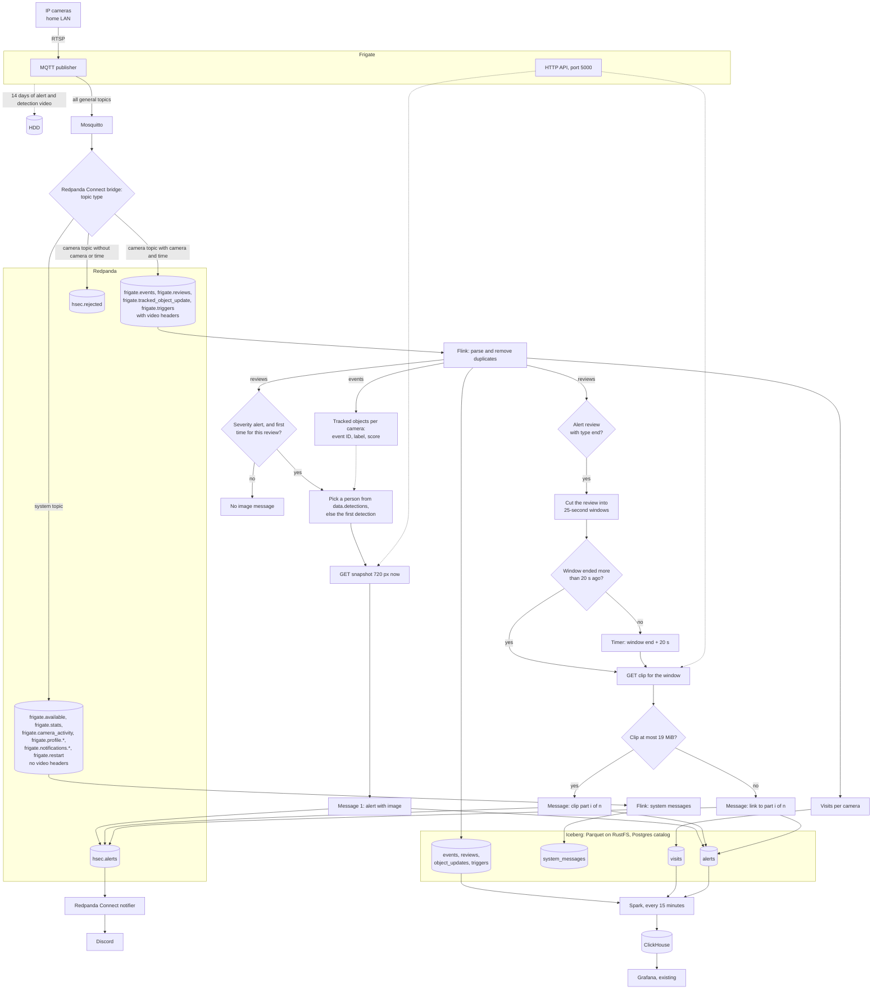

# Home security system: top-level design

- Status: draft for review
- Date: 2026-10-03
- Owner: Huy Le Nguyen
- Details: [specs.md](specs.md)

## Contents

- [Summary](#summary)
- [Goals and non-goals](#goals-and-non-goals)
- [Prerequisites](#prerequisites)
- [Architecture](#architecture)
- [Components](#components)
- [Data flow](#data-flow)
- [Data stores and retention](#data-stores-and-retention)
- [Freshness](#freshness)
- [Resource budget](#resource-budget)
- [Storage budget](#storage-budget)
- [Delivery guarantees](#delivery-guarantees)
- [Failure modes](#failure-modes)
- [Security and privacy](#security-and-privacy)
- [Decisions](#decisions)
- [Open questions](#open-questions)
- [References](#references)

## Summary

Cameras send video to Frigate. Frigate detects people and objects and recognizes household faces. It keeps the video of alerts and detections for 14 days.

All messages on the general Frigate MQTT topics go through Mosquitto (an MQTT broker) and Redpanda Connect into Redpanda. A Flink job cleans the events and groups them into visits. When Frigate marks a review item as an alert, Flink sends an alert with a snapshot image at once. When that review item ends, Flink sends its video as clip parts of up to 25 seconds. The notifier posts all of them to Discord. The same job writes all data to Iceberg tables, which are Parquet files on RustFS.

Every camera message in Redpanda carries a video reference: the camera and a time range. For 14 days, the Frigate clip API returns the video of that camera and time. System messages, such as Frigate stats, have no camera and no video reference.

Every 15 minutes, a Spark job reads the Iceberg tables, computes stats, and writes them to ClickHouse. The existing Grafana shows dashboards from ClickHouse.

Everything runs on the existing k3s cluster. Terraform deploys everything.

## Goals and non-goals

Goals:

1. Detect people and objects on every camera, and recognize household faces.
2. For each Frigate alert review, send a Discord alert with a snapshot image within seconds. After the review ends, send its video as clip parts of up to 25 seconds.
3. Capture every message on the general Frigate MQTT topics. Keep events, reviews, object updates, triggers, visits, alerts, and system messages as Iceberg tables in Parquet files. The `alerts` table keeps the image and the clip parts of each alert.
4. Keep the video of every alert and detection in Frigate for 14 days.
5. Give every camera message in Redpanda a reference to its video.
6. Show a timeline, an hourly activity heatmap, daily stats, and alerts in Grafana. Dashboard data is at most about 20 minutes old.
7. Keep no data longer than 30 days.
8. Deploy everything with Terraform. Test every custom part with unit tests.

Non-goals:

- Installing or changing the host, Fedora, k3s, or Grafana. See [Prerequisites](#prerequisites).
- Access from the internet. Remote access uses the existing WireGuard VPN.
- High availability. One node runs everything.
- Recovery of events that Frigate sends while Mosquitto is down.
- Alert feedback ("correct" or "wrong" labels) and alert precision stats.
- Continuous or motion recording. Only alert and detection video is kept.
- Video in Iceberg, except the clip parts of alert reviews.
- Filtering of household members. Frigate marks every person and every car as an alert by default, so household members also cause alerts.

## Prerequisites

This design needs the system below. It does not install or change these parts.

| Area | Requirement | How to make sure |
| --- | --- | --- |
| Host | Dell Vostro 3578 laptop with Fedora 44 (kernel 7.1), an Intel i5-8250U (4 cores, 8 threads), and 23.3 GiB of RAM. It runs all day. | `fastfetch` on the host |
| GPU | The Intel UHD 620, used directly through the host `i915` driver. The AMD Radeon R5 M435 stays unused, because ROCm does not support it [26]. | On the host, `ls -l /sys/class/drm/renderD*/device/driver` shows one render node with the `i915` driver. |
| Cluster | Single-node k3s directly on Fedora, with no VMs. Kubernetes 1.31 or newer. Fedora uses SELinux, so the `k3s-selinux` package is installed [27]. | `kubectl get nodes` shows one node. |
| Node memory | At least 14 GiB of memory is free for this project. Today, 3.2 GiB of the 23.3 GiB is in use. See [Resource budget](#resource-budget). | `free -h` on the host |
| Node CPU | The 8 CPU threads are shared with the Fedora desktop. The project requests up to 4.4 CPU. | `kubectl describe node <node>` |
| SSD storage class | An existing class on the 100 GB SSD, with at least 20 GiB free. The volumes are local to the node. The file system is XFS or ext4. | `kubectl get storageclass` and `df -T` on the host |
| HDD storage class | An existing class on the 1 TB HDD, with at least 300 GiB free. | `kubectl get storageclass` and `df -h` on the host |
| k3s features | The embedded network policy controller and ServiceLB are on. Both are k3s defaults [1]. | No `--disable-network-policy` and no `--disable=servicelb` in the k3s configuration. |
| Camera network | The cameras are on the same LAN as the node and use RTSP (TCP 554). Their internet access is blocked on the router. | `ffprobe rtsp://...` from the host |
| Node address | The node has a fixed LAN address, for example a DHCP reservation for 192.168.1.17. LAN clients and the alert links use it. | The DHCP page of the router |
| Internet | Pods can reach `discord.com` on TCP 443. Frigate downloads its face models on first start. | `curl -I https://discord.com` from a pod. |
| LAN access | LAN and WireGuard clients can reach the node address on ports 8971, 8554, and 8555. | Open `https://192.168.1.17:8971` from a LAN client. |
| Grafana | Existing Grafana with the `grafana-clickhouse-datasource` plugin. A service account token with the Admin role. | Grafana plugin list and service account page. |
| Admin machine | Terraform 1.16, kubectl, and Docker with `buildx`. A kubeconfig with cluster-admin rights. | `terraform version`, `kubectl auth can-i '*' '*'` |
| Image registry | A registry that the cluster can pull from, for the two custom images (Flink job and Spark job). | `docker push` from the admin machine and a test pull on the node. |
| Discord | A webhook URL for the alert channel. | Send a test message with `curl`. |

## Architecture

The system has five layers:

1. Capture: Frigate reads the cameras, runs detection on the UHD 620, and keeps alert and detection video for 14 days.
2. Ingestion: Mosquitto and the Redpanda Connect bridge copy every message on the general Frigate topics into Redpanda.
3. Stream processing: Flink removes duplicate messages, builds visits, and writes Iceberg tables. For each alert review, it sends an alert with an image at once, and the review video as clip parts after the review ends. The notifier sends them to Discord.
4. Lake and batch: Iceberg stores the tables as Parquet files on RustFS. Postgres holds the Iceberg catalog. Spark computes stats every 15 minutes and cleans the tables every night.
5. Serving: ClickHouse stores the stats. Grafana shows them.

## Components

The repository is a monorepo with one folder per app. Each app folder holds its code, its tests, and its Terraform module. See [Monorepo](specs.md#monorepo).

| Component | Version | Job | Namespace | Folder | Deployed with |
| --- | --- | --- | --- | --- | --- |
| Intel GPU device plugin | 0.37.1 | Gives the UHD 620 to the Frigate pod. | `intel-gpu-plugin` | `hsec-frigate` | Terraform `kubernetes` |
| Frigate | 0.18.0 | Detects, recognizes faces, keeps alert and detection video for 14 days, and publishes MQTT messages. | `hsec` | `hsec-frigate` | Terraform `kubernetes` |
| Mosquitto | 2.1.2 | Passes Frigate messages to the bridge. Queues them while the bridge is offline. | `hsec` | `hsec-mqtt` | Terraform `kubernetes` |
| Redpanda | 26.2.3 (chart 26.2.4) | Stores Frigate messages, system messages, and alerts for 7 days. | `hsec` | `hsec-redpanda` | Terraform `helm` |
| Redpanda Connect | 4.112.0 | Runs the MQTT bridge and the Discord notifier. | `hsec` | `hsec-redpanda` | Terraform `kubernetes` |
| Flink Kubernetes Operator | 1.16.1 | Runs and upgrades the Flink job. | `hsec` | `hsec-flink` | Terraform `helm` |
| Flink | 2.2.1 | Runs the stream job. | `hsec` | `hsec-flink` | Terraform `kubernetes_manifest` |
| Iceberg | 1.12.0 | Table format over Parquet files. A library inside the Flink and Spark images. | not a pod | `hsec-flink` (table schemas) | Container images |
| RustFS | 1.0.1 (chart 1.0.1) | S3-compatible object store for Iceberg files and Flink checkpoints. | `hsec` | `hsec-rustfs` | Terraform `helm` |
| Postgres | 18.6 | Stores the Iceberg JDBC catalog. | `hsec` | `hsec-iceberg` | Terraform `kubernetes` |
| Spark Operator | 2.5.2 | Runs the Spark job on a schedule. | `hsec` | `hsec-spark` | Terraform `helm` |
| Spark | 4.0.4 | Computes stats and cleans the Iceberg tables. | `hsec` | `hsec-spark` | Terraform `kubernetes_manifest` |
| ClickHouse | 26.3.39.7 (LTS) | Stores the stats for the dashboards. | `hsec` | `hsec-clickhouse` | Terraform `kubernetes` |
| Grafana | existing | Shows the dashboards. This design adds one data source and four dashboards. | existing | `hsec-clickhouse` | Terraform `grafana` |

## Data flow

1. Frigate reads the camera streams. It decodes video on the UHD 620 and detects objects with OpenVINO on the same GPU.
2. Frigate publishes messages on its general MQTT topics, such as `frigate/events`, `frigate/reviews`, and `frigate/stats` [6].
3. The Redpanda Connect bridge reads all general topics and writes each message unchanged to a Redpanda topic of the same name. It adds the video reference as record headers to camera messages. System messages get no video headers. A camera message without a camera or a time goes to the topic `hsec.rejected`.
4. The Flink job reads all Frigate topics. It removes duplicate messages and writes them to the Iceberg tables `events`, `reviews`, `object_updates`, `triggers`, and `system_messages`.
5. The Flink job groups person activity per camera into visits and writes them to the `visits` table.
6. When a review item becomes an alert, Flink picks a person from the review, or else its first tracked object. It downloads the snapshot of that object at once and sends message 1 with the image.
7. When the alert review ends, Flink cuts the review into 25-second windows. It downloads the clip of each window as soon as Frigate finishes that video, and sends one message per window.
8. Flink writes all alert messages to the `hsec.alerts` topic and to the `alerts` table.
9. The notifier reads `hsec.alerts` and posts each message to the Discord webhook, with its image or clip attached.
10. Every 15 minutes, Spark reads the last 48 hours from Iceberg. It computes five tables and writes them to ClickHouse. It never reads the image or the clip columns.
11. Grafana queries ClickHouse.
12. Every night, the first Spark run after 03:00 also deletes old Iceberg data and merges small files.

## Data stores and retention

No store keeps data longer than 30 days, except the Frigate face library and the Iceberg catalog pointers.

| Store | Data | Retention | Disk |
| --- | --- | --- | --- |
| Frigate media | Alert and detection video, snapshots | Video: 14 days. Snapshots: 30 days. | HDD |
| Frigate database | Tracked objects, face library | Tracked objects follow the media retention. The face library has no time limit. | SSD |
| Mosquitto | Queue for the offline bridge | Until the bridge receives it | SSD |
| Redpanda | Frigate messages, system messages, alerts with images and clips, rejected messages | 7 days | SSD |
| Iceberg (RustFS) | Events, reviews, object updates, triggers, system messages, visits, alerts with images and clips | Today plus the 27 days before. Deleted files leave the disk within 30 days. | HDD |
| Flink checkpoints (RustFS) | Job state | Last 3 checkpoints | HDD |
| Postgres | Iceberg catalog pointers | No time limit. It holds no camera data. | SSD |
| ClickHouse | Objects, visits, alerts, hourly and daily stats | 29 days | HDD |
| Discord | Alert messages | Outside this system | none |

[specs.md](specs.md#retention-and-maintenance) explains the retention math.

## Freshness

| Path | Delay |
| --- | --- |
| Alert image to Discord | A few seconds after Frigate marks the review item as an alert |
| Alert clip parts to Discord | When the review ends for earlier parts. 20 seconds after its window ends for the last part. |
| Data in Iceberg | Up to 1 minute (one Flink checkpoint) |
| Data in ClickHouse and Grafana | Up to about 20 minutes (15-minute schedule plus the run time) |

## Resource budget

All values are starting values. Measure them with `kubectl top pod` after one week and adjust. Memory requests equal memory limits, so the scheduler never overcommits memory.

| Pod | Memory | CPU request | Runs |
| --- | --- | --- | --- |
| Frigate | 3 GiB | 1 | Always |
| Redpanda | 2.5 GiB | 1 | Always |
| ClickHouse | 1.5 GiB | 0.25 | Always |
| Flink TaskManager | 1.5 GiB | 0.5 | Always |
| Flink JobManager | 768 MiB | 0.25 | Always |
| Flink operator | 512 MiB | 0.1 | Always |
| RustFS | 512 MiB | 0.1 | Always |
| Postgres | 512 MiB | 0.1 | Always |
| Spark operator | 256 MiB | 0.1 | Always |
| Redpanda Connect bridge | 128 MiB | 0.05 | Always |
| Redpanda Connect notifier | 256 MiB | 0.05 | Always |
| Mosquitto | 64 MiB | 0.05 | Always |
| Intel GPU plugin | 64 MiB | 0.05 | Always |
| Spark driver | 1 GiB | 0.25 | Every 15 minutes |
| Spark executor | 1 GiB | 0.5 | Every 15 minutes |

Totals:

- All day: about 11.5 GiB of memory and 3.6 CPU.
- While Spark runs: about 13.5 GiB of memory and 4.4 CPU.
- The machine has 23.3 GiB. Today, Fedora, the desktop, k3s, and the pods that run now use 3.2 GiB. With the 13.5 GiB peak of this project, about 6.5 GiB stays free.
- A clip part is at most 19 MiB. The Flink TaskManager and the notifier each hold a few copies of one part in memory, so they get extra memory. Flink downloads at most 2 clip parts at a time.

## Storage budget

SSD volumes:

| Volume | Size | Expected use |
| --- | --- | --- |
| Redpanda | 10 GiB | Up to 6.3 GiB, limited by topic retention (1 GiB of it for alerts with clips) |
| Frigate configuration | 5 GiB | 2 to 4 GiB (models and database) |
| Postgres | 2 GiB | Under 100 MiB |
| Mosquitto | 1 GiB | Under 100 MiB |
| Total | 18 GiB | About 9 GiB |

HDD volumes:

| Volume | Size | Expected use |
| --- | --- | --- |
| Frigate media | 200 GiB | 14 days of alert and detection video (about 32 GB at 1x), and 30 days of snapshots. See [Video volume](#video-volume). |
| RustFS | 400 GiB data and 1 GiB logs | About 32 GB at 1x, mostly alert clips |
| ClickHouse | 5 GiB | Under 1 GiB |
| Total | 606 GiB of the 1 TB HDD | About 70 GB at 1x |

ClickHouse on the HDD:

- Spark inserts every 15 minutes. Each insert makes small parts, which ClickHouse merges in the background.
- The tables stay under 1 GiB, so the page cache of the node can hold the data that the dashboards read.
- A query that misses the page cache waits for the disk, so the first dashboard load after a quiet period can be slower.

RustFS on the HDD:

- Flink writes a few small files per minute, and Spark reads the last 48 hours every 15 minutes. These are a few MB, so the HDD handles them.
- Before the nightly compaction, the current day has up to 1,440 small files per table. Each Spark run reads them, and every read needs a disk seek.
- If Spark runs get slow, raise the Flink checkpoint interval from 1 minute to 5 minutes. That gives 5 times fewer files, but Iceberg data is then up to 5 minutes old.

### Video volume

These numbers are estimates. Measure the real numbers after launch.

- 2 cameras at 4 Mbit/s.
- 100 review items per day, with an average length of 45 seconds.
- One review item gives 45 s x 4 Mbit/s / 8 = 22.5 MB of video.
- Half of the review items are alerts, so 50 alerts per day. Each alert sends its whole review video as clip parts.

| Load | Frigate video per day | Frigate video in 14 days | Alert clips per day | Alert clips in Iceberg (28 days) |
| --- | --- | --- | --- | --- |
| 1x | 2.25 GB | About 32 GB | About 1.1 GB | About 32 GB |
| 10x | 22.5 GB | About 315 GB | About 11 GB | About 315 GB |

- At 10x, the video takes about 630 GB of the 1 TB HDD.
- A 25-second clip part stays under 19 MiB for a record stream of up to about 6 Mbit/s. A larger part goes to Discord as a link.
- At 1x, Discord gets about 150 messages per day: one image and about two clip parts per alert.
- If free space gets low, Frigate deletes its oldest video [2].

## Delivery guarantees

"At least once" means that each message arrives one or more times. "Exactly once" means that each message arrives one time.

| Step | Guarantee | Gap |
| --- | --- | --- |
| Frigate to Mosquitto | At least once, while Mosquitto runs | If Mosquitto is down, Frigate drops the messages [3]. |
| Mosquitto to bridge | At least once | Mosquitto queues up to 10000 messages for the offline bridge. |
| Bridge to Redpanda | At least once | If the bridge crashes, it loses the few messages in progress [4]. A camera message without a camera or a time goes to `hsec.rejected`, not to the Frigate topics. |
| Redpanda to Iceberg (Flink) | Exactly once for each Redpanda message | Flink commits Iceberg data and Redpanda offsets together in each checkpoint. Flink removes repeated messages from the earlier steps. |
| Flink to `hsec.alerts` | At least once | Flink sends alert messages without a wait for the checkpoint. After a Flink restart, a message can repeat. If the image download fails, message 1 goes out without the image. If a clip download fails, that part goes out as a link. |
| Notifier to Discord | At least once | The notifier retries on HTTP 429 and on errors. |
| Iceberg to ClickHouse (Spark) | Repeatable | Each run computes the last 48 hours again. ClickHouse keeps only the newest version of each row. |

## Failure modes

Kubernetes restarts each failed pod. The table shows what else happens.

| Failure | Effect | Recovery |
| --- | --- | --- |
| The node stops (power cut or reboot) | Everything stops. No video and no alerts. | Fedora starts k3s again, and all pods start again. Events from the gap are lost. |
| Frigate stops | No detection, video, or events. | The pod restarts. |
| Mosquitto stops | Frigate drops event messages. Recording continues. | The pod restarts and loads its saved queue. |
| A clip part is above 19 MiB | That part goes to Discord as a link to the Frigate clip. | Lower the bitrate of the camera record stream. |
| Redpanda stops | The bridge waits. Mosquitto queues messages. Flink waits. | The pod restarts. All parts continue. |
| Flink job fails | No alerts and no Iceberg writes. Redpanda keeps the messages for 7 days. | The operator restarts the job from the last checkpoint. Waiting clip timers are part of the checkpoint, so they fire after the restart. |
| RustFS or Postgres stops | Flink checkpoints fail, and the job restarts until the store is back. Spark runs fail. | The pod restarts. Flink continues from the last checkpoint. |
| A Spark run fails | ClickHouse data gets older. | The next run, 15 minutes later, computes the last 48 hours again. |
| ClickHouse stops | Spark runs fail. Dashboards show no data. | The pod restarts. The next Spark run fills the gap. |
| Discord is down or limits requests | Alerts wait in Redpanda. | The notifier retries until Discord accepts them. |
| The Frigate API does not answer | Message 1 goes out without an image, and clip parts go out as links. | No action. When the API answers again, alerts have images and clips again. |
| The Intel GPU is missing | The Frigate pod stays `Pending`, because it requests the GPU. | Fix the `i915` driver or the GPU plugin. Or move detection to the CPU and remove the GPU request. |
| The SSD is full | Writes fail in Redpanda and Postgres. | Free space. The volume sizes keep this project under 18 GiB. |
| The HDD is full | Frigate deletes its oldest video [2]. Until it frees space, RustFS and ClickHouse writes fail. Flink checkpoints fail and the job restarts, and Spark runs fail. | Lower the retention days or add disk space. |

## Security and privacy

- Cameras: the cameras are on the home LAN. Block their internet access on the router, so that they cannot send video out. Do not open router ports. Use the WireGuard VPN for remote access.
- Network policies: the `hsec` namespace accepts traffic from other namespaces only on a few listed ports. Inside the namespace, pods can reach each other, except for the Frigate port 5000. See [specs.md](specs.md#network-policies).
- Frigate: the UI on port 8971 needs a login. Port 5000 has no login and gives admin access [5]. The Service `frigate-api` exposes it inside the cluster for the Flink job. A network policy allows only the Flink TaskManager pod to reach it.
- Passwords: Terraform creates random passwords for all internal users. You give only the Discord webhook URL, the camera RTSP password, and the Grafana token.
- Terraform state: the state holds all passwords in plain text. It lives in a Kubernetes Secret, not in git. `.gitignore` must exclude `*.tfvars` and `.terraform/`.
- Shared key: Flink and Spark share one RustFS key. This is an accepted risk for a home lab with one admin.
- ClickHouse: the `default` user accepts only local connections. Grafana uses a read-only user.
- Discord: anyone with the webhook URL can post to the channel. Keep it secret. Alerts contain the camera name, the time, the zones, a snapshot image, and the video of each alert review, household members included. These files leave the home network and stay on Discord, outside the 30-day retention.
- Video: Frigate holds alert and detection video for 14 days, behind its login. The `alerts` table holds the alert clips for up to 30 days. Anyone with the RustFS key can read them.
- Face data: store faces of household members only. Encrypt the HDD, for example with LUKS.
- People: tell household members and guests about the cameras.

## Decisions

### ADR-1: Keep an MQTT broker between Frigate and Redpanda

- Context: Frigate has no Kafka output. It sends events by MQTT and by a WebSocket on port 5000, which has no login.
- Decision: Frigate publishes to Mosquitto. Redpanda Connect reads from Mosquitto.
- Alternatives:
  - Read the WebSocket. Nothing queues the messages, so the bridge loses events while it is down.
  - A custom Go plugin for Redpanda Connect.
  - A Frigate fork with a Kafka output.
- Consequences: one more small pod. MQTT is the integration that Frigate documents [6].

### ADR-2: Stock Redpanda Connect for the bridge and the notifier

- Context: both jobs only move and reshape messages.
- Decision: two Redpanda Connect pods, each with one YAML pipeline. They use only "certified" components, which need no enterprise license [7].
- Alternatives: Kafka Connect (needs a Java worker), or custom Python code.
- Consequences: no custom code to maintain. Unit tests run with `rpk connect test`.

### ADR-3: Terraform for everything, in two stages

- Context: you want all deployment code in plain Terraform. During the plan, the `kubernetes_manifest` resource reads the cluster [8]. So the operator CRDs must exist before the plan that uses them.
- Decision:
  - Each `hsec-*` app folder has its own Terraform module.
  - The root `deploy/platform` creates the namespaces and calls the GPU plugin and operator modules.
  - The root `deploy/apps` creates the passwords and the network policies, and calls the app modules.
  - Own apps use plain `kubernetes_*` resources. Charts that ship operators or CRDs, and the Redpanda and RustFS charts, use `helm_release`.
- Alternatives:
  - One Terraform root per app folder. That means about ten applies in a fixed order, and passwords must move between states.
  - One stage with `-target` flags.
  - No Helm at all. That means rewriting each chart by hand.
- Consequences: two `terraform apply` runs on a fresh cluster. Each app keeps its deployment code next to its own code.

### ADR-4: Iceberg with a JDBC catalog in Postgres

- Context: Flink and Spark both write to the same tables. Iceberg needs a catalog that commits each change atomically. The Hadoop catalog is not safe for concurrent writes on S3 [9].
- Decision: the Iceberg JDBC catalog, stored in Postgres [10].
- Alternatives: Lakekeeper, Polaris, or Nessie (one more service), or Hive Metastore (a heavy service plus its own database).
- Consequences: one small Postgres pod. Only Flink and Spark can open the tables. Other tools must read the Parquet files through Iceberg metadata.

### ADR-5: Spark writes stats to ClickHouse every 15 minutes

- Context: you chose that ClickHouse does not read Iceberg, and that Spark moves the data.
- Decision: a Spark job every 15 minutes computes the last 48 hours and writes five ClickHouse tables. ClickHouse keeps only the newest version of each row.
- Alternatives: nightly or hourly runs (staler dashboards), or Spark streaming (2 GiB of memory all day).
- Consequences: dashboards are up to about 20 minutes old. Spark is 4.0.4, because the ClickHouse Spark connector supports Spark only up to 4.0 [11] and Iceberg 1.12 supports Spark 3.5 to 4.1 [12].

### ADR-6: Flink 2.2.1 with Java DataStream code

- Context: Iceberg 1.12 supports Flink 2.2 and 2.3 [12]. The newest Flink Kafka connector (5.0.0) supports Flink 2.1 and 2.2 only [13].
- Decision: Flink 2.2.1. The alert logic uses keyed state and processing-time timers in the DataStream API.
- Alternatives: Flink CEP or Flink SQL `MATCH_RECOGNIZE`. Both work, but timers need less code for the review state and the clip windows.
- Consequences: one Java project with JUnit tests.

### ADR-7: Redpanda with fsync on

- Context: `--mode dev-container` turns off fsync [14]. A power loss can then delete acknowledged messages.
- Decision: the Helm chart in its normal mode, with one broker, one core, and 2.5 GiB of memory.
- Consequences: Redpanda needs 2 GB of memory for its core [15].

### ADR-8: Frigate configuration is seeded once

- Context: Frigate 0.18 can edit its configuration file from its web UI. You draw zones and masks in the UI.
- Decision: if `config.yml` does not exist, an init container copies a starting file from Terraform. After that, the Frigate UI owns the file on the SSD volume.
- Alternatives: Terraform owns the file and mounts it read-only. Then UI edits fail, and you must copy zone coordinates into Terraform by hand.
- Consequences: Terraform changes to the starting configuration do not reach a running system. Back up `config.yml` after UI changes.

### ADR-9: Detection on the UHD 620, with a CPU fallback

- Context:
  - k3s runs directly on Fedora, so pods can use the host GPUs without a VM layer.
  - The host has an Intel UHD 620 (Gen 9.5) and an AMD Radeon R5 M435. OpenVINO supports Intel GPUs from 6th Gen [16].
  - The Frigate ROCm detector needs an AMD GPU that ROCm supports. The current ROCm release supports only much newer chips than the R5 M435 [26].
- Decision:
  - The OpenVINO detector on `GPU`, and VAAPI video decode (`preset-vaapi`) [17], both on the UHD 620. Face recognition uses the `small` model on the CPU [18].
  - The Intel GPU plugin gives Frigate only the Intel render node. If Frigate sees one render node, it uses that node [28].
  - The AMD GPU stays unused.
- Alternatives:
  - The ROCm detector on the AMD GPU. ROCm does not support it.
  - Detection on the CPU. It works, but it uses much more CPU. If the GPU fails, the CPU is the fallback.
- Consequences: on the first start, make sure that Frigate shows the GPU detector in its system page.

### ADR-10: Retention of 30 days or less

- Context: you set a maximum retention of 30 days.
- Decision: Frigate keeps alert and detection video for 14 days and snapshots for 30 days. Redpanda keeps messages and alerts for 7 days. Iceberg keeps today plus the 27 days before, and old Iceberg snapshots expire after 1 day. ClickHouse keeps 29 days.
- Consequences: Iceberg tables show 28 days, which is shorter than the 30-day limit, so that deleted files also leave the disk in time.

### ADR-11: Alerts from Frigate alert reviews, with the image first and clip parts later

- Context:
  - You want an alert for every Frigate review item with severity `alert`, with no custom rules and no media exporter.
  - You want the image at once, and the clip without a fixed wait. Video that is not ready yet goes out later.
  - Frigate builds each clip from its own recording segments [19]. It writes recordings in 10-second segments, and its clip API serves only finished segments. So the newest 10 to 17 seconds are not ready yet.
  - Discord accepts files of up to 20 MiB by default [23]. A review can be several minutes long.
- Decision:
  - Frigate keeps alert and detection video for 14 days. It is the only full store of video.
  - Message 1: when a review becomes an alert, Flink picks a person from the review, or else its first tracked object. It downloads the 720-pixel snapshot of that object at once [25].
  - Clip parts: when the alert review ends, Flink cuts it into 25-second windows. It downloads each window 20 seconds after the window ends, so every part is complete. Windows that ended earlier go out at once. Each part is one message.
  - A part above 19 MiB goes to Discord as a link to the Frigate clip.
  - The topic `hsec.alerts` allows messages of up to 32 MiB (`max.message.bytes`) [21]. This is under the default request limit of 100 MiB [20], so no Redpanda cluster setting changes.
- Alternatives:
  - The two custom rules (unknown face at night, loitering unknown). They filtered out household members, but you chose every alert review.
  - One message at the end of the review. The alert then arrives only after the person leaves.
  - The review clip at once. It misses the newest 10 to 17 seconds, and it fails right after the review starts.
  - The review thumbnail from `thumb_path`, or the event thumbnail. Both are under 180 pixels high, too small to recognize a face.
  - A media exporter, a low-resolution preview clip, or a clip pointer in RustFS (the "claim check" pattern [22]).
- Consequences:
  - Household members also cause alerts, because Frigate marks every person and every car as an alert by default.
  - At 1x, Discord gets about 150 messages per day. A long review sends one message per 25 seconds of video.
  - Iceberg keeps the video of all alert reviews for 28 days, about 32 GB at 1x.

### ADR-12: Video references on all camera messages

- Context: you want every message in Redpanda to reference its video. The system topics (`available`, `stats`, `camera_activity`, `profile`, `notifications`, `restart`) have no camera and no time.
- Decision:
  - The video reference is the camera and a time range. The bridge adds it to every camera message as the record headers `video_camera`, `video_from`, and `video_to`. Flink adds the same headers to its alert messages.
  - `frigate/triggers` has a camera but no time. For its headers, the bridge uses its own receive time.
  - System messages go to their own topics without video headers.
  - For 14 days, the Frigate clip API returns the video of a camera and a time range [19].
  - Review items on one camera never overlap [24], and by default every tracked object is part of a review item. So the video of every tracked object is in Frigate.
  - A camera message without a camera or a time goes to the topic `hsec.rejected`.
- Alternatives:
  - An exact review ID on each message. This needs a stateful join of events to reviews, and events must wait for their review.
  - One video per tracked object. Objects in view at the same time store the same footage several times.
- Consequences:
  - The Frigate payloads stay unchanged. The references live in the record headers.
  - A reference older than 14 days finds no video.
  - Snapshot images and alert clips leave the home network through Discord.

## Open questions

1. How many cameras are there, and what are their RTSP URLs, resolutions, and bitrates? A 25-second clip part must stay under 19 MiB, so each record stream can use up to about 6 Mbit/s.
2. What are the names of the SSD and HDD storage classes?
3. Which image registry can the cluster pull from?
4. What are the Grafana URL and namespace, and is the ClickHouse plugin installed?
5. Which Kubernetes version does the k3s cluster run?

## References

[1] K3s, "Networking Services," K3s Documentation. Accessed: Oct. 3, 2026. [Online]. Available: https://docs.k3s.io/networking/networking-services

[2] Frigate, "Recording," Frigate Documentation. Accessed: Oct. 3, 2026. [Online]. Available: https://docs.frigate.video/configuration/record

[3] Frigate contributors, "`frigate/comms/mqtt.py`," GitHub. Accessed: Oct. 3, 2026. [Online]. Available: https://github.com/blakeblackshear/frigate/blob/master/frigate/comms/mqtt.py

[4] Redpanda Data, "`internal/impl/mqtt/input.go`," Redpanda Connect, GitHub. Accessed: Oct. 3, 2026. [Online]. Available: https://github.com/redpanda-data/connect/blob/main/internal/impl/mqtt/input.go

[5] Frigate, "Authentication," Frigate Documentation. Accessed: Oct. 3, 2026. [Online]. Available: https://docs.frigate.video/configuration/authentication

[6] Frigate, "MQTT," Frigate Documentation. Accessed: Oct. 3, 2026. [Online]. Available: https://docs.frigate.video/integrations/mqtt

[7] Redpanda Data, "`internal/plugins/info.csv`," Redpanda Connect, GitHub. Accessed: Oct. 3, 2026. [Online]. Available: https://github.com/redpanda-data/connect/blob/main/internal/plugins/info.csv

[8] HashiCorp, "kubernetes_manifest," Terraform Kubernetes Provider Documentation. Accessed: Oct. 3, 2026. [Online]. Available: https://registry.terraform.io/providers/hashicorp/kubernetes/latest/docs/resources/manifest

[9] Apache Iceberg, "Java API Quickstart," Iceberg Documentation. Accessed: Oct. 3, 2026. [Online]. Available: https://iceberg.apache.org/docs/latest/java-api-quickstart/

[10] Apache Iceberg, "JDBC," Iceberg Documentation. Accessed: Oct. 3, 2026. [Online]. Available: https://iceberg.apache.org/docs/latest/jdbc/

[11] ClickHouse, "Spark Connector," ClickHouse Documentation. Accessed: Oct. 3, 2026. [Online]. Available: https://clickhouse.com/docs/integrations/apache-spark/spark-native-connector

[12] Apache Iceberg, "Multi-Engine Support," Iceberg Documentation. Accessed: Oct. 3, 2026. [Online]. Available: https://iceberg.apache.org/multi-engine-support/

[13] Apache Software Foundation, "flink-connector-kafka," Maven Central. Accessed: Oct. 3, 2026. [Online]. Available: https://repo1.maven.org/maven2/org/apache/flink/flink-connector-kafka/

[14] Redpanda Data, "rpk redpanda mode," Redpanda Documentation. Accessed: Oct. 3, 2026. [Online]. Available: https://docs.redpanda.com/current/reference/rpk/rpk-redpanda/rpk-redpanda-mode/

[15] Redpanda Data, "Requirements and Recommendations," Redpanda Documentation. Accessed: Oct. 3, 2026. [Online]. Available: https://docs.redpanda.com/current/deploy/redpanda/manual/production/requirements/

[16] Frigate, "Object Detectors," Frigate Documentation. Accessed: Oct. 3, 2026. [Online]. Available: https://docs.frigate.video/configuration/object_detectors

[17] Frigate, "Video Decoding," Frigate Documentation. Accessed: Oct. 3, 2026. [Online]. Available: https://docs.frigate.video/configuration/hardware_acceleration_video

[18] Frigate, "Face Recognition," Frigate Documentation. Accessed: Oct. 3, 2026. [Online]. Available: https://docs.frigate.video/configuration/face_recognition

[19] Frigate contributors, "`frigate/api/media.py`," GitHub. Accessed: Oct. 3, 2026. [Online]. Available: https://github.com/blakeblackshear/frigate/blob/master/frigate/api/media.py

[20] Redpanda Data, "Cluster Configuration Properties," Redpanda Documentation. Accessed: Oct. 3, 2026. [Online]. Available: https://docs.redpanda.com/current/reference/properties/cluster-properties/

[21] Redpanda Data, "Topic Configuration Properties," Redpanda Documentation. Accessed: Oct. 3, 2026. [Online]. Available: https://docs.redpanda.com/current/reference/properties/topic-properties/

[22] G. Hohpe and B. Woolf, "Claim Check," in Enterprise Integration Patterns. Boston, MA, USA: Addison-Wesley, 2003. [Online]. Available: https://www.enterpriseintegrationpatterns.com/patterns/messaging/StoreInLibrary.html

[23] Discord, "API Reference: Uploading Files," Discord Developer Documentation. Accessed: Oct. 4, 2026. [Online]. Available: https://docs.discord.com/developers/reference

[24] Frigate, "Review," Frigate Documentation. Accessed: Oct. 4, 2026. [Online]. Available: https://docs.frigate.video/configuration/review

[25] Apache Flink, "Asynchronous I/O for External Data Access," Flink 2.2 Documentation. Accessed: Oct. 4, 2026. [Online]. Available: https://nightlies.apache.org/flink/flink-docs-release-2.2/docs/dev/datastream/operators/asyncio/

[26] AMD, "System Requirements (Linux)," ROCm Documentation. Accessed: Oct. 4, 2026. [Online]. Available: https://rocm.docs.amd.com/projects/install-on-linux/en/latest/reference/system-requirements.html

[27] K3s, "Advanced Options and Configuration: SELinux Support," K3s Documentation. Accessed: Oct. 4, 2026. [Online]. Available: https://docs.k3s.io/advanced#selinux-support

[28] Frigate contributors, "`frigate/ffmpeg_presets.py`," GitHub. Accessed: Oct. 4, 2026. [Online]. Available: https://github.com/blakeblackshear/frigate/blob/master/frigate/ffmpeg_presets.py
