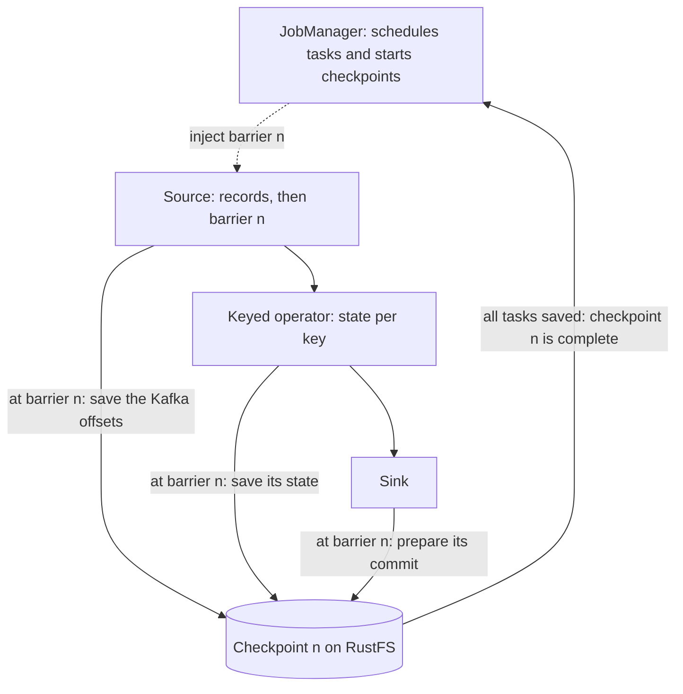
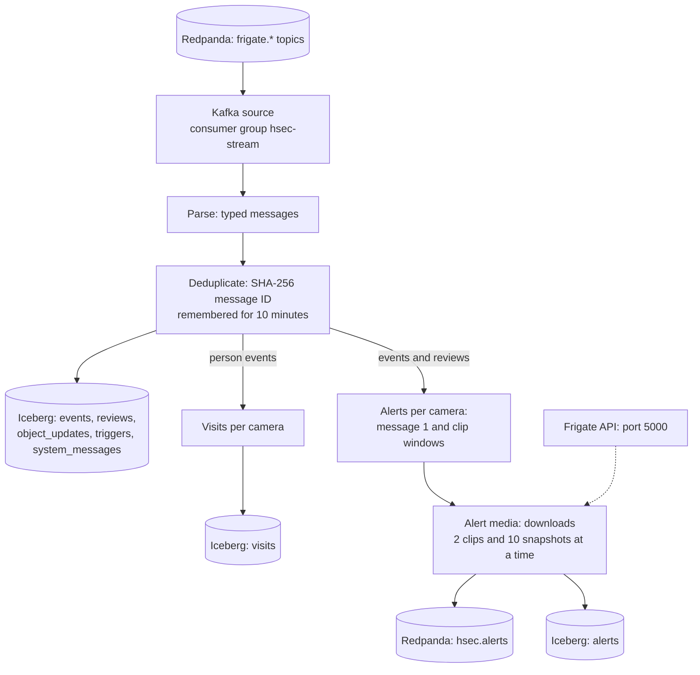

# hsec-app-flink

Flink 2.2.1 runs the stream job `hsec-stream`. The job reads every Frigate message from Redpanda, writes the Iceberg tables, builds visits, and sends alerts with an image and the review video. The Flink Kubernetes Operator 1.16.1 runs and upgrades the job.

## Base knowledge

Apache Flink is an engine for stateful computations over data streams [1]. A Flink job is a dataflow graph: sources read records, operators change or combine them, and sinks write them out. A stream job does not end. It handles each record as soon as it arrives. It keeps state between records, such as the open reviews of each camera.



### Terms

| Term | Meaning |
| --- | --- |
| JobManager | Coordinates the job. It schedules the tasks, starts the checkpoints, and restarts the job after a failure [2]. |
| TaskManager | A worker process. Its task slots run the tasks of the job [2]. |
| Operator and task | An operator is one step of the graph. A task is one parallel copy of one or more operators. |
| Operator chaining | Flink joins neighbor operators into one task, so records pass by a method call instead of over the network. |
| Keyed stream | A stream split by a key, such as the camera. All records with one key go to the same task. |
| Keyed state | Values that an operator keeps per key. Flink saves and restores them for the operator [3]. |
| State backend | Where the state lives: on the Java heap (`hashmap`) or in RocksDB on the local disk. |
| Checkpoint | A consistent copy of all state and all source positions, which Flink makes while the job runs [4]. |
| Barrier | A marker that the sources put into the stream. When an operator sees barrier n, it saves its state for checkpoint n. This is a variant of the Chandy-Lamport snapshot algorithm [4], [5]. |
| Exactly-once state | After a failure, Flink restores the last checkpoint and rewinds the sources to its offsets. So each record changes the state exactly once [3]. |
| Processing time and event time | Processing time is the clock of the machine. Event time is the time inside the record. Event time needs watermarks, which mark how far the data got in event time [6], [7]. |
| Timer | A callback at a set time for one key, for example 5 minutes after the last person left. |
| Async I/O | Lets an operator wait for many external calls at the same time, instead of one call after the other [8]. |
| Savepoint | A checkpoint that you start by hand, for example before an upgrade. |

### In this project

- The job runs with parallelism 1 on one TaskManager with one slot. The data volume of a home is small.
- Three operators are keyed: the duplicate filter by message ID, and visits and alerts by camera.
- The state is small, so it lives on the heap. A checkpoint every 60 seconds copies it to the bucket `hsec-flink` on RustFS.
- The Iceberg sink writes files all the time. It commits them only after a checkpoint completes. So each row lands in Iceberg exactly once, even after a restart.
- The Kafka sink to `hsec.alerts` uses at-least-once delivery, so that alerts leave without waiting for a checkpoint. After a restart, Discord can show an alert twice.
- The timers use processing time, not event time. Even without a new message, a timer must fire, for example 5 minutes after the last person left.
- The media downloads use ordered async I/O, so message 1 of a review always leaves before its clip parts. See [Alerts](#alerts).
- The Flink Kubernetes Operator runs the job from the FlinkDeployment. With `upgradeMode: last-state`, an upgrade continues from the latest checkpoint [9].

## How it works



| Step | What it does |
| --- | --- |
| Source | Reads all `frigate.*` topics. It starts from the committed offsets, or from the earliest offset on the first run. |
| Parse | Turns JSON into typed messages. A system message keeps its topic and its raw text. A camera message that does not parse increases the metric `parseFailures`, goes to the log, and leaves the stream. |
| Deduplicate | The message ID is the SHA-256 of the topic and the raw bytes. A message with an ID seen in the last 10 minutes leaves the stream. |
| Raw tables | Appends each message to its Iceberg table. |
| Visits | A visit is a period of person activity on one camera. If no new person comes in for 5 minutes after the last person leaves, the visit ends. |
| Alerts | Joins events and reviews by camera, and asks the media step for message 1 and for each clip window. |
| Alert media | Downloads the files from Frigate, builds the alert messages, and writes them to `hsec.alerts` and to the Iceberg table `alerts`. |

## Alerts

Message 1 (`kind: start`):

1. A review message with the severity `alert` arrives, and the job has not alerted on this review yet.
2. From the review detections, the job picks the person with the highest top score. If no person is known, it picks the first detection.
3. The media step downloads the snapshot of that object: 720 pixels high, with its bounding box. It waits at most 5 seconds and accepts at most 1 MiB.

Clip parts (`kind: clip`):

1. When the alert review ends, the job cuts the review time into windows of 25 seconds. The last window can be shorter, and a review always has at least one window.
2. Frigate needs up to about 17 seconds to finish and store a recording segment. So a window is ready 20 seconds after it ends.
3. A window that is already ready goes to the media step at once. The others wait for a processing-time timer, which is part of each checkpoint.
4. The media step downloads the clip of the exact window. It waits at most 30 seconds and accepts at most 19 MiB. A bigger part goes out with only a Frigate link.

The media step keeps the order of the requests. So message 1 of a review always leaves before its clip parts. If a download fails, the message still goes out without the file.

Each alert message has the key `alert_id` and the headers `video_camera`, `video_from`, and `video_to`. Times in the JSON and in the headers are Unix seconds with 6 decimals. The JSON fields are `alert_id`, `kind`, `review_id`, `camera`, `review_start`, `video`, and the fields of its kind:

- `start`: `severity`, `objects`, `sub_labels`, `zones`, `event_id`, `fired_ts`, `snapshot_url`, and `image_jpeg` in base64, or null.
- `clip`: `part`, `part_count`, `clip_url`, and `clip_mp4` in base64, or null.

## State and checkpoints

- The state is small, so it lives on the JVM heap (`hashmap` state backend).
- A checkpoint every 60 seconds saves the state and the Kafka offsets to the bucket `hsec-flink` on RustFS. Iceberg commits once per checkpoint, so new rows appear in the tables within about 1 minute.
- Kubernetes high availability and `upgradeMode: last-state` let the job continue from its last checkpoint after a crash or an upgrade.
- The job never creates or changes tables. The migrations in `hsec-db-iceberg` create them. If a table is missing, the job fails at start.
- The Iceberg sinks do not shuffle by range. The migration sort order sets `write.distribution-mode=range`, but one writer does not need it, and the nightly Spark compaction sorts the files.

## Arguments

The FlinkDeployment passes these program arguments:

| Argument | Value |
| --- | --- |
| `--timezone` | The Terraform variable `timezone`, for the alert time |
| `--frigate-url` | The Terraform variable `frigate_url`, for the links in alerts |
| `--frigate-api` | `http://frigate-api.<namespace>.svc.cluster.local:5000` |
| `--kafka-bootstrap` | `redpanda-0.redpanda.<namespace>.svc.cluster.local:9093` |
| `--catalog-uri` | `jdbc:postgresql://postgres.<namespace>.svc.cluster.local:5432/iceberg_catalog` |
| `--warehouse` | `s3://hsec-lake/warehouse` |
| `--s3-endpoint` | `http://rustfs-svc.<namespace>.svc.cluster.local:9000` |

The Secret `flink-env` gives `POSTGRES_ICEBERG_PASSWORD`, `RUSTFS_ACCESS_KEY`, and `RUSTFS_SECRET_KEY` as environment variables. The checkpoint file system reads the RustFS keys only from the Flink configuration. So the module reads them from the Secret `rustfs-root` and puts them into the FlinkDeployment.

## Kubernetes objects

| Object | Name | Purpose |
| --- | --- | --- |
| Helm release | `flink-kubernetes-operator` | The operator, 512 MiB, CPU request 0.1. It watches only the app namespace and has no webhook. |
| Helm release | `hsec-stream` | The local chart `terraform/chart/` with the FlinkDeployment `hsec-stream` |
| Pod | `hsec-stream-...` | The JobManager, 768 MiB, CPU 0.25 |
| Pod | `hsec-stream-taskmanager-1-1` | The TaskManager, 1536 MiB, CPU 0.5. It has the labels `app: hsec-stream` and `component: taskmanager`, which the Frigate network policy allows. |

The job is a custom resource of the operator. A `kubernetes_manifest` reads the CRD during the plan, so it fails on a fresh cluster. Helm checks the resource only at install time, after the operator release created the CRDs.

## Files

```text
hsec-app-flink/
├── README.md
├── pom.xml                          # Maven project: Flink 2.2.1, Kafka 5.0.0-2.2, Iceberg 1.12.0
├── Dockerfile                       # builds the jar, then adds it to flink:2.2.1-scala_2.12-java17
├── .dockerignore
├── src/main/java/hsec/stream/
│   ├── StreamJob.java               # main: Kafka source, Kafka sink, JDBC catalog
│   ├── Pipeline.java                # the job graph
│   ├── JobConfig.java               # program arguments and passwords
│   ├── RawRecord.java               # one Kafka record with its video headers
│   ├── RawRecordDeserializer.java   # Kafka record to RawRecord
│   ├── Parser.java                  # JSON to typed messages, message ID
│   ├── ParseFunction.java           # parse step with the parseFailures metric
│   ├── Envelope.java                # one parsed message of any kind
│   ├── EventMsg.java                # frigate/events message
│   ├── ReviewMsg.java               # frigate/reviews message
│   ├── ObjectUpdateMsg.java         # frigate/tracked_object_update message
│   ├── TriggerMsg.java              # frigate/triggers message
│   ├── SystemMsg.java               # message of a system topic
│   ├── Dedupe.java                  # drops repeated messages
│   ├── Tables.java                  # the seven Iceberg schemas
│   ├── Rows.java                    # messages to Iceberg rows
│   ├── Times.java                   # Unix seconds to timestamps and text
│   ├── Visit.java                   # one closed visit
│   ├── VisitFunction.java           # builds visits per camera
│   ├── AlertRequest.java            # request for a snapshot or a clip
│   ├── AlertFunction.java           # message 1 and the clip windows per camera
│   ├── FrigateClient.java           # downloads with timeouts and size limits
│   ├── MediaFunction.java           # asynchronous downloads, then alert messages
│   ├── AlertMessage.java            # alert message and its JSON
│   └── AlertKafkaSerializer.java    # key and video headers on hsec.alerts
├── src/test/java/hsec/stream/       # 55 JUnit 5 tests, including a MiniCluster run
└── terraform/
    ├── versions.tf
    ├── variables.tf
    ├── main.tf                      # operator release, job release, RustFS Secret read
    ├── chart/                       # local Helm chart of the FlinkDeployment
    │   ├── Chart.yaml
    │   ├── values.yaml
    │   └── templates/flinkdeployment.yaml
    └── tests/
        └── flink.tftest.hcl
```

## Build

Run the tests first. Then build and push the image from the repository root:

```sh
(cd hsec-app-flink && mvn test)
docker buildx build --platform linux/amd64 -t <registry>/hsec-app-flink:<tag> --push hsec-app-flink/
```

The Docker build skips the tests, because `MigrationSchemaTest` reads `../hsec-db-iceberg/migrations`, which is outside the build context.

## Deploy

- Terraform root: `terraform/020-app`. Apply `terraform/010-workload` first, and run the Iceberg migrations. See the [hsec-db-iceberg README](../hsec-db-iceberg/README.md#migrate).
- Module inputs: `namespace`, `labels`, `image`, `timezone`, `frigate_url`, `env_secret_name`, and `rustfs_secret_name`.

## Test

- `mvn test` runs 55 JUnit 5 tests. They cover these parts:
  - The parser and the duplicate filter.
  - Visits, the alert logic, and its timers.
  - Downloads against a mock HTTP server.
  - The alert JSON and its headers.
  - The match with the Iceberg migrations.
- `PipelineTest` runs the whole job graph on a Flink MiniCluster with Iceberg tables in a temporary folder. It checks that a 5 MB clip comes back byte for byte, and that message 1 leaves before the clip.
- In `terraform/chart/`, run `helm lint` and `helm template`.
- In `terraform/`, run `terraform init -backend=false` and then `terraform test`.

## Details

See [Flink](../docs/specs.md#flink), [Alerts](../docs/specs.md#alerts), and [Alert media](../docs/specs.md#alert-media) in the specs.

## References

[1] P. Carbone, A. Katsifodimos, S. Ewen, V. Markl, S. Haridi, and K. Tzoumas, "Apache Flink: Stream and batch processing in a single engine," Bull. IEEE Comput. Soc. Tech. Comm. Data Eng., vol. 38, no. 4, pp. 28–38, 2015. [Online]. Available: http://sites.computer.org/debull/A15dec/p28.pdf

[2] Apache Flink, "Flink Architecture," Flink 2.2 Documentation. Accessed: Oct. 5, 2026. [Online]. Available: https://nightlies.apache.org/flink/flink-docs-release-2.2/docs/concepts/flink-architecture/

[3] P. Carbone, S. Ewen, G. Fóra, S. Haridi, S. Richter, and K. Tzoumas, "State management in Apache Flink: Consistent stateful distributed stream processing," Proc. VLDB Endow., vol. 10, no. 12, pp. 1718–1729, 2017. [Online]. Available: https://www.vldb.org/pvldb/vol10/p1718-carbone.pdf

[4] P. Carbone, G. Fóra, S. Ewen, S. Haridi, and K. Tzoumas, "Lightweight asynchronous snapshots for distributed dataflows," arXiv:1506.08603, 2015. [Online]. Available: https://arxiv.org/abs/1506.08603

[5] K. M. Chandy and L. Lamport, "Distributed snapshots: Determining global states of distributed systems," ACM Trans. Comput. Syst., vol. 3, no. 1, pp. 63–75, 1985, doi: 10.1145/214451.214456.

[6] T. Akidau, R. Bradshaw, C. Chambers, S. Chernyak, R. J. Fernández-Moctezuma, R. Lax, S. McVeety, D. Mills, F. Perry, E. Schmidt, and S. Whittle, "The Dataflow model: A practical approach to balancing correctness, latency, and cost in massive-scale, unbounded, out-of-order data processing," Proc. VLDB Endow., vol. 8, no. 12, pp. 1792–1803, 2015. [Online]. Available: https://www.vldb.org/pvldb/vol8/p1792-Akidau.pdf

[7] Apache Flink, "Timely Stream Processing," Flink 2.2 Documentation. Accessed: Oct. 5, 2026. [Online]. Available: https://nightlies.apache.org/flink/flink-docs-release-2.2/docs/concepts/time/

[8] Apache Flink, "Async I/O," Flink 2.2 Documentation. Accessed: Oct. 5, 2026. [Online]. Available: https://nightlies.apache.org/flink/flink-docs-release-2.2/docs/dev/datastream/operators/asyncio/

[9] Apache Flink, "Job Management," Flink Kubernetes Operator 1.16 Documentation. Accessed: Oct. 5, 2026. [Online]. Available: https://nightlies.apache.org/flink/flink-kubernetes-operator-docs-release-1.16/docs/managing/job-management/
