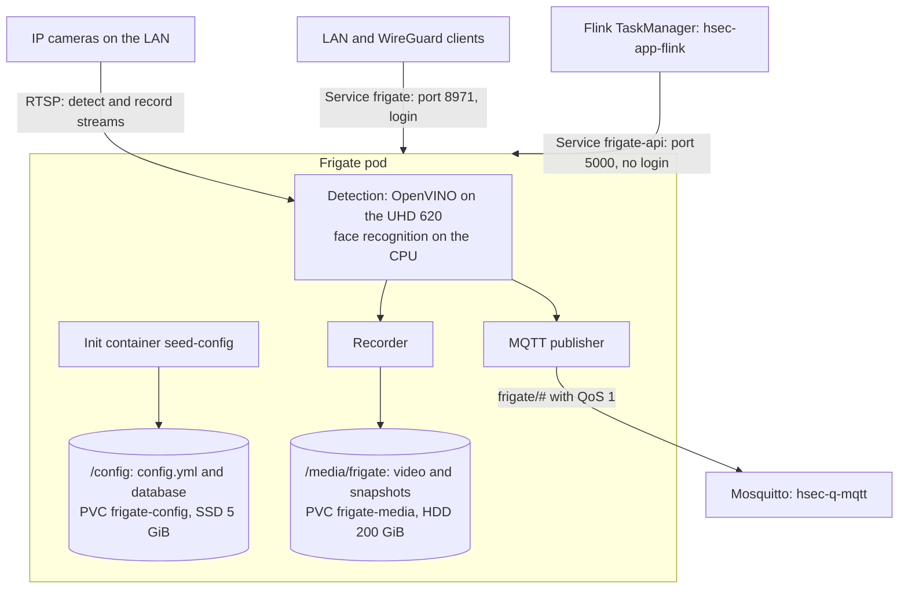

# hsec-app-frigate

Frigate 0.18.0 is the network video recorder (software that records cameras) of the system. It reads the IP cameras, finds people, cars, and faces, and records the video of each detection. It is the only full store of video. It sends what it sees as MQTT messages to Mosquitto (`hsec-q-mqtt`).

## How it works



1. Each camera sends two RTSP streams: a small stream for detection and a full stream for recording.
2. Frigate decodes the detect stream with VAAPI (Video Acceleration API, hardware video decode) on the Intel UHD 620. OpenVINO finds objects on the same GPU. Face recognition runs on the CPU.
3. Frigate records only the video around alerts and detections, and keeps it for 14 days. Snapshots stay for 30 days.
4. Frigate publishes events, reviews, object updates, and status messages under the MQTT prefix `frigate/`.
5. LAN clients use the web UI on port 8971, which needs a login. Port 5000 has no login. A network policy lets only the Flink TaskManager reach it, for alert snapshots and clips.

## Configuration

`config.seed.yml.tftpl` is the starting configuration. Terraform renders it with the namespace and the cameras, and stores it in the ConfigMap `frigate-seed`. If `/config/config.yml` does not exist, the init container `seed-config` copies the file there. After the first start, the Frigate web UI owns the file, so a later change to the template does not change a running system.

| Section | Value | Reason |
| --- | --- | --- |
| `mqtt` | `mosquitto.<namespace>.svc.cluster.local:1883`, QoS 1 | Mosquitto sends each message again until the bridge has it. |
| `detectors` | OpenVINO on `GPU` | Object detection on the UHD 620 |
| `model` | SSDLite MobileNet v2, 300 x 300 pixels | The OpenVINO model in the Frigate image |
| `ffmpeg` | `preset-vaapi` | Hardware decode on Intel Gen 8 to Gen 12 graphics |
| `face_recognition` | `small` model | Runs on the CPU |
| `record` | Alerts and detections 14 days, other video 0 days | Only video with a detection stays. |
| `snapshots` | 30 days | The retention limit of the system |
| `cameras` | One entry per camera, detection at 5 fps | From the Terraform variable `cameras` |

The camera URLs contain the text `{FRIGATE_RTSP_PASSWORD}`, and the MQTT login uses `{FRIGATE_MQTT_USER}` and `{FRIGATE_MQTT_PASSWORD}`. Frigate replaces them with environment variables from the Secret `frigate-env`. So no password is in the configuration file.

If OpenVINO fails on the UHD 620, change `device: GPU` to `device: CPU` in the Frigate UI.

## Kubernetes objects

| Object | Name | Purpose |
| --- | --- | --- |
| ConfigMap | `frigate-seed` | The starting configuration |
| PVC | `frigate-config` | `/config` on the SSD class, 5 GiB: configuration, database, and models |
| PVC | `frigate-media` | `/media/frigate` on the HDD class, 200 GiB: recordings and snapshots |
| Deployment | `frigate` | One pod with the `Recreate` strategy, 3 GiB of memory, 1 CPU, and one Intel GPU |
| Service | `frigate` | Type `LoadBalancer` (k3s ServiceLB) on ports 8971, 8554, and 8555 |
| Service | `frigate-api` | Type `ClusterIP` on port 5000, for Flink |

The pod also mounts two folders in memory: `/dev/shm` (512 MiB) and `/tmp/cache` (1 GiB). They count toward the 3 GiB memory limit. The startup probe gives the first start up to 10 minutes, because Frigate downloads its models then. On the first start, Frigate prints the admin password in its log.

## Files

```text
hsec-app-frigate/
├── README.md
├── config.seed.yml.tftpl        # starting Frigate configuration
└── terraform/
    ├── versions.tf              # Terraform and provider versions
    ├── variables.tf             # module inputs, with checks on the cameras
    ├── main.tf                  # ConfigMap, PVCs, Deployment, and Services
    └── tests/
        └── frigate.tftest.hcl   # terraform test with a mock provider
```

## Deploy

- Terraform root: `terraform/020-app`. Apply `terraform/010-workload` first, because it creates the GPU plugin, the Secret `frigate-env`, and Mosquitto.
- Module inputs: `namespace`, `labels`, `ssd_storage_class`, `hdd_storage_class`, `timezone`, `env_secret_name`, and `cameras`.
- A camera name can use only letters, digits, `_`, and `-`. The detect width and height must be greater than 0.

## Test

In `terraform/`, run `terraform init -backend=false` and then `terraform test`. The tests cover the rendered configuration, the pod, the volumes, the Services, and the camera checks.

## Details

See [Frigate](../docs/specs.md#frigate) and [Network policies](../docs/specs.md#network-policies) in the specs.
