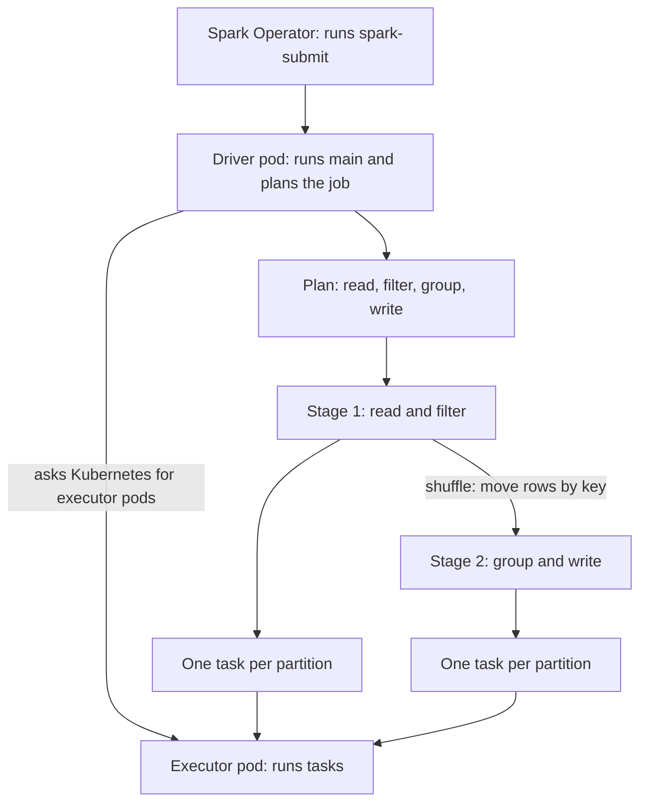
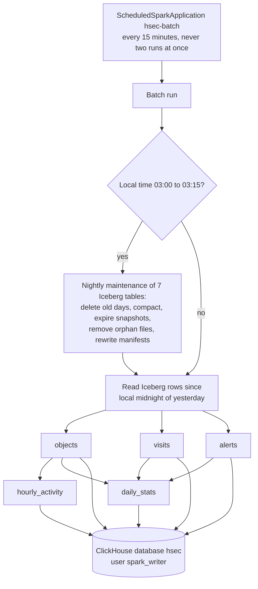

# hsec-app-spark

Spark 4.0.4 runs the batch job `hsec-batch` every 15 minutes. The job reads the Iceberg tables, computes the stats for the dashboards, and appends them to ClickHouse (`hsec-db-clickhouse`). Once a night, it also cleans and compacts the Iceberg tables. The Spark Operator 2.5.2 starts each run.

## Base knowledge

Apache Spark is an engine for processing large data sets on a cluster [1], [2]. A program describes the data steps. Spark plans them, splits the data into partitions, and runs the steps on many partitions at the same time. If a machine fails, Spark computes the lost partitions again from the steps that made them [1].



### Terms

| Term | Meaning |
| --- | --- |
| Driver | The process that runs `main`, builds the plan, and sends tasks to the executors [3]. |
| Executor | A process that runs tasks and keeps cached data. |
| Cluster manager | The system that starts the executors. Here it is Kubernetes: the driver creates the executor pods itself [4]. |
| SparkSession | The entry point of a program. It holds the settings and the catalogs. |
| DataFrame | A table of rows with a schema, spread over the cluster in partitions. |
| Transformation and action | A transformation, such as `filter` or `groupBy`, only adds a step to the plan. An action, such as a write or a count, runs the plan. This is lazy evaluation [1]. |
| Partition and task | A partition is one slice of a DataFrame. One task handles one partition in one step. |
| Shuffle | Moving rows between executors, for example to put all rows of one key together. A shuffle splits a job into stages. |
| Catalyst | The optimizer of Spark SQL. It rewrites the plan, for example to read only the needed columns and to skip files that cannot match a filter [2]. |
| Catalog | A named source of tables, set with `spark.sql.catalog.<name>`. A table name then starts with the catalog, for example `lake.hsec.events`. |
| RDD | The base idea of Spark: a read-only, partitioned set of records that Spark rebuilds from its lineage after a failure [1]. |
| Spark Operator | A Kubernetes operator. It runs `spark-submit` for each SparkApplication, and creates a SparkApplication on a schedule for each ScheduledSparkApplication [5]. |

### In this project

- The job runs in cluster mode: the driver runs in its own pod, and the Spark Operator only starts it.
- The job has 1 executor with 1 core, so it runs one task at a time. The data of 2 days is small, so this is enough.
- The job uses two catalogs: `lake` (Iceberg) and `clickhouse` (the ClickHouse connector). See [Arguments](#arguments).
- Catalyst passes the column list and the time filter down to the Iceberg reader. So the job never reads the `image` and `clip` columns, and it reads only the needed days.
- The job caches `objects`, `visits`, and `alerts`, because the five writes use them again.
- The Spark Operator runs `spark-submit` as a JVM inside its controller pod. This is why the controller needs 512 MiB.

## How it works



1. The operator creates one run every 15 minutes. With `concurrencyPolicy: Forbid`, a run waits while the last run is still active, so the memory budget holds.
2. The run builds two catalogs: `lake` (Iceberg, through the JDBC catalog in Postgres) and `clickhouse` (the ClickHouse Spark connector over HTTP).
3. The first run at or after 03:00 local time does the nightly maintenance first.
4. The run reads the Iceberg rows from local midnight of yesterday, so the window is 24 to 48 hours long. It never reads the `image` and `clip` columns of `alerts`.
5. It computes the five ClickHouse tables and appends each one with `writeTo("clickhouse.hsec.<table>").append()`.

Each row gets `version`, the start time of the run. ClickHouse keeps only the row with the newest version for each key. So a repeated run gives the same result, and the stats of yesterday and today stay up to date.

## Stats

| ClickHouse table | How the job computes it |
| --- | --- |
| `objects` | One row per tracked object from `events`. `known_name` is the newest non-empty `sub_label`. If any message has a face score, `has_face` is true. `top_score` is the highest score. `zones` is the union of `entered_zones`. `end_ts` comes from the `end` message, and `duration_s` is the time between start and end. |
| `visits` | The rows of the Iceberg table `visits`, plus `duration_s` |
| `alerts` | The rows of the Iceberg table `alerts` with `kind = 'start'`, one per alert, without the files |
| `hourly_activity` | Objects per local hour, camera, zone, and label. An object counts once in each zone that it entered. An object without a zone counts under the empty zone. It counts objects, known people, and unknown faces, and averages `top_score`. |
| `daily_stats` | Per local day and camera: visits, people, faces seen, unknown faces, the unknown face rate, the average score by day and by night, and alerts. A camera with only one of these still gets a row, with zeros in the other counts. |

The night window comes from `night_start` and `night_end`, by default 23:00 to 06:00. It can cross midnight. The day score uses objects outside the night window.

Objects that started before the window are not written again. For a long object, such as a parked car, ClickHouse keeps the last row from its time inside the window.

## Nightly maintenance

For each of the 7 Iceberg tables, in this order:

1. Delete the rows with `event_ts` before UTC midnight 27 days ago. The filter matches whole daily partitions, so Iceberg deletes them without a rewrite.
2. Compact the small files with `rewrite_data_files` and the `sort` strategy. The job skips `alerts`, because a rewrite loads its clips into the 1 GiB executor.
3. Expire the snapshots older than 1 day, and keep the last one.
4. Remove the orphan files older than 1 day.
5. Rewrite the manifests.

So the tables keep the current UTC day plus the 27 days before, and no data file is older than 30 days. Snapshots stay for 1 day, so a restarted Flink job still finds its last commit.

## Arguments

The ScheduledSparkApplication passes these arguments:

| Argument | Value |
| --- | --- |
| `--timezone` | The Terraform variable `timezone`. Local days and hours use it. |
| `--night-start`, `--night-end` | The Terraform variables `night_start` and `night_end` |
| `--catalog-uri` | `jdbc:postgresql://postgres.<namespace>.svc.cluster.local:5432/iceberg_catalog` |
| `--warehouse` | `s3://hsec-lake/warehouse` |
| `--s3-endpoint` | `http://rustfs-svc.<namespace>.svc.cluster.local:9000` |
| `--clickhouse-host` | `clickhouse.<namespace>.svc.cluster.local` |

The Secret `spark-env` gives `POSTGRES_ICEBERG_PASSWORD`, `RUSTFS_ACCESS_KEY`, `RUSTFS_SECRET_KEY`, and `CLICKHOUSE_SPARK_PASSWORD` to the driver and the executor. The job builds its catalogs from them, so no password is in the manifest.

## Kubernetes objects

| Object | Name | Purpose |
| --- | --- | --- |
| Helm release | `spark-operator` | The controller (512 MiB) and the webhook (128 MiB). It runs jobs only in the app namespace. |
| Helm release | `hsec-batch` | The local chart `terraform/chart/` with the ScheduledSparkApplication `hsec-batch` |
| Pod | `hsec-batch-...-driver` | The driver during a run: 512 MiB plus 384 MiB overhead, CPU request 0.25 |
| Pod | `hsec-batch-...-exec-1` | The executor during a run: 640 MiB plus 384 MiB overhead, CPU request 0.5 |

- The controller runs `spark-submit`, a JVM, inside its own pod. With 128 MiB, a test run was OOMKilled, so the controller gets 512 MiB.
- The job uses `envFrom`, which needs the operator webhook.
- The driver uses the service account `spark-operator-spark`, which the operator chart creates.
- The job is a custom resource of the operator. Helm checks it only at install time, after the operator release created the CRDs.

## Files

```text
hsec-app-spark/
├── README.md
├── pom.xml                          # Maven project: Spark 4.0.4, Java 17
├── Dockerfile                       # builds the jar, adds it and the library jars to apache/spark
├── .dockerignore
├── src/main/java/hsec/batch/
│   ├── BatchJob.java                # main: maintenance, reads, transforms, writes
│   ├── BatchConfig.java             # arguments, passwords, and catalog settings
│   ├── Schedule.java                # window start, maintenance time, retention, night
│   ├── Transforms.java              # the five ClickHouse tables
│   └── Maintenance.java             # the nightly Iceberg statements
├── src/test/java/hsec/batch/        # 20 JUnit 5 tests with a local SparkSession
└── terraform/
    ├── versions.tf
    ├── variables.tf                 # module inputs, with checks on the night window
    ├── main.tf                      # operator release and job release
    ├── chart/                       # local Helm chart of the ScheduledSparkApplication
    │   ├── Chart.yaml
    │   ├── values.yaml
    │   └── templates/scheduledsparkapplication.yaml
    └── tests/
        └── spark.tftest.hcl
```

The image adds these jars to `/opt/spark/jars`: `iceberg-spark-runtime-4.0_2.13:1.12.0`, `iceberg-aws-bundle:1.12.0`, `postgresql:42.7.13`, `clickhouse-spark-runtime-4.0_2.13:0.10.0`, and `clickhouse-jdbc:0.9.5` with the `all` classifier. The job jar is at `/opt/hsec/hsec-batch.jar`.

## Build

Run the tests first. Then build and push the image from the repository root:

```sh
(cd hsec-app-spark && mvn test)
docker buildx build --platform linux/amd64 -t <registry>/hsec-app-spark:<tag> --push hsec-app-spark/
```

The Docker build skips the tests, because `ClickHouseSchemaTest` reads `../hsec-db-clickhouse/migrations`, which is outside the build context.

## Deploy

- Terraform root: `terraform/020-app`. Apply `terraform/010-workload` first, and run both migrations.
- Module inputs: `namespace`, `labels`, `image`, `timezone`, `night_start`, `night_end`, and `env_secret_name`.

To start one run by hand, copy the template of the schedule into a SparkApplication:

```sh
kubectl -n hsec get scheduledsparkapplication hsec-batch -o json \
  | jq '{apiVersion, kind: "SparkApplication", metadata: {name: "hsec-batch-manual", namespace: "hsec"}, spec: .spec.template}' \
  | kubectl apply -f -
```

## Test

- `mvn test` runs 20 JUnit 5 tests. They cover these parts:
  - The newest name, the face flag, and the zone union.
  - The hourly grouping and the night window across midnight.
  - Empty input.
  - The window start, the maintenance time, and the maintenance statements.
  - The match with the ClickHouse migrations.
- In `terraform/chart/`, run `helm lint` and `helm template`.
- In `terraform/`, run `terraform init -backend=false` and then `terraform test`.

## Details

See [Spark](../docs/specs.md#spark) and [Retention and maintenance](../docs/specs.md#retention-and-maintenance) in the specs.

## References

[1] M. Zaharia, M. Chowdhury, T. Das, A. Dave, J. Ma, M. McCauley, M. J. Franklin, S. Shenker, and I. Stoica, "Resilient distributed datasets: A fault-tolerant abstraction for in-memory cluster computing," in Proc. USENIX Symp. Netw. Syst. Des. Implement. (NSDI), San Jose, CA, USA, 2012, pp. 15–28. [Online]. Available: https://www.usenix.org/conference/nsdi12/technical-sessions/presentation/zaharia

[2] M. Armbrust, R. S. Xin, C. Lian, Y. Huai, D. Liu, J. K. Bradley, X. Meng, T. Kaftan, M. J. Franklin, A. Ghodsi, and M. Zaharia, "Spark SQL: Relational data processing in Spark," in Proc. ACM SIGMOD Int. Conf. Manage. Data, 2015, pp. 1383–1394, doi: 10.1145/2723372.2742797.

[3] Apache Spark, "Cluster Mode Overview," Spark 4.0.0 Documentation. Accessed: Oct. 5, 2026. [Online]. Available: https://spark.apache.org/docs/4.0.0/cluster-overview.html

[4] Apache Spark, "Running Spark on Kubernetes," Spark 4.0.0 Documentation. Accessed: Oct. 5, 2026. [Online]. Available: https://spark.apache.org/docs/4.0.0/running-on-kubernetes.html

[5] Kubeflow, "Spark Operator: Overview," Kubeflow Documentation. Accessed: Oct. 5, 2026. [Online]. Available: https://www.kubeflow.org/docs/components/spark-operator/overview/
