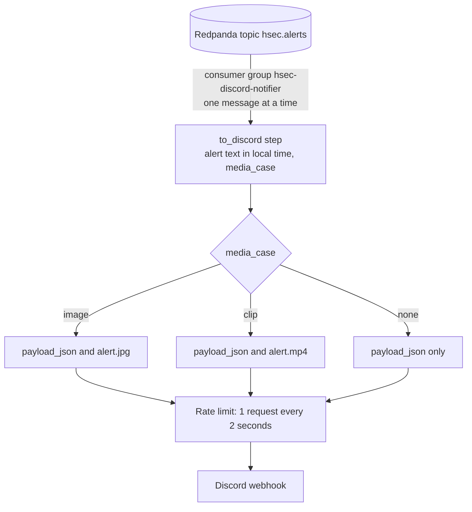

# hsec-conn-discord

The notifier posts each alert from the topic `hsec.alerts` to a Discord channel. It is a Redpanda Connect 4.112.0 pipeline (a stream processor configured in YAML). For each alert review, Discord first shows a message with the snapshot image, then one message per clip part.

## How it works



1. The `redpanda` input reads `hsec.alerts` with the consumer group `hsec-discord-notifier`. After a restart, it continues from its last committed offset.
2. The `to_discord` step builds the text and the field `payload_json`, and sets `media_case` to `image`, `clip`, or `none`.
3. The `switch` output picks the multipart form for the case. Discord expects the fields `payload_json` and `files[0]`.
4. A rate limit of 1 request every 2 seconds stays under the Discord limit of about 30 requests per minute.

The input yields batches of at most 1 byte, which means one message per batch, and it keeps one batch in flight per partition. The `switch` output sends the messages of one batch to its cases in parallel. With bigger batches, a clip part can overtake its image.

## Messages

| Alert message | Discord text | File |
| --- | --- | --- |
| `kind: start` with `image_jpeg` | `Alert on <camera> at <local time>: <objects>. Zones: <zones>.` | `alert.jpg` |
| `kind: start` without an image | The same text | None |
| `kind: clip` with `clip_mp4` | `Clip <part> of <part_count> for the alert on <camera> at <local time>.` | `alert.mp4` |
| `kind: clip` without a clip | `Clip <part> of <part_count> for the alert on <camera> at <local time> is not attached. Frigate link: <clip_url>` | None |

The local time comes from `review_start` and the time zone in `TZ`. The Frigate link needs a Frigate login. A clip part above 19 MiB has no file, because Discord accepts files of up to 20 MiB.

Errors:

- HTTP 429 (too many requests): the output waits and tries again.
- HTTP 400 (bad request): the output drops the message, because it can never succeed.
- Any other error: the output tries 3 times. Then the input delivers the message again later, so no alert is lost while Discord is down.

## Kubernetes objects

| Object | Name | Purpose |
| --- | --- | --- |
| ConfigMap | `notifier-pipeline` | `alerts-to-discord.yaml` |
| Deployment | `notifier` | One pod with the `Recreate` strategy, 256 MiB of memory, and CPU request 0.05 |

- One message can hold a file of up to 19 MiB, plus its base64 text and the upload body. So the pod gets 256 MiB.
- The `Recreate` strategy stops the old pod before the new pod starts. Two pods in the same consumer group can post an alert twice during a rebalance.
- The pod has the annotation `checksum/pipeline`. A change of the pipeline file changes it, so `terraform apply` restarts the pod.
- Liveness probe: `GET /ping` on port 4195. Readiness probe: `GET /ready` on port 4195.
- `DISCORD_WEBHOOK_URL` comes from the Secret `notifier-env`. `TZ` comes from the Terraform variable `timezone`.

## Files

```text
hsec-conn-discord/
├── README.md
├── connect/
│   ├── alerts-to-discord.yaml    # the pipeline
│   └── tests/
│       ├── to_discord_test.yaml  # 5 test cases for the to_discord step
│       └── test.env              # dummy webhook URL and time zone for the tests
└── terraform/
    ├── versions.tf
    ├── variables.tf
    ├── main.tf                   # ConfigMap and Deployment
    └── tests/
        └── notifier.tftest.hcl
```

## Deploy

- Terraform root: `terraform/020-app`. Apply `terraform/010-workload` first, because it creates Redpanda and the Secret.
- You give the webhook URL to `terraform/010-workload` as the sensitive variable `discord_webhook_url`.
- Module inputs: `namespace`, `labels`, `timezone`, and `env_secret_name`.

## Test

Run the pipeline tests from this folder with the Redpanda Connect image:

```sh
docker run --rm -v "$PWD:/w" -w /w docker.redpanda.com/redpandadata/connect:4.112.0 \
  test --env-file connect/tests/test.env ./connect/tests/...
```

The tests cover message 1 with and without an image, clip parts with and without a file, and an empty zone list.

In `terraform/`, run `terraform init -backend=false` and then `terraform test`.

The output was also tested against a local capture server. The requests had the fields `payload_json` and `files[0]` with the exact file bytes. In three rounds of 9 messages, each image arrived before its clip parts.

## Details

See [Discord notifier](../docs/specs.md#discord-notifier) and [Alerts](../docs/specs.md#alerts) in the specs.
