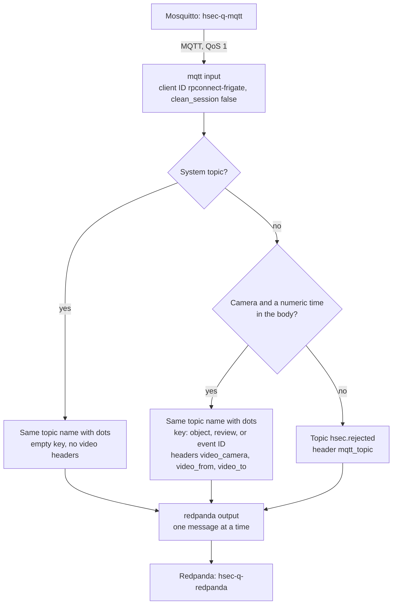

# hsec-conn-mqtt

The bridge copies every general Frigate MQTT message from Mosquitto (`hsec-q-mqtt`) into Redpanda (`hsec-q-redpanda`). It is a Redpanda Connect 4.112.0 pipeline (a stream processor configured in YAML). It adds a video reference to each camera message, so that every record points to its video in Frigate.

## How it works



1. The `mqtt` input subscribes to the 10 general Frigate topics with QoS 1. Its fixed client ID and `clean_session false` let Mosquitto queue messages while the bridge is offline.
2. The `route` step decides the Redpanda topic, the key, and the headers of each message. It does not change the body.
3. The `redpanda` output writes one message at a time, so Redpanda keeps the order in which the bridge received the messages.

The input acknowledges a message as soon as it reads it. If the bridge crashes, it loses the few messages in progress.

## Routing

| MQTT topic | Redpanda topic | Key | Video headers |
| --- | --- | --- | --- |
| `frigate/events` | `frigate.events` | `after.id`, the tracked object ID | Yes |
| `frigate/reviews` | `frigate.reviews` | `after.id`, the review ID | Yes |
| `frigate/tracked_object_update` | `frigate.tracked_object_update` | `id`, the tracked object ID | Yes |
| `frigate/triggers` | `frigate.triggers` | `event_id` | Yes |
| `frigate/available`, `restart`, `stats`, `camera_activity`, `profile/set`, `profile/state`, `notifications/set`, `notifications/state` | Same name with dots, for example `frigate.profile.set` | Empty | No |
| A camera message without a camera, without a numeric time, or with a body that is not JSON | `hsec.rejected` | Empty | No |

The video headers point to the video of a record in Frigate. Frigate can return that video as a clip for 14 days.

| Topic | `video_camera` | `video_from` | `video_to` |
| --- | --- | --- | --- |
| `frigate.events` | `after.camera` | `after.start_time` | `after.end_time`, or `after.frame_time` while the object is active |
| `frigate.reviews` | `after.camera` | `after.start_time` | `after.end_time`, or `after.start_time` while the review is open |
| `frigate.tracked_object_update` | `camera` | `timestamp` | `timestamp` |
| `frigate.triggers` | `camera` | Bridge receive time | Bridge receive time |

Times are Unix seconds with 6 decimals, for example `1607123955.475377`. Bloblang (the Redpanda Connect mapping language) writes a large number as `1.6e+09`. So the step formats each time with `%.6f`.

The step is a `mapping` that starts with `root = content()`, and it reads the fields from a parsed copy of the body. A `mutation`, or any use of `this`, re-serializes the JSON and changes its key order. So the Frigate payload stays byte for byte, and the message ID that Flink computes from it stays stable. Every message also keeps the header `mqtt_topic`.

## Kubernetes objects

| Object | Name | Purpose |
| --- | --- | --- |
| ConfigMap | `bridge-pipeline` | `frigate-to-redpanda.yaml` |
| Deployment | `bridge` | One pod with the `Recreate` strategy, 128 MiB of memory, and CPU request 0.05 |

- The `Recreate` strategy stops the old pod before the new pod starts. Two pods with the same MQTT client ID make Mosquitto disconnect one of them.
- The pod has the annotation `checksum/pipeline`. A change of the pipeline file changes it, so `terraform apply` restarts the pod.
- Liveness probe: `GET /ping` on port 4195. Readiness probe: `GET /ready` on port 4195, which answers 200 after the input and the output connect.
- The pod gets `NAMESPACE` from its own metadata, and the pipeline builds the Mosquitto and Redpanda addresses from it. The default is `hsec`.
- `MQTT_BRIDGE_USER` and `MQTT_BRIDGE_PASSWORD` come from the Secret `bridge-env`.

## Files

```text
hsec-conn-mqtt/
├── README.md
├── connect/
│   ├── frigate-to-redpanda.yaml  # the pipeline
│   └── tests/
│       ├── route_test.yaml       # 12 test cases for the route step
│       └── test.env              # dummy login for the tests
└── terraform/
    ├── versions.tf
    ├── variables.tf
    ├── main.tf                   # ConfigMap and Deployment
    └── tests/
        └── bridge.tftest.hcl
```

## Deploy

- Terraform root: `terraform/020-app`. Apply `terraform/010-workload` first, because it creates Mosquitto, Redpanda, and the Secret.
- Module inputs: `namespace`, `labels`, and `env_secret_name`.

## Test

Run the pipeline tests from this folder with the Redpanda Connect image:

```sh
docker run --rm -v "$PWD:/w" -w /w docker.redpanda.com/redpandadata/connect:4.112.0 \
  test --env-file connect/tests/test.env ./connect/tests/...
```

The tests cover these cases:

- The four camera topics and the system topics.
- Plain text bodies and unchanged bodies.
- Missing fields, bodies that are not JSON, and times that are not numbers.

In `terraform/`, run `terraform init -backend=false` and then `terraform test`.

## Details

See [Redpanda Connect bridge](../docs/specs.md#redpanda-connect-bridge) and [Video reference](../docs/specs.md#video-reference) in the specs.
