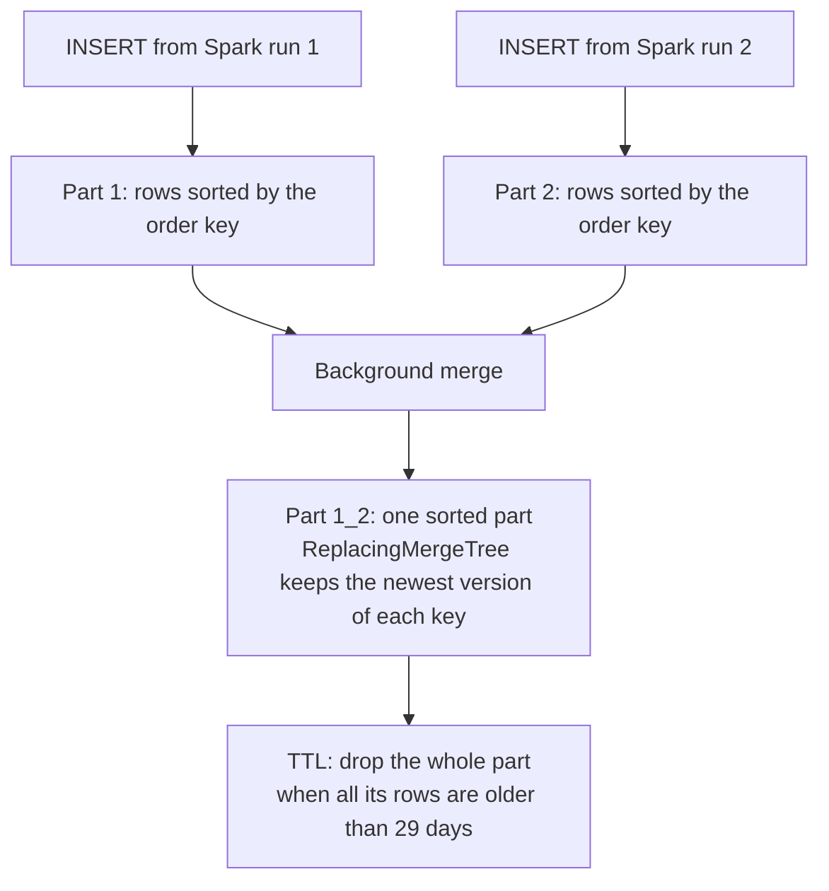
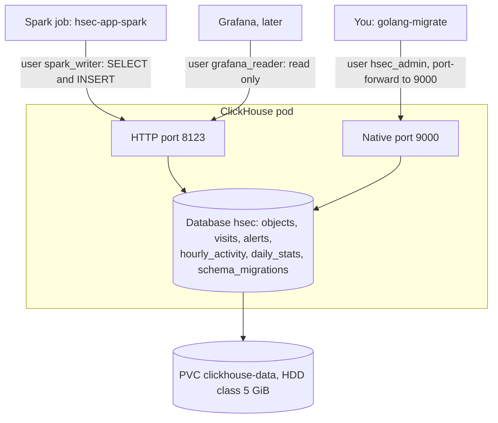

# hsec-db-clickhouse

ClickHouse 26.3.39.7 (LTS) stores the stats that the dashboards show. It is a column database: it reads only the columns that a query needs, so dashboard queries over many rows stay fast. Spark (`hsec-app-spark`) writes the stats every 15 minutes. Grafana will read them later, and this module does not set up Grafana yet.

## Base knowledge

ClickHouse is a column-oriented database for analytics [1]. A row store keeps each row together on disk, which suits reading and changing single rows. A column store keeps each column together, so a query that reads 3 columns of a wide table reads only those 3 columns [2]. Values of one column are alike, so they compress well. ClickHouse also processes them in blocks of many values at once (vectorized execution) [1].



### Terms

| Term | Meaning |
| --- | --- |
| MergeTree | The main family of table engines. Each INSERT writes a new part that never changes, and background merges join small parts into bigger ones [3]. |
| Part | A folder of column files for a set of rows, sorted by the order key. |
| Order key (`ORDER BY`) | The sort order of the rows in each part. It is also the primary key, unless the table sets another one. |
| Granule and sparse index | ClickHouse splits the rows of a part into granules of 8192 rows. The primary index has one entry per granule, not per row, so it stays small and fits in memory [1]. |
| Partition (`PARTITION BY`) | A group of parts, here one per day. Merges never join parts of different partitions, and ClickHouse can drop a whole partition at once. |
| TTL (time to live) | A rule that deletes old data. With `ttl_only_drop_parts = 1`, ClickHouse waits until all rows of a part are expired. Then it drops the whole part, so it never rewrites a part for TTL. |
| ReplacingMergeTree | A MergeTree that keeps one row per order key during merges: the row with the highest value in the version column [4]. |
| `FINAL` | A query modifier that applies the replacing logic at read time. So a query sees no old versions, even before a merge. |
| LowCardinality | Dictionary encoding. The column stores small numbers that point to a list of the distinct strings [5]. |

### In this project

- Each Spark run writes every row of the last 24 to 48 hours again. The rows of one run form a few new parts.
- ReplacingMergeTree keeps the row with the newest `version`. Until a merge runs, old versions stay on disk, so the dashboards query with `FINAL`. See [How it works](#how-it-works).
- ReplacingMergeTree only merges rows inside one partition. Each table derives its partition from a column in its order key, so all versions of a row land in the same partition.
- The order keys start with the camera and the time, or with the hour or day and the camera. So the sparse index makes a filter on these columns cheap.
- The 29-day TTL drops whole daily parts, so old data leaves without a rewrite.

## How it works



1. Each Spark run writes all rows of the last 24 to 48 hours again, with `version` set to the start time of the run.
2. Every table uses `ReplacingMergeTree(version)`. In the background, ClickHouse merges the rows with the same order key and keeps the one with the newest version. Until a merge runs, old versions are still on disk.
3. Queries add `FINAL`, for example `SELECT ... FROM hsec.objects FINAL`. Then they see only the newest version of each row, even before a merge.
4. Each table has one partition per local day and a 29-day TTL (time to live) with `ttl_only_drop_parts = 1`. ClickHouse drops whole old days at once.

## Tables

| Table | One row per | Order key | Columns |
| --- | --- | --- | --- |
| `objects` | Tracked object | `camera, start_ts, event_id` | `label`, `known_name`, `has_face`, `top_score`, `zones`, `start_ts`, `end_ts`, `duration_s` |
| `visits` | Visit | `camera, start_ts, visit_id` | `start_ts`, `end_ts`, `duration_s`, `person_count`, `known_names`, `unknown_count`, `zones` |
| `alerts` | Alert (message 1 only) | `camera, fired_ts, alert_id` | `review_id`, `severity`, `objects`, `sub_labels`, `zones`, `review_start`, `event_id`, `fired_ts`, `snapshot_url` |
| `hourly_activity` | Local hour, camera, zone, and label | `hour, camera, zone, label` | `objects`, `known_people`, `unknown_faces`, `avg_top_score` |
| `daily_stats` | Local day and camera | `day, camera` | `visits`, `people`, `faces_seen`, `unknown_faces`, `unknown_face_rate`, `avg_score_day`, `avg_score_night`, `alerts` |
| `schema_migrations` | Applied migration | none | `version` and `dirty`. golang-migrate writes it. |

Every stats table also has `version`, a `DateTime64(3)`. Spark has no unsigned 64-bit type, and `ReplacingMergeTree` accepts a `DateTime64` version column. `camera`, `label`, `zone`, and `severity` use `LowCardinality(String)`, which stores repeated values once. The server time zone sets the local days and hours.

## Users

`users.d/hsec.xml.tftpl` defines the users. Terraform fills in the SHA-256 of each random password and stores the file in the Secret `clickhouse-users`, not in a ConfigMap.

| User | Rights | Used by |
| --- | --- | --- |
| `default` | Only from `127.0.0.1` and `::1` | Nobody |
| `hsec_admin` | All on `hsec.*` | The migrations |
| `spark_writer` | `SELECT` and `INSERT` on `hsec.*`, and `SELECT` on `system.clusters` and `system.macros` | Spark. The connector reads both system tables before each write. |
| `grafana_reader` | `SELECT` on `hsec.*`, profile `read_only` | Grafana |

The profile `read_only` sets `readonly = 2`. It allows query settings, which Grafana sends, but no writes.

## Server settings

`config.d/hsec.xml.tftpl`, with the time zone from Terraform:

| Setting | Value | Reason |
| --- | --- | --- |
| `timezone` | The Terraform variable `timezone` | Local days and hours |
| `max_server_memory_usage_to_ram_ratio` | `0.8` | Stays under the 1.5 GiB pod limit |
| `mark_cache_size` | 256 MiB | Smaller cache for a small server |
| `ttl` of `query_log`, `part_log`, `metric_log`, `asynchronous_metric_log`, `trace_log` | 7 days | The system log tables otherwise grow without limit. |

## Migrate

Terraform creates no tables. You run the migrations by hand with golang-migrate 4.20.1, after `terraform/010-workload` and before `terraform/020-app`. golang-migrate records the applied version in `hsec.schema_migrations`.

The database `hsec` exists already, because the pod sets `CLICKHOUSE_DB=hsec`, and the image creates the database at its first start.

1. In a first terminal, run `kubectl -n hsec port-forward svc/clickhouse 9000:9000`.
2. In a second terminal, go to the repository root.
3. Run the commands below.

```sh
CH_PASSWORD=$(kubectl -n hsec get secret clickhouse-admin -o jsonpath='{.data.CLICKHOUSE_ADMIN_PASSWORD}' | base64 -d)
migrate -path hsec-db-clickhouse/migrations \
  -database "clickhouse://localhost:9000?username=hsec_admin&password=${CH_PASSWORD}&database=hsec&x-multi-statement=true" \
  up
```

- The ClickHouse driver of golang-migrate loads the server time zone. So the admin machine needs its time zone database, which macOS and Linux include.
- If a file fails part way, golang-migrate marks the version as dirty and stops. Undo the partial change by hand. Then run `migrate force <last good version>` and `migrate up` again.
- To add a migration, run `migrate create -ext sql -dir migrations -seq -digits 4 <name>` in this folder. Never change a file after it ran on the cluster.

Do not run `migrate down` on the cluster. It runs the `.down.sql` files, which delete the tables and their data.

## Kubernetes objects

| Object | Name | Purpose |
| --- | --- | --- |
| ConfigMap | `clickhouse-server-config` | The server settings |
| Secret | `clickhouse-users` | The users and their password hashes |
| PVC | `clickhouse-data` | `/var/lib/clickhouse` on the HDD class, 5 GiB |
| Service | `clickhouse` | Type `ClusterIP` on ports 8123 (HTTP) and 9000 (native) |
| StatefulSet | `clickhouse` | One pod, 1.5 GiB of memory, CPU request 0.25, and `/ping` probes |

- The settings and the users file are mounted as single files, so the files that the image ships in the same folders stay.
- The pod has the annotation `checksum/config`. A change of either file restarts the pod.
- No ClickHouse Keeper runs, because no table uses replication.
- The Secret `clickhouse-admin` holds `CLICKHOUSE_ADMIN_PASSWORD` for the migrations. No pod uses it.

## Files

```text
hsec-db-clickhouse/
├── README.md
├── config.d/
│   └── hsec.xml.tftpl           # server settings
├── users.d/
│   └── hsec.xml.tftpl           # users, rights, and password hashes
├── migrations/
│   ├── 0001_init.up.sql         # the five stats tables
│   └── 0001_init.down.sql       # drops them, for the tests
└── terraform/
    ├── versions.tf
    ├── variables.tf
    ├── main.tf                  # ConfigMap, Secret, PVC, Service, and StatefulSet
    └── tests/
        └── clickhouse.tftest.hcl
```

## Deploy

- Terraform root: `terraform/010-workload`.
- Module inputs: `namespace`, `labels`, `hdd_storage_class`, `timezone`, `admin_password`, `spark_password`, and `grafana_password`.
- Address inside the cluster: `http://clickhouse.hsec.svc.cluster.local:8123`.

## Test

- With `clickhouse local`, run `CREATE DATABASE hsec`. Then run each `.up.sql` file in order, and each `.down.sql` file in reverse order. Make sure that no statement fails.
- In `terraform/`, run `terraform init -backend=false` and then `terraform test`.
- `ClickHouseSchemaTest` in `hsec-app-spark` makes sure that the Spark results match these tables.
- In a k3s test cluster, golang-migrate applied the migration, and a full Spark run filled all five tables as `spark_writer`.

## Details

See [ClickHouse](../docs/specs.md#clickhouse) and [ClickHouse migrations](../docs/specs.md#clickhouse-migrations) in the specs.

## References

[1] R. Schulze, T. Schreiber, I. Yatsishin, R. Dahimene, and A. Milovidov, "ClickHouse - Lightning fast analytics for everyone," Proc. VLDB Endow., vol. 17, no. 12, pp. 3731–3744, 2024. [Online]. Available: https://www.vldb.org/pvldb/vol17/p3731-schulze.pdf

[2] D. J. Abadi, S. R. Madden, and N. Hachem, "Column-stores vs. row-stores: How different are they really?," in Proc. ACM SIGMOD Int. Conf. Manage. Data, 2008, pp. 967–980, doi: 10.1145/1376616.1376712.

[3] ClickHouse, "MergeTree table engine," ClickHouse Documentation. Accessed: Oct. 5, 2026. [Online]. Available: https://clickhouse.com/docs/engines/table-engines/mergetree-family/mergetree

[4] ClickHouse, "ReplacingMergeTree table engine," ClickHouse Documentation. Accessed: Oct. 5, 2026. [Online]. Available: https://clickhouse.com/docs/engines/table-engines/mergetree-family/replacingmergetree

[5] ClickHouse, "LowCardinality(T)," ClickHouse Documentation. Accessed: Oct. 5, 2026. [Online]. Available: https://clickhouse.com/docs/sql-reference/data-types/lowcardinality
