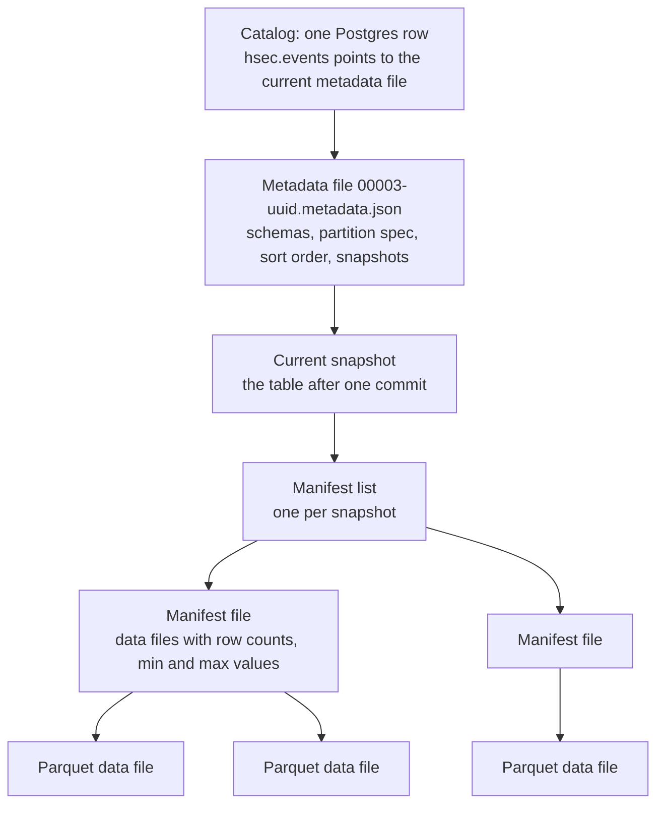
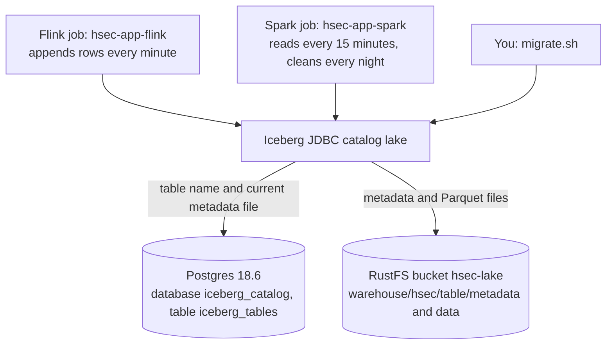

# hsec-db-iceberg

This folder holds the Iceberg lake (the long-term store of every Frigate message and alert) and its catalog. Iceberg is a table format: each table is a set of Parquet data files plus metadata files that list them. The data and metadata files are in RustFS (`hsec-db-rustfs`). Postgres 18.6 holds the Iceberg JDBC catalog `lake`, which knows the current metadata file of each table. The folder also holds the migrations that create and change the seven tables.

## Base knowledge

Apache Iceberg is an open table format for large analytic tables [1]. It turns a set of files on object storage into a table that several engines, such as Flink and Spark, can read and write safely. It adds what plain files lack: a schema, atomic commits, snapshots, and hidden partitions. This way of working is often called a lakehouse: the data stays in open files on cheap storage, but readers get database guarantees [2].



### Terms

| Term | Meaning |
| --- | --- |
| Table format | The rules for how data files and metadata files form one table. |
| Catalog | The service that maps a table name to its current metadata file. It makes each commit atomic. |
| Metadata file | A JSON file with the schemas, the partition specs, the sort orders, the table properties, and the list of snapshots. |
| Snapshot | The state of the table after one commit. A reader works on one snapshot, so it never sees a half-done write [1]. |
| Manifest list and manifest | Index files. A manifest lists data files with their partition and their column statistics, so a reader skips files that cannot match its filter. |
| Data file | A Parquet file with rows. Iceberg never changes a data file. A commit only adds files and removes files from the table. |
| Commit | A writer writes new files, then asks the catalog to swap the pointer. If another writer committed first, the swap fails, and the writer tries again on the new snapshot. This is optimistic concurrency [3]. |
| Hidden partitioning | The table derives the partition from a column, for example `days(event_ts)`. A query filters on `event_ts`, and Iceberg skips the other days by itself [4]. |
| Schema evolution | Each column has a field ID. Iceberg matches columns by ID, not by name, so adding or renaming a column rewrites no data [5]. |
| Copy-on-write | A delete or an update rewrites the affected data files. The other mode, merge-on-read, writes small delete files. A reader applies them at read time. |
| Snapshot expiry and orphan files | Old snapshots keep old files alive. Expiry removes old snapshots. Orphan removal deletes files that no snapshot uses, for example files of a failed write. |

Parquet is the file format of the data files [6]. A Parquet file has row groups. Each row group keeps each column as a separate column chunk, and splits it into pages. The footer of the file holds the schema and the minimum and maximum values of each column chunk. So a reader that needs 3 of 20 columns reads only 3 chunks, and it skips row groups whose values cannot match. The way Parquet stores nested values comes from Google Dremel [7].

### In this project

- Flink commits once per checkpoint, every 60 seconds. Each commit adds a few small files to each table. The nightly Spark compaction merges them and sorts them by camera and time.
- Retention deletes whole days. The filter on `event_ts` matches whole `days(event_ts)` partitions, so Iceberg only removes the files from the metadata, without a rewrite.
- RustFS has no atomic rename, so the atomic swap happens in Postgres. See [How it works](#how-it-works).
- The tables use format version 2 and copy-on-write, so readers never need delete files.
- In Spark, you can read the history of a table from its metadata tables, for example `SELECT * FROM lake.hsec.events.snapshots`.

## How it works



1. A writer, such as Flink, writes new Parquet files and a new metadata file to RustFS.
2. Then it asks the catalog to move the pointer of the table from the old metadata file to the new one. Postgres does this in one transaction. If the pointer no longer has the old value, the move fails.
3. If two writers commit at the same time, one wins and the other tries again. Flink appends every minute, and Spark cleans the same tables every night, so this matters.
4. A reader asks the catalog for the current metadata file, and reads only the files that it lists.

Postgres holds only one row per table: the namespace, the table name, the current metadata file, and the previous one. The schema, the partitions, and the history of each table are in its metadata files on RustFS. The Iceberg catalog creates its own table `iceberg_tables` in Postgres on first use.

ADR-4 in the system design explains why the catalog is in Postgres. A catalog of files on RustFS alone is not safe. RustFS has no atomic rename, so two writers can lose a commit without an error.

## Tables

All tables are in the namespace `hsec` of the catalog `lake`.

| Table | One row per | Main columns |
| --- | --- | --- |
| `events` | Message on `frigate/events` | `event_id`, `msg_type`, `camera`, `label`, `sub_label` (recognized name), `top_score`, zones, `face_score`, start, end, and frame time |
| `reviews` | Message on `frigate/reviews` | `review_id`, `msg_type`, `camera`, `severity`, start and end time, `detections`, `objects`, `sub_labels`, `zones` |
| `object_updates` | Message on `frigate/tracked_object_update` | `event_id`, `update_type` (face, lpr, description, or classification), `name`, `score`, `plate`, `description` |
| `triggers` | Message on `frigate/triggers` | `event_id`, `camera`, `name`, `type`, `score`. The time is the bridge receive time. |
| `system_messages` | Message on a system topic | `topic` and `payload`, the raw text |
| `visits` | Closed visit | `visit_id`, `camera`, start and end time, `person_count`, `known_names`, `unknown_count`, `zones` |
| `alerts` | Alert message (`start` or `clip`) | The alert fields, the video window, and the files: `image` (JPEG) and `clip` (MP4) |

Every table also has `event_ts` (the time of the record), and `ingest_ts` (when Flink wrote it). The raw tables have `message_id`, the SHA-256 of the topic and the raw message.

Shared settings, which the migration sets explicitly:

| Setting | Value | Reason |
| --- | --- | --- |
| `format-version` | `2` | Current Iceberg format |
| `write.format.default` | `parquet` | Column files that Spark reads fast |
| `write.parquet.compression-codec` | `zstd` | Small files |
| `write.delete.mode` | `copy-on-write` | No separate delete files |
| Partition | `days(event_ts)` | One partition per UTC day, so retention drops whole days |
| Sort order | `camera`, then `event_ts` (`topic` for `system_messages`) | The nightly compaction sorts by it. |

Spark SQL `timestamp` creates an Iceberg `timestamptz` column. The tables keep the current UTC day plus the 27 days before. The nightly Spark run deletes older days. See the [hsec-app-spark README](../hsec-app-spark/README.md#nightly-maintenance).

## Migrate

Terraform creates no tables, and the Flink and Spark jobs never create or change tables. You run the migrations by hand, after `terraform/010-workload` and before `terraform/020-app`.

golang-migrate has no Iceberg driver. So the files use the golang-migrate names, but `migrate.sh` runs them with a local `spark-sql`.

- The folder has only `.up.sql` files. A dropped Iceberg table loses its data, so no `.down.sql` files exist.
- Nothing records which files ran. You run each file once, in order. `0001_init.up.sql` changes nothing on a second run.
- Never change a file after it ran on the cluster. Write a new file instead.

You need Java 17 and Spark 4.0.4 (`spark-4.0.4-bin-hadoop3`) on the admin machine, with `spark-sql` on the `PATH`.

1. In a first terminal, run `kubectl -n hsec port-forward svc/postgres 15432:5432`.
2. In a second terminal, run `kubectl -n hsec port-forward svc/rustfs-svc 19000:9000`.
3. In a third terminal, go to the repository root.
4. Run each new file with the script:

```sh
hsec-db-iceberg/migrate.sh hsec-db-iceberg/migrations/0001_init.up.sql
```

The script reads the passwords from the Secret `spark-env`. It writes them to a temporary file that only you can read, not onto the command line. It runs `spark-sql` in a temporary folder, with the `lake` catalog pointed at the two tunnels. Its exit code is the exit code of `spark-sql`. The first run downloads the Iceberg and Postgres jars from Maven Central.

Only the client uses the local addresses. The table locations stay `s3://hsec-lake/warehouse/...`, so Flink and Spark in the cluster still find the files.

To add a migration, run `migrate create -ext sql -dir migrations -seq -digits 4 <name>` in this folder. Then delete the `.down.sql` file.

## Kubernetes objects

| Object | Name | Purpose |
| --- | --- | --- |
| PVC | `postgres-data` | Postgres data on the SSD class, 2 GiB, at `/var/lib/postgresql` |
| Service | `postgres` | Type `ClusterIP` on port 5432 |
| StatefulSet | `postgres` | One pod with `postgres:18.6-alpine`, 512 MiB, CPU request 0.1, and `pg_isready` probes |

The database is `iceberg_catalog`, and the user is `iceberg`. The password comes from the Secret `postgres-iceberg`. Postgres 18 images keep the data under `/var/lib/postgresql`, not under `/var/lib/postgresql/data`.

## Files

```text
hsec-db-iceberg/
├── README.md
├── migrate.sh                   # runs one migration with a local spark-sql through tunnels
├── migrations/
│   └── 0001_init.up.sql         # namespace hsec and the seven tables
└── terraform/
    ├── versions.tf
    ├── variables.tf
    ├── main.tf                  # PVC, Service, and StatefulSet of Postgres
    └── tests/
        └── postgres.tftest.hcl
```

## Test

- Run `shellcheck migrate.sh`.
- In `terraform/`, run `terraform init -backend=false` and then `terraform test`.
- `MigrationSchemaTest` in `hsec-app-flink` makes sure that the Java schemas of the Flink job match the migrations.
- `migrate.sh` was tested against Postgres 18.6 and RustFS 1.0.1, and in a k3s cluster through real port-forwards. The second run changed nothing.

## Details

See [Iceberg](../docs/specs.md#iceberg), [Postgres](../docs/specs.md#postgres), and [Iceberg migrations](../docs/specs.md#iceberg-migrations) in the specs.

## References

[1] Apache Iceberg, "Iceberg Table Spec," Apache Iceberg Documentation. Accessed: Oct. 5, 2026. [Online]. Available: https://iceberg.apache.org/spec/

[2] M. Armbrust, A. Ghodsi, R. Xin, and M. Zaharia, "Lakehouse: A new generation of open platforms that unify data warehousing and advanced analytics," in Proc. Conf. Innovative Data Syst. Res. (CIDR), 2021. [Online]. Available: https://www.cidrdb.org/cidr2021/papers/cidr2021_paper17.pdf

[3] Apache Iceberg, "Reliability," Apache Iceberg Documentation. Accessed: Oct. 5, 2026. [Online]. Available: https://iceberg.apache.org/docs/latest/reliability/

[4] Apache Iceberg, "Partitioning," Apache Iceberg Documentation. Accessed: Oct. 5, 2026. [Online]. Available: https://iceberg.apache.org/docs/latest/partitioning/

[5] Apache Iceberg, "Evolution," Apache Iceberg Documentation. Accessed: Oct. 5, 2026. [Online]. Available: https://iceberg.apache.org/docs/latest/evolution/

[6] Apache Parquet, "File Format," Apache Parquet Documentation. Accessed: Oct. 5, 2026. [Online]. Available: https://parquet.apache.org/docs/file-format/

[7] S. Melnik, A. Gubarev, J. J. Long, G. Romer, S. Shivakumar, M. Tolton, and T. Vassilakis, "Dremel: Interactive analysis of web-scale datasets," Proc. VLDB Endow., vol. 3, no. 1–2, pp. 330–339, 2010, doi: 10.14778/1920841.1920886.
