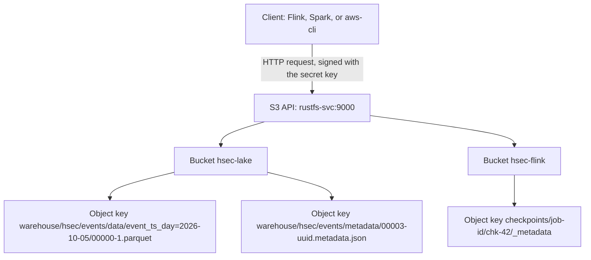
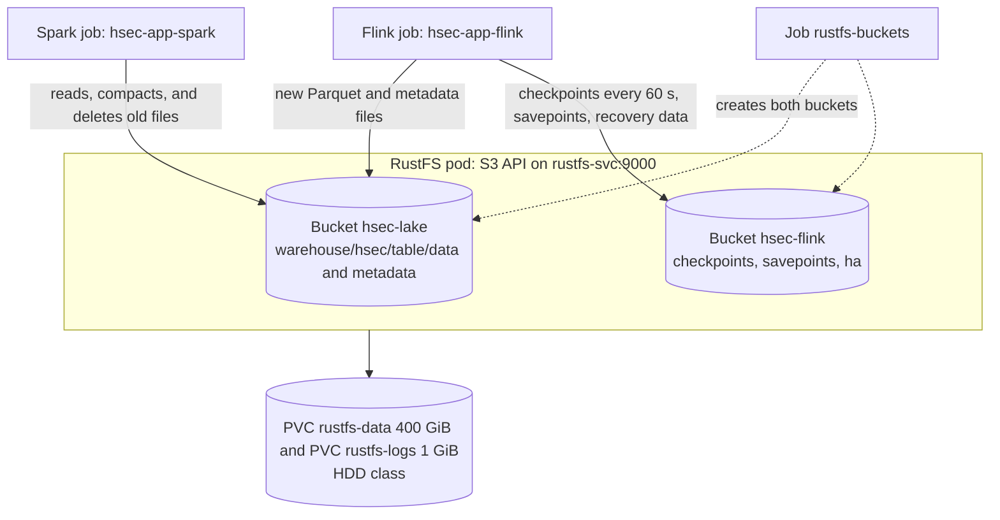

# hsec-db-rustfs

RustFS 1.0.1 is the object store of the system. It speaks the S3 API (the Amazon Simple Storage Service protocol), so Iceberg and Flink use it like Amazon S3. It holds the Iceberg data and metadata files, and the Flink checkpoints. It runs as one pod in standalone mode on the HDD.

## Base knowledge

Object storage keeps data as objects in buckets, and clients reach it over HTTP. RustFS is an object store written in Rust under the Apache 2.0 license, and it speaks the S3 API of Amazon S3 [1], [2]. An object is a whole file with a key and metadata. A client writes an object in one request and reads it by its key. There is no real file system: a "folder" is only a shared start of keys [3].



### Terms

| Term | Meaning |
| --- | --- |
| Bucket | A top-level container of objects, with a unique name. |
| Object | One stored file: its bytes, its key, and its metadata. A client replaces a whole object, and it cannot change a part of it. |
| Key | The full name of an object in its bucket, for example `warehouse/hsec/events/data/...`. |
| Prefix | The start of a key. Tools show prefixes as folders, but the store has only flat keys [3]. |
| PUT, GET, LIST, DELETE | The main operations: write an object, read it, list the keys under a prefix, and remove it. |
| Path-style address | The bucket name is in the URL path, for example `http://rustfs-svc:9000/hsec-lake/key`. The other style puts the bucket name in the host name [4]. |
| Access key and secret key | The login. The client signs each request with the secret key (AWS Signature Version 4), so the secret key itself never crosses the network [5]. |
| No rename | The S3 API has no rename. A rename is a copy and a delete, and it is not atomic. |
| Erasure coding | In a distributed setup, the store splits each object into data parts and parity parts on several disks, so it survives a lost disk. Standalone mode has one disk and no such protection. |

### In this project

- RustFS runs as one standalone pod with one HDD volume. If that disk fails, the lake and the Flink checkpoints are lost.
- Flink and Spark use path-style addresses (`s3.path-style-access=true`), because the bucket names are not DNS names in the cluster.
- Iceberg writes each file once, under a new and unique key, and never renames a file. So it fits object storage well. The atomic step of a commit happens in the Postgres catalog. See the [hsec-db-iceberg README](../hsec-db-iceberg/README.md#base-knowledge).
- Flink writes its checkpoints with the Presto S3 file system, which reads the keys from the Flink configuration.
- The region `us-east-1` is a placeholder. RustFS ignores it, but the AWS SDK needs a value.

## How it works



## Buckets

| Bucket | Path | Contents | Writer | Readers |
| --- | --- | --- | --- | --- |
| `hsec-lake` | `warehouse/hsec/<table>/data/` | Parquet data files, one folder per day partition | Flink, and Spark during compaction | Spark |
| `hsec-lake` | `warehouse/hsec/<table>/metadata/` | Iceberg metadata files, manifest lists, and manifests | Flink, Spark, and the migrations | Flink and Spark |
| `hsec-flink` | `checkpoints/` | The last 3 Flink checkpoints: state and Kafka offsets | Flink | Flink after a restart |
| `hsec-flink` | `savepoints/` | Savepoints, for example before an upgrade | Flink | Flink |
| `hsec-flink` | `ha/` | Recovery data of the JobManager | Flink | Flink |

The Iceberg catalog in Postgres (`hsec-db-iceberg`) stores which metadata file is current for each table. RustFS stores everything else.

Expected use at 1x: about 32 GB, mostly alert clips in the table `alerts`. The nightly Spark run deletes data older than 28 days, expires old snapshots, and removes orphan files. So the bucket `hsec-lake` does not grow without limit.

The access key and the secret key come from the Secret `rustfs-root`, with the key names that the chart expects: `RUSTFS_ACCESS_KEY` and `RUSTFS_SECRET_KEY`. Flink and Spark get the same keys from their own Secrets.

## Chart values

The chart `rustfs` 1.0.1 defaults to a distributed cluster with 4 pods. This module changes these values:

| Value | New value | Reason |
| --- | --- | --- |
| `mode.standalone.enabled` | `true` | One node |
| `mode.distributed.enabled` | `false` | One node |
| `replicaCount` | `1` | One pod |
| `storageclass.name` | The HDD class | Large and cheap storage |
| `storageclass.dataStorageSize` | `400Gi` | Data volume |
| `storageclass.logStorageSize` | `1Gi` | Log volume |
| `secret.existingSecret` | `rustfs-root` | Keys from Terraform, not chart defaults |
| `resources` | 512 MiB, CPU request 0.1 | Memory budget |
| `ingress.enabled` | `false` | The S3 API and the console stay inside the cluster. |

## Kubernetes objects

| Object | Name | Purpose |
| --- | --- | --- |
| Helm release | `rustfs` | Deployment `rustfs`, Service `rustfs-svc` (ports 9000 for S3 and 9001 for the console), and the PVCs `rustfs-data` and `rustfs-logs` |
| Job | `rustfs-buckets-<hash>` | Creates `hsec-lake` and `hsec-flink` with `amazon/aws-cli`. A second run changes nothing. The name holds a hash of the script. |

If RustFS is not ready yet, the bucket Job fails and tries again, up to 5 times.

Address inside the cluster: `http://rustfs-svc.hsec.svc.cluster.local:9000`. To open the console from the admin machine, run `kubectl -n hsec port-forward svc/rustfs-svc 9001:9001`, then open `http://localhost:9001`.

## Files

```text
hsec-db-rustfs/
├── README.md
└── terraform/
    ├── versions.tf
    ├── variables.tf
    ├── main.tf                  # Helm release and bucket Job
    └── tests/
        └── rustfs.tftest.hcl
```

## Deploy

- Terraform root: `terraform/010-workload`.
- Module inputs: `namespace`, `labels`, `hdd_storage_class`, and `root_secret_name`.

## Test

- In `terraform/`, run `terraform init -backend=false` and then `terraform test`.
- The bucket script was tested twice against a local RustFS 1.0.1. The second run changed nothing.

## Details

See [RustFS](../docs/specs.md#rustfs) and [Storage budget](../docs/system-design.md#storage-budget).

## References

[1] RustFS contributors, "RustFS," GitHub. Accessed: Oct. 5, 2026. [Online]. Available: https://github.com/rustfs/rustfs

[2] Amazon Web Services, "What is Amazon S3?," Amazon S3 User Guide. Accessed: Oct. 5, 2026. [Online]. Available: https://docs.aws.amazon.com/AmazonS3/latest/userguide/Welcome.html

[3] Amazon Web Services, "Amazon S3 objects overview," Amazon S3 User Guide. Accessed: Oct. 5, 2026. [Online]. Available: https://docs.aws.amazon.com/AmazonS3/latest/userguide/UsingObjects.html

[4] Amazon Web Services, "Virtual hosting of general purpose buckets," Amazon S3 User Guide. Accessed: Oct. 5, 2026. [Online]. Available: https://docs.aws.amazon.com/AmazonS3/latest/userguide/VirtualHosting.html

[5] Amazon Web Services, "AWS Signature Version 4 for API requests," IAM User Guide. Accessed: Oct. 5, 2026. [Online]. Available: https://docs.aws.amazon.com/IAM/latest/UserGuide/reference_sigv.html
