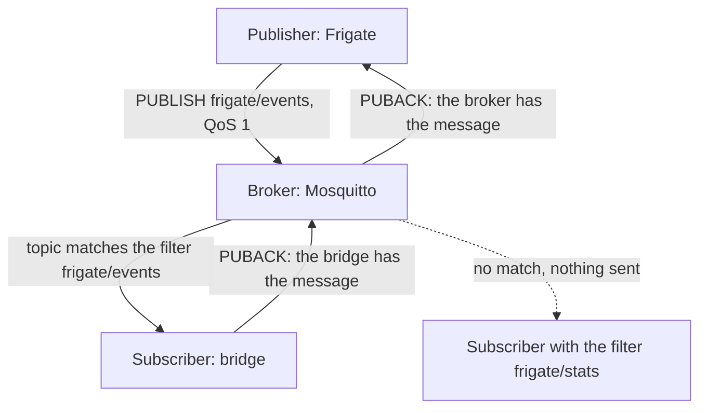
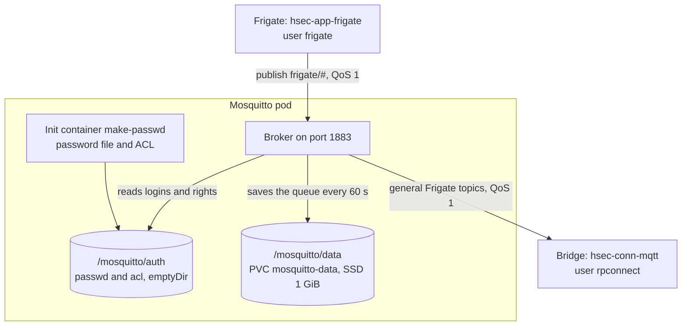

# hsec-q-mqtt

Mosquitto 2.1.2 is the MQTT broker (a server that passes messages from publishers to subscribers) between Frigate and the bridge. Frigate publishes to it, and the bridge (`hsec-conn-mqtt`) subscribes to it. While the bridge is offline, Mosquitto keeps the messages in a queue and sends them later.

## Base knowledge

MQTT is a small publish and subscribe protocol for messages over TCP [1], [2]. A client publishes a message to a topic. The broker sends the message to every client that subscribed to that topic. Publishers and subscribers never connect to each other, so one side can go offline without the other side noticing. Eclipse Mosquitto is an open source MQTT broker [3], [4].



### Terms

| Term | Meaning |
| --- | --- |
| Broker | The server that receives every message and passes it to the subscribers. |
| Client | A program that connects to the broker. It can publish, subscribe, or both. Each client has a client ID. |
| Topic | A text address with levels split by `/`, for example `frigate/profile/set`. A topic needs no setup before use. |
| Topic filter | The topics that a subscriber wants. `+` matches one level, and `#` matches all remaining levels [1]. |
| QoS (quality of service) | The delivery promise for one message. QoS 0 is at most once, QoS 1 is at least once, and QoS 2 is exactly once [1]. |
| PUBACK | The reply to a QoS 1 message. Until the sender gets it, the sender sends the message again. So a QoS 1 message can arrive twice. |
| Persistent session | With `clean_session false` and a fixed client ID, the broker keeps the subscriptions of a client. It also queues QoS 1 and QoS 2 messages while the client is offline [1]. |
| Retained message | A message with the retain flag. The broker keeps the last one of each topic and sends it to each new subscriber. |
| Keep alive | If the client has nothing else to send, it sends a ping. So the broker finds a dead connection. |
| Persistence | Mosquitto saves its queues and retained messages to disk, and loads them again after a restart [3]. |

### In this project

- Frigate publishes with QoS 1, so each message arrives at least once. A message can arrive twice, so the Flink job removes duplicates.
- The bridge has a persistent session: the client ID `rpconnect-frigate` and `clean_session false`. So Mosquitto queues messages while the bridge restarts. See [How it works](#how-it-works).
- Mosquitto saves the queue every 60 seconds. If Mosquitto itself crashes, it can lose the messages that arrived after the last save.
- The ACL uses the filter `frigate/profile/+`, which matches `frigate/profile/set` and `frigate/profile/state`. See [Configuration](#configuration).

## How it works



1. Before the broker starts, the init container `make-passwd` reads `MQTT_FRIGATE_PASSWORD` and `MQTT_BRIDGE_PASSWORD` from the Secret `mosquitto-env`.
2. It writes the password file with `mosquitto_passwd` and copies the ACL (access control list, the topics that each user can use) next to it.
3. It gives both files to the `mosquitto` user (UID 1883) with mode 0700. Mosquitto warns that a future version will refuse files that it does not own, and a ConfigMap file always belongs to root.
4. Each client must log in. The user `frigate` can read and write `frigate/#`. The user `rpconnect` can only read the general Frigate topics.
5. The bridge subscribes with QoS 1, a fixed client ID, and `clean_session false`. So Mosquitto keeps its subscription and queues messages while the bridge is offline.
6. Mosquitto saves the queue to disk every 60 seconds and loads it again after a restart. The queue holds up to 10000 messages, about 20 MB.

## Configuration

`mosquitto.conf`:

| Line | Reason |
| --- | --- |
| `listener 1883` | Plain MQTT inside the cluster |
| `allow_anonymous false` | Each client must log in. |
| `password_file /mosquitto/auth/passwd` | Written by the init container from the Secret |
| `acl_file /mosquitto/auth/acl` | The copy that the init container makes |
| `persistence true`, `persistence_location /mosquitto/data/` | The queue survives a restart. |
| `autosave_interval 60` | Saves the queue every 60 seconds. The default is 1800 seconds. |
| `max_queued_messages 10000` | Room for an offline bridge. The default is 1000. |

`acl`:

| User | Rights |
| --- | --- |
| `frigate` | Read and write on `frigate/#`. Frigate also reads its own command topics. |
| `rpconnect` | Read only on `frigate/available`, `restart`, `events`, `tracked_object_update`, `reviews`, `triggers`, `stats`, `camera_activity`, `profile/+`, and `notifications/+` |

## Kubernetes objects

| Object | Name | Purpose |
| --- | --- | --- |
| ConfigMap | `mosquitto-config` | `mosquitto.conf` and `acl` |
| PVC | `mosquitto-data` | The saved queue, SSD class, 1 GiB |
| Deployment | `mosquitto` | One pod with the `Recreate` strategy, 64 MiB of memory, CPU request 0.05, and a TCP liveness probe |
| Service | `mosquitto` | Type `ClusterIP` on port 1883 |

The pod has the annotation `checksum/config`. A change of `mosquitto.conf` or `acl` changes it, so `terraform apply` restarts the pod.

## Files

```text
hsec-q-mqtt/
├── README.md
├── mosquitto.conf               # broker configuration
├── acl                          # topic rights of each user
└── terraform/
    ├── versions.tf
    ├── variables.tf
    ├── main.tf                  # ConfigMap, PVC, Deployment with the init container, Service
    └── tests/
        └── mosquitto.tftest.hcl
```

## Deploy

- Terraform root: `terraform/010-workload`.
- Module inputs: `namespace`, `labels`, `ssd_storage_class`, and `env_secret_name`.
- Address inside the cluster: `mosquitto.hsec.svc.cluster.local:1883`.

To watch the messages by hand, run this command. It reads the password from the Secret.

```sh
kubectl -n hsec exec deploy/mosquitto -- mosquitto_sub -u frigate \
  -P "$(kubectl -n hsec get secret frigate-env -o jsonpath='{.data.FRIGATE_MQTT_PASSWORD}' | base64 -d)" \
  -t 'frigate/#' -v
```

## Test

- In `terraform/`, run `terraform init -backend=false` and then `terraform test`.
- The smoke test in the specs stops the bridge, publishes 100 messages, and starts the bridge again. Then it makes sure that all 100 messages arrive in Redpanda. `tests/smoke-test.sh` is not written yet.

## Details

See [Mosquitto](../docs/specs.md#mosquitto) in the specs.

## References

[1] OASIS, "MQTT Version 3.1.1," OASIS Standard, Oct. 2014. [Online]. Available: http://docs.oasis-open.org/mqtt/mqtt/v3.1.1/os/mqtt-v3.1.1-os.html

[2] OASIS, "MQTT Version 5.0," OASIS Standard, Mar. 2019. [Online]. Available: https://docs.oasis-open.org/mqtt/mqtt/v5.0/mqtt-v5.0.html

[3] Eclipse Foundation, "mosquitto.conf(5)," Eclipse Mosquitto Documentation. Accessed: Oct. 5, 2026. [Online]. Available: https://mosquitto.org/man/mosquitto-conf-5.html

[4] R. A. Light, "Mosquitto: server and client implementation of the MQTT protocol," J. Open Source Softw., vol. 2, no. 13, p. 265, 2017, doi: 10.21105/joss.00265.
