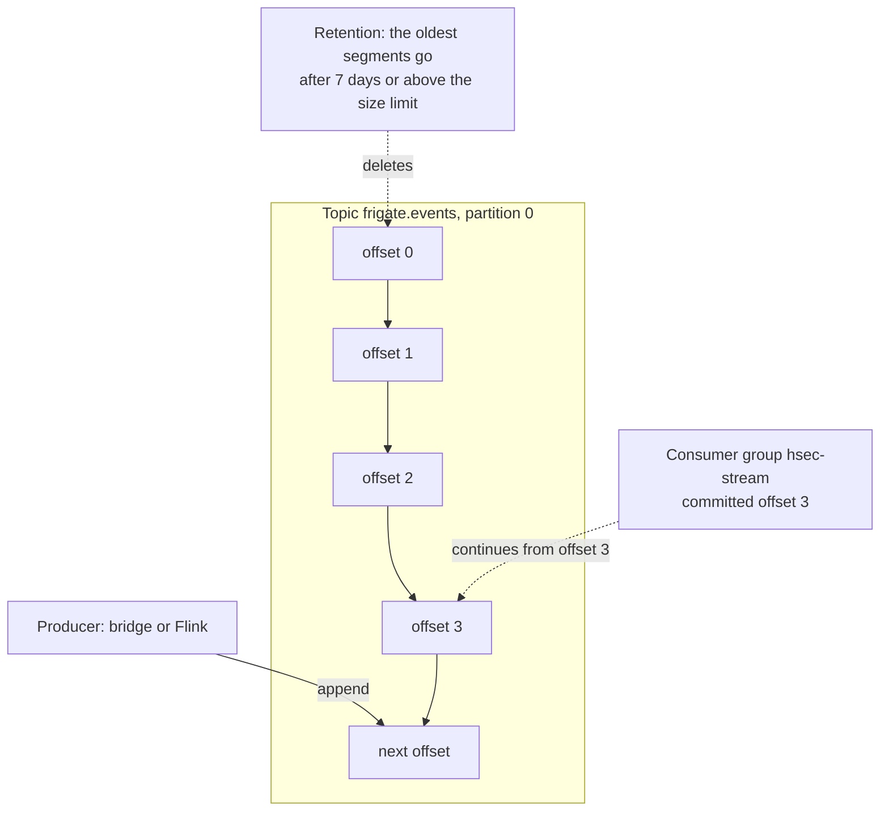
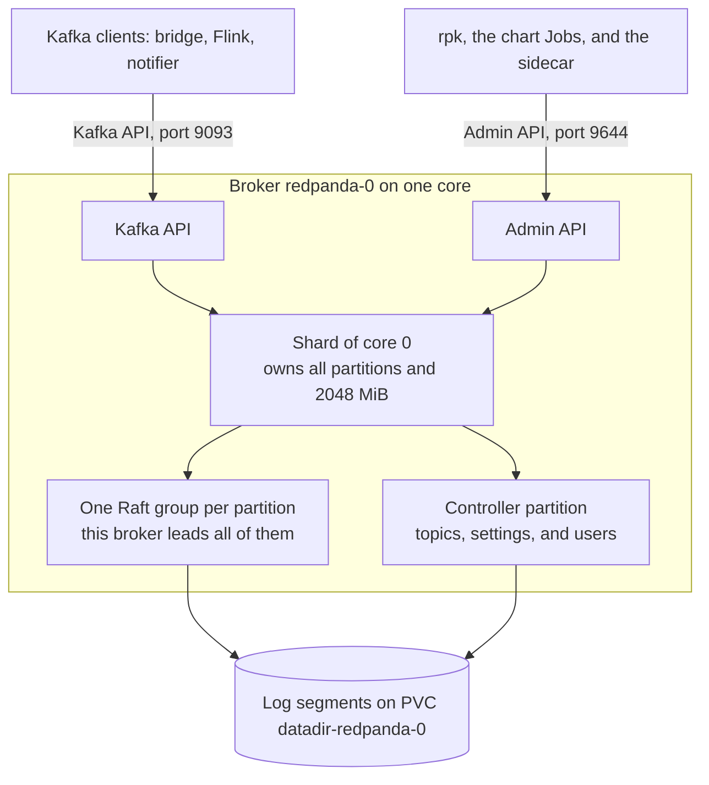
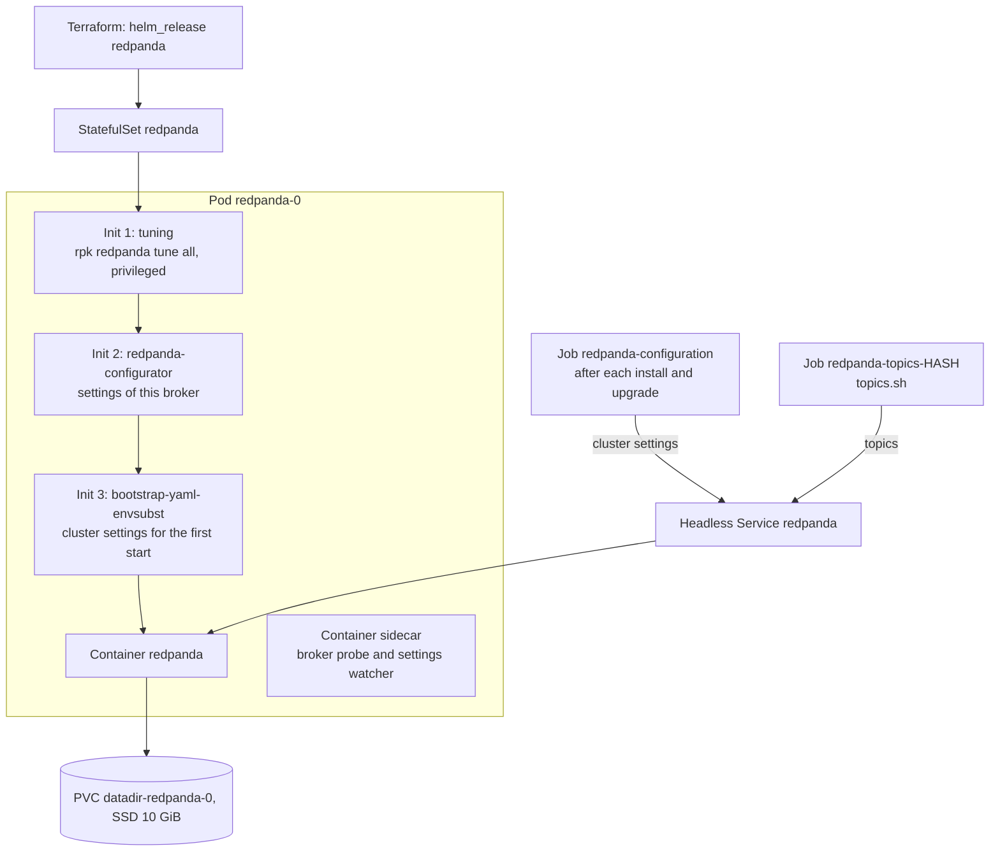
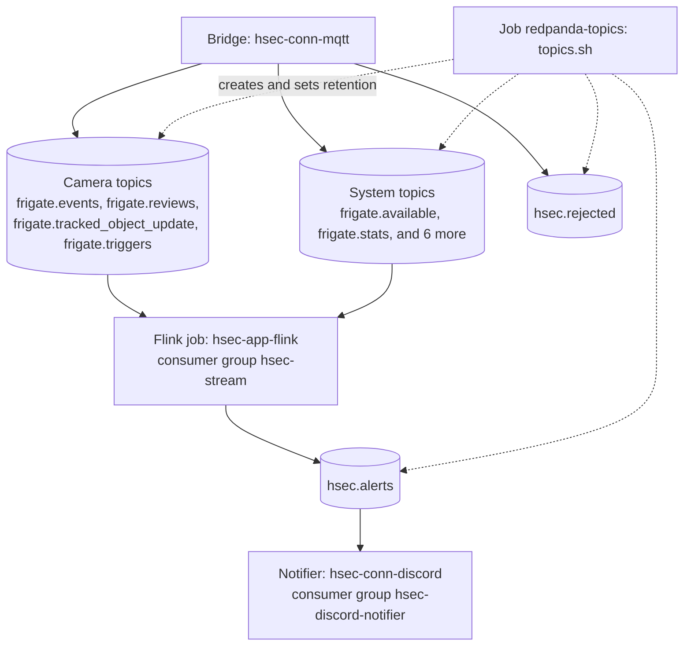

# hsec-q-redpanda

Redpanda 26.2.3 is the message log of the system. It is Kafka compatible: it keeps the messages of each topic in order on disk, and each reader keeps its own position (offset) in the topic. It holds every Frigate message and every alert for 7 days. So Flink can replay data after a restart, and the notifier can catch up after a Discord outage.

## Base knowledge

Redpanda is a streaming data platform that speaks the Apache Kafka protocol [1], [2]. Its central idea is the log: an ordered list of records that only grows at the end [3]. Writers append records. Each reader keeps its own position in the log. So many readers can read the same data at their own pace, and a reader can read old data again.



### Terms

| Term | Meaning |
| --- | --- |
| Record | One message: a key, a value, headers, and a timestamp. Redpanda does not look inside the value. |
| Topic | A named log, for example `frigate.events`. |
| Partition | One ordered part of a topic. The order of records holds only inside one partition. |
| Offset | The position of a record in its partition: 0, 1, 2, and so on. |
| Producer | A client that appends records. With more than one partition, the record key picks the partition, so all records with one key stay in order. |
| Consumer | A client that reads records, starting at an offset. |
| Consumer group | Readers that share a name. The group commits the offset of the last record that it processed, so a restarted reader continues where it stopped [5]. |
| Segment | A file that holds a range of records of one partition. Retention deletes whole old segments. |
| Retention | Rules to delete old data: by age (`retention.ms`) and by size per partition (`retention.bytes`). |
| Replication | Copies of each partition on several brokers. The Raft consensus algorithm keeps the copies in step [4]. |
| fsync | A system call that forces data from memory onto the disk. Redpanda confirms a write only after the data is on disk. |

Redpanda differs from Apache Kafka in how it runs, not in the protocol. It is one C++ program without a JVM and without ZooKeeper. It uses a thread-per-core design: each CPU core runs its own share of the work, without locks between cores [2].

### In this project

- Each topic has 1 partition, so all records of a topic stay in order. The notifier needs this order: the image comes before the clip parts.
- The cluster has 1 broker, so each partition has 1 copy. If the Redpanda volume is lost, the topics are lost. Flink writes every record to Iceberg within about 1 minute, so the long-term data survives.
- The keys are the object, review, or alert IDs. With one partition, they only label the records.
- Two consumer groups read the topics: `hsec-stream` (Flink) and `hsec-discord-notifier` (the notifier). Flink restores its exact position from its own checkpoint, and its committed offsets only help the first start.
- The record headers carry the video reference of each camera message. See [How it works](#how-it-works).

## Architecture

### Broker

Redpanda is one C++ program, built on the Seastar framework [2], [6]. It uses a thread-per-core model: it pins one thread to each CPU core, and the threads talk to each other only by message passing [2]. It allocates its memory up front, splits it between the cores, and writes to disk with direct memory access (DMA) [2].



| Part | Role |
| --- | --- |
| Seastar | A C++ framework for thread-per-core servers with asynchronous I/O [6]. |
| Shard | One core, with its thread and its share of memory. Each partition belongs to one shard. |
| Raft group | Each partition is a Raft group with one elected leader and zero or more followers. The leader takes the writes and copies them to the followers [2], [4]. |
| Controller partition | A system partition that stores the metadata commands, such as creating a topic or a user. It takes the place of ZooKeeper in Apache Kafka [2]. |
| Kafka API | The protocol of the producers and consumers [2]. |
| Admin API | An HTTP API for the cluster settings and the broker health. `rpk` and the chart use it. |
| HTTP Proxy and Schema Registry | Two more HTTP APIs in the same program, on ports 8082 and 8081. This project does not use them. |

The chart gives 80 % of the container memory to Redpanda [7]. So in the 2.5 GiB pod, Redpanda runs with `--smp=1` (one core), `--memory=2048M`, and `--reserve-memory=205M`. With one broker, each Raft group has a leader and no followers.

### In the cluster



1. The init container `tuning` runs `rpk redpanda tune all` in privileged mode. `rpk` runs only the tuners that are on, and the chart turns on only `rpk.tune_aio_events` [8]. This tuner raises the number of asynchronous I/O requests that the kernel allows. It changes a setting of the whole Fedora host, not only of the pod.
2. The init container `redpanda-configurator` writes the settings of this broker, such as its addresses.
3. The init container `bootstrap-yaml-envsubst` writes the cluster settings for the first start.
4. The container `sidecar` checks the health of the broker through the Admin API, and watches the settings.
5. After each install and upgrade, the Job `redpanda-configuration` syncs the cluster settings, for example `auto_create_topics_enabled: false`.
6. The Service `redpanda` is headless: it has no cluster IP, and each pod gets its own DNS name. Clients use `redpanda-0.redpanda.hsec.svc.cluster.local`, the stable name of the StatefulSet pod.

| Port | Name | Use |
| --- | --- | --- |
| 9093 | `kafka` | Kafka API inside the cluster |
| 9644 | `admin` | Admin API |
| 8082 | `http` | HTTP Proxy, not used |
| 8081 | `schemaregistry` | Schema Registry, not used |
| 33145 | `rpc` | Raft traffic between brokers |

## How it works



1. The bridge writes each Frigate message to its topic. Camera messages carry the video headers.
2. The Flink job reads all `frigate.*` topics with the consumer group `hsec-stream`. It writes alert messages with images and clips to `hsec.alerts`.
3. The notifier reads `hsec.alerts` with the consumer group `hsec-discord-notifier` and posts each message to Discord.
4. A consumer group stores how far it has read. After a restart, each reader continues from its last committed offset.
5. Each topic has 1 partition, so all messages of a topic keep their order. The notifier depends on this order: the image comes before the clip parts.
6. `hsec.rejected` only collects camera messages that the bridge cannot read. Nothing reads it automatically. To look for lost messages, read this topic.

## Topics

| Topic | Writer | Retention time | Retention size | Largest message |
| --- | --- | --- | --- | --- |
| `frigate.events` | Bridge | 7 days | 1 GiB | 1 MiB (default) |
| `frigate.reviews` | Bridge | 7 days | 1 GiB | 1 MiB (default) |
| `frigate.tracked_object_update` | Bridge | 7 days | 1 GiB | 1 MiB (default) |
| `frigate.triggers` | Bridge | 7 days | 1 GiB | 1 MiB (default) |
| `frigate.available`, `frigate.restart`, `frigate.stats`, `frigate.camera_activity`, `frigate.profile.set`, `frigate.profile.state`, `frigate.notifications.set`, `frigate.notifications.state` | Bridge | 7 days | 128 MiB each | 1 MiB (default) |
| `hsec.alerts` | Flink | 7 days | 1 GiB | 32 MiB |
| `hsec.rejected` | Bridge | 7 days | 256 MiB | 1 MiB (default) |

If a topic passes its retention time or its retention size, Redpanda deletes its oldest data. An alert message carries at most 19 MiB of video, which is about 26 MiB in base64. So `hsec.alerts` allows messages of up to 32 MiB.

`topics.sh` creates each missing topic and sets its retention. A second run changes nothing, except new retention values. Automatic topic creation is off, so a typo in a topic name fails instead of making a new topic.

## Chart values

The chart `redpanda` 26.2.4 defaults to a production cluster with three brokers. This module changes these values:

| Value | New value | Reason |
| --- | --- | --- |
| `statefulset.replicas` | `1` | One node |
| `console.enabled`, `tls.enabled`, `external.enabled` | `false` | Inside the cluster only |
| `resources.cpu.cores` | `1` | One core |
| `resources.memory.container.max` | `2.5Gi` | Redpanda needs 2 GiB for its core. |
| `storage.persistentVolume` | 10 GiB on the SSD class | Fast writes |
| `config.cluster.auto_create_topics_enabled` | `false` | Only `topics.sh` creates topics. |

Redpanda runs in its normal mode with fsync on. The `dev-container` mode turns fsync off, and a power loss can then delete messages that Redpanda already confirmed.

## Kubernetes objects

| Object | Name | Purpose |
| --- | --- | --- |
| Helm release | `redpanda` | StatefulSet `redpanda` with the pod `redpanda-0`, Services, and the volume `datadir-redpanda-0` |
| ConfigMap | `redpanda-topics` | `topics.sh` |
| Job | `redpanda-topics-<hash>` | Runs `topics.sh` after the chart is ready. The name holds a hash of the script, so a changed script runs again. |

Addresses inside the cluster:

- Kafka API: `redpanda-0.redpanda.hsec.svc.cluster.local:9093`
- Admin API: `redpanda-0.redpanda.hsec.svc.cluster.local:9644`

## Files

```text
hsec-q-redpanda/
├── README.md
├── topics.sh                    # creates the 14 topics and sets their retention
└── terraform/
    ├── versions.tf
    ├── variables.tf
    ├── main.tf                  # Helm release, ConfigMap, and topics Job
    └── tests/
        └── redpanda.tftest.hcl
```

## Deploy

- Terraform root: `terraform/010-workload`.
- Module inputs: `namespace`, `labels`, and `ssd_storage_class`.

To read messages by hand, run `rpk` in the broker pod. For example, this command prints the last 5 alerts with their headers:

```sh
kubectl -n hsec exec redpanda-0 -c redpanda -- \
  rpk topic consume hsec.alerts -o -5 -n 5 -f '%k [%h{%k=%v;}]\n'
```

## Test

- Run `shellcheck topics.sh`.
- In `terraform/`, run `terraform init -backend=false` and then `terraform test`.
- `topics.sh` was also tested twice against a local Redpanda 26.2.3. The first run created the 14 topics, and the second run created nothing.

## Details

See [Redpanda](../docs/specs.md#redpanda) and [Message contract](../docs/specs.md#message-contract) in the specs.

## References

[1] Apache Software Foundation, "Apache Kafka Documentation: Design," Apache Kafka. Accessed: Oct. 5, 2026. [Online]. Available: https://kafka.apache.org/documentation/#design

[2] Redpanda Data, "How Redpanda Works," Redpanda Documentation. Accessed: Oct. 5, 2026. [Online]. Available: https://docs.redpanda.com/current/get-started/architecture/

[3] J. Kreps, N. Narkhede, and J. Rao, "Kafka: a distributed messaging system for log processing," in Proc. NetDB Workshop, Athens, Greece, 2011. [Online]. Available: http://notes.stephenholiday.com/Kafka.pdf

[4] D. Ongaro and J. Ousterhout, "In search of an understandable consensus algorithm," in Proc. USENIX Annu. Tech. Conf. (ATC), Philadelphia, PA, USA, 2014, pp. 305–319. [Online]. Available: https://www.usenix.org/conference/atc14/technical-sessions/presentation/ongaro

[5] Redpanda Data, "Consumer Offsets," Redpanda Documentation. Accessed: Oct. 5, 2026. [Online]. Available: https://docs.redpanda.com/current/develop/consume-data/consumer-offsets/

[6] ScyllaDB, "Seastar," Seastar Project. Accessed: Oct. 5, 2026. [Online]. Available: https://seastar.io/

[7] Redpanda Data, "Redpanda Helm Chart Specification," Redpanda Documentation. Accessed: Oct. 5, 2026. [Online]. Available: https://docs.redpanda.com/current/reference/k-redpanda-helm-spec/

[8] Redpanda Data, "rpk redpanda tune," Redpanda Documentation. Accessed: Oct. 5, 2026. [Online]. Available: https://docs.redpanda.com/current/reference/rpk/rpk-redpanda/rpk-redpanda-tune/
